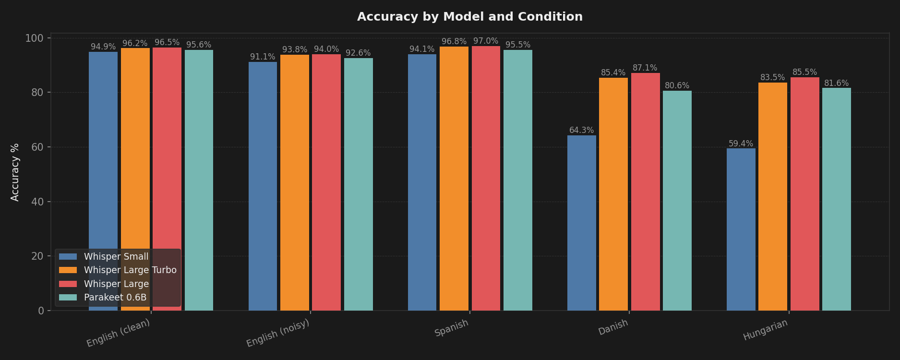
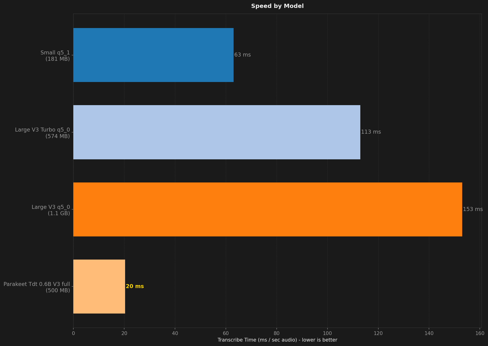
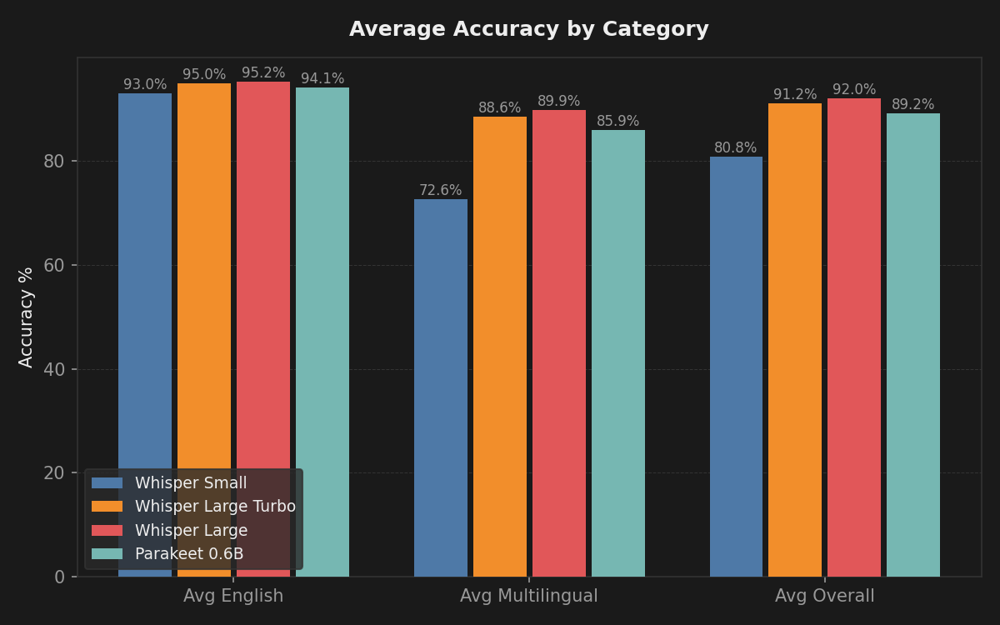

# STT Benchmark Report

**Description:** Comparison of Codictate's curated speech models (Small q5_1, Large V3 Turbo q5_0, Large V3 q5_0, Parakeet) to determine the best-performing default model.

- **Date:** 2026-05-08T07:56:46.176Z
- **Hardware:** Apple M4 Max / 36 GB / macOS 26.4.1
- **Samples per dataset:** 200
- **Warmup utterances:** 3
- **Models tested:** 4

## Summary

| Model | Disk | Min Peak RSS | Avg Peak RSS | Max Peak RSS | Transcribe Time / sec Audio | Avg Overall | Avg English | Avg Multilingual | English (clean) | English (noisy) | Spanish | Danish | Hungarian |
| --- | --- | --- | --- | --- | --- | --- | --- | --- | --- | --- | --- | --- | --- |
| Large V3 q5_0 | 1.1 GB | 2.0 GB | 2.0 GB | 2.0 GB | 147 ms | **92.0%** | **95.2%** | **89.9%** | **96.5%** | **94.0%** | **97.0%** | **87.1%** | **85.5%** |
| Large V3 Turbo q5_0 | 574 MB | 798 MB | 801 MB | 805 MB | 105 ms | 91.2% | 95.0% | 88.6% | 96.2% | 93.8% | 96.8% | 85.4% | 83.5% |
| Parakeet TDT v3 full | 500 MB | **78 MB** | **80 MB** | **86 MB** | **19 ms** | 89.2% | 94.1% | 85.9% | 95.6% | 92.6% | 95.5% | 80.6% | 81.6% |
| Small q5_1 | **181 MB** | 473 MB | 477 MB | 482 MB | 58 ms | 80.8% | 93.0% | 72.6% | 94.9% | 91.1% | 94.1% | 64.3% | 59.4% |

## Ratings (1-10)

| Model | Speed | Accuracy | Languages |
| --- | --- | --- | --- |
| Large V3 q5_0 | 9 | 9 | 10 |
| Large V3 Turbo q5_0 | 9 | 8 | 10 |
| Parakeet TDT v3 full | 10 | 8 | 8 |
| Small q5_1 | 9 | 7 | 10 |

## Charts

## Accuracy by Condition

### English (clean)

| Model | Accuracy (%) |
| --- | --- |
| Large V3 q5_0 | 96.5% |
| Large V3 Turbo q5_0 | 96.2% |
| Parakeet TDT v3 full | 95.6% |
| Small q5_1 | 94.9% |

### English (noisy)

| Model | Accuracy (%) |
| --- | --- |
| Large V3 q5_0 | 94.0% |
| Large V3 Turbo q5_0 | 93.8% |
| Parakeet TDT v3 full | 92.6% |
| Small q5_1 | 91.1% |

### Spanish

| Model | Accuracy (%) |
| --- | --- |
| Large V3 q5_0 | 97.0% |
| Large V3 Turbo q5_0 | 96.8% |
| Parakeet TDT v3 full | 95.5% |
| Small q5_1 | 94.1% |

### Danish

| Model | Accuracy (%) |
| --- | --- |
| Large V3 q5_0 | 87.1% |
| Large V3 Turbo q5_0 | 85.4% |
| Parakeet TDT v3 full | 80.6% |
| Small q5_1 | 64.3% |

### Hungarian

| Model | Accuracy (%) |
| --- | --- |
| Large V3 q5_0 | 85.5% |
| Large V3 Turbo q5_0 | 83.5% |
| Parakeet TDT v3 full | 81.6% |
| Small q5_1 | 59.4% |

## Speed by Condition

### English (clean)

| Model | Transcribe Time / sec Audio |
| --- | --- |
| Large V3 q5_0 | 199 ms |
| Large V3 Turbo q5_0 | 165 ms |
| Parakeet TDT v3 full | 29 ms |
| Small q5_1 | 92 ms |

### English (noisy)

| Model | Transcribe Time / sec Audio |
| --- | --- |
| Large V3 q5_0 | 163 ms |
| Large V3 Turbo q5_0 | 129 ms |
| Parakeet TDT v3 full | 24 ms |
| Small q5_1 | 77 ms |

### Spanish

| Model | Transcribe Time / sec Audio |
| --- | --- |
| Large V3 q5_0 | 123 ms |
| Large V3 Turbo q5_0 | 88 ms |
| Parakeet TDT v3 full | 16 ms |
| Small q5_1 | 47 ms |

### Danish

| Model | Transcribe Time / sec Audio |
| --- | --- |
| Large V3 q5_0 | 139 ms |
| Large V3 Turbo q5_0 | 96 ms |
| Parakeet TDT v3 full | 17 ms |
| Small q5_1 | 51 ms |

### Hungarian

| Model | Transcribe Time / sec Audio |
| --- | --- |
| Large V3 q5_0 | 141 ms |
| Large V3 Turbo q5_0 | 86 ms |
| Parakeet TDT v3 full | 16 ms |
| Small q5_1 | 48 ms |
