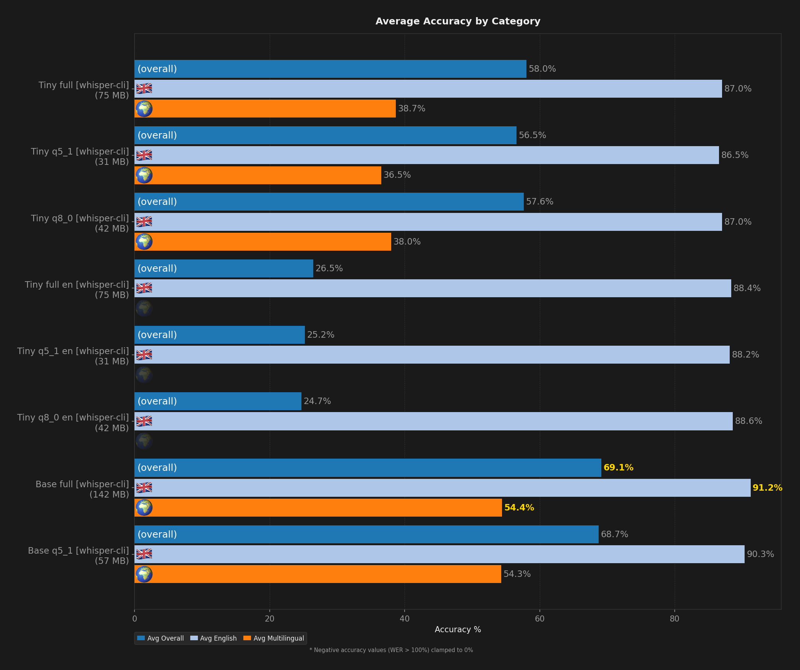
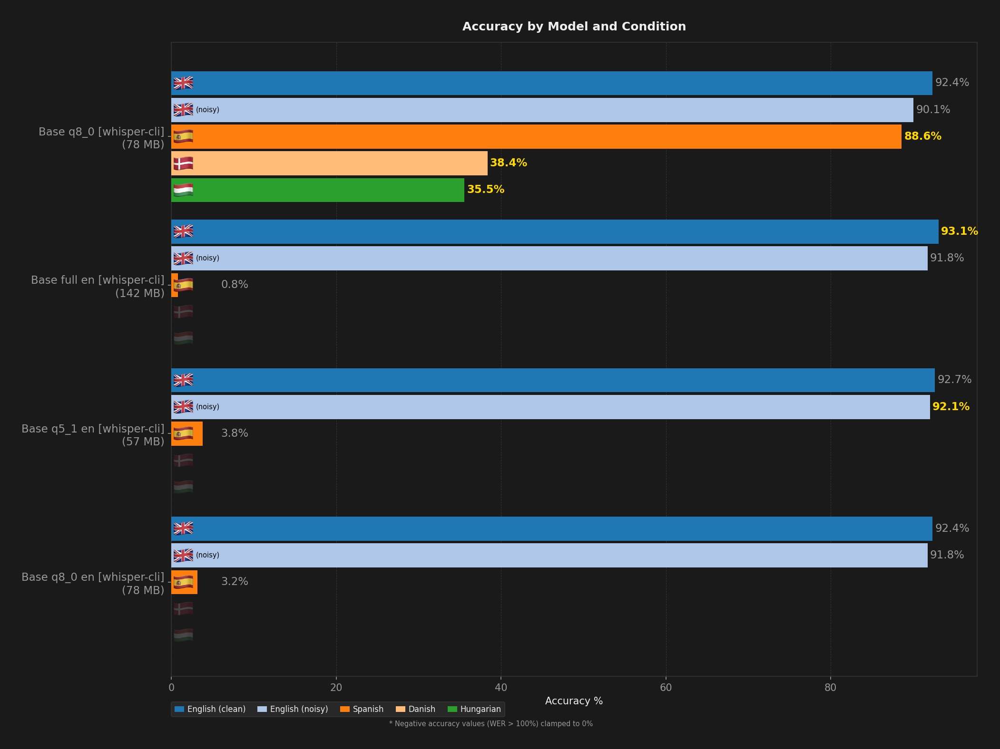
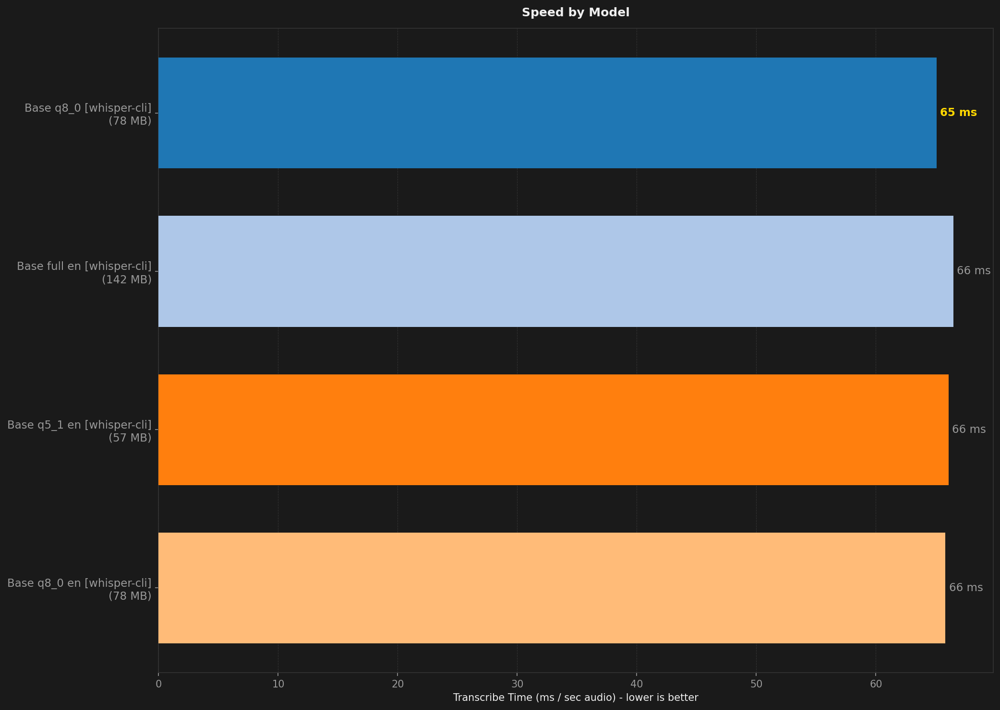
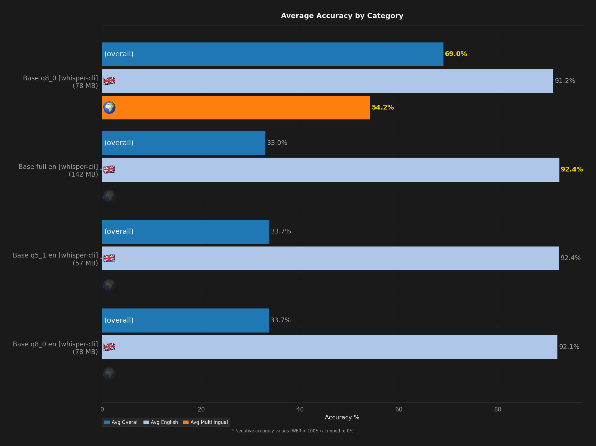
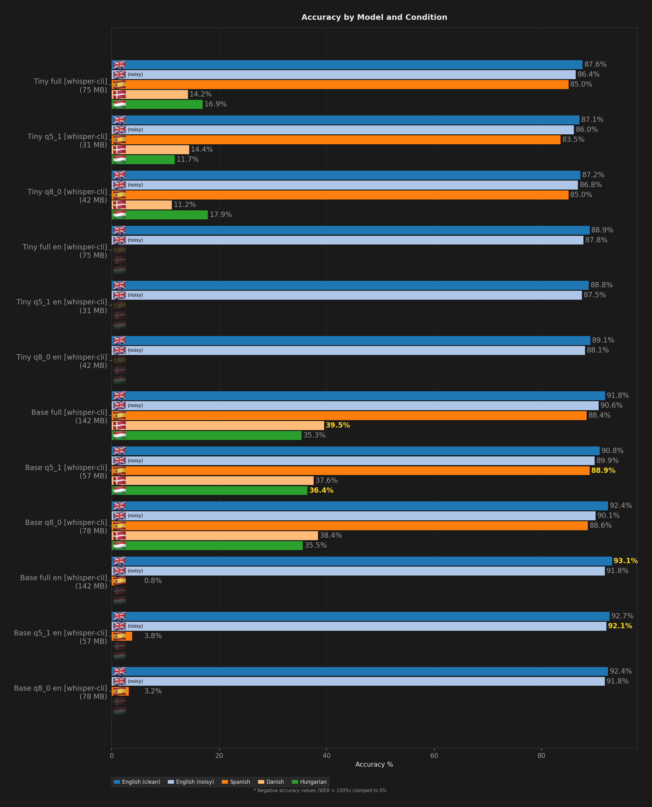
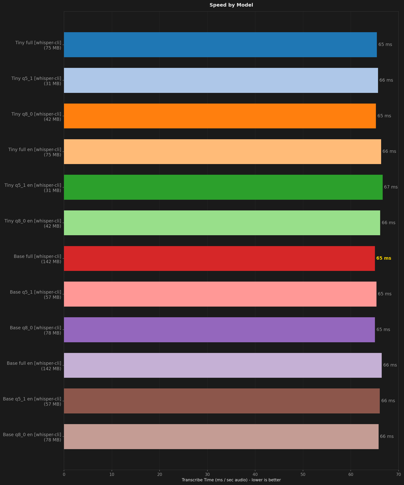
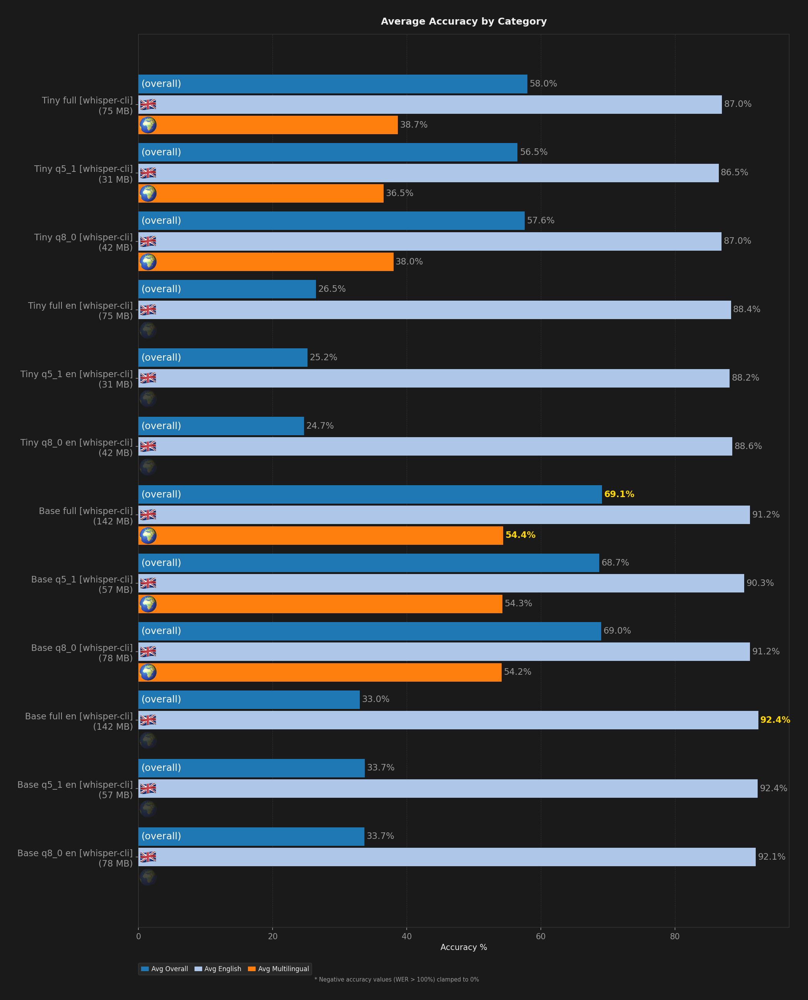

# STT Benchmark Report

**Description:** Triage of Tiny and Base model families (all quantization and language variants) to evaluate whether these smaller models are worth further benchmarking.

- **Date:** 2026-05-09T10:12:34.798Z
- **Hardware:** Apple M4 Max / 36 GB / macOS 26.4.1
- **Samples per dataset:** 50
- **Warmup utterances:** 3
- **ASR Harness:** whisper-cli
- **Combinations tested:** 12

## Summary

| Model | Disk | Min Peak RSS | Avg Peak RSS | Max Peak RSS | Transcribe Time / sec Audio | Avg Overall | Avg English | Avg Multilingual | English (clean) | English (noisy) | Spanish | Danish | Hungarian |
| --- | --- | --- | --- | --- | --- | --- | --- | --- | --- | --- | --- | --- | --- |
| Base q5_1 [whisper-cli] | 57 MB | 214 MB | 219 MB | 227 MB | 57 ms | 68.7% | 90.3% | 54.3% | 90.8% | 89.9% | **88.9%** | 37.6% | **36.4%** |
| Base q8_0 [whisper-cli] | 78 MB | 243 MB | 247 MB | 256 MB | 57 ms | 69.0% | 91.2% | 54.2% | 92.4% | 90.1% | 88.6% | 38.4% | 35.5% |
| Base q5_1 en [whisper-cli] | 57 MB | 215 MB | 217 MB | 225 MB | 58 ms | 33.7% | 92.4% | -5.3% | 92.7% | **92.1%** | 3.8% | -9.6% | -10.2% |
| Base q8_0 en [whisper-cli] | 78 MB | 243 MB | 247 MB | 259 MB | 58 ms | 33.7% | 92.1% | -5.2% | 92.4% | 91.8% | 3.2% | -7.9% | -10.9% |
| Base full en [whisper-cli] | 142 MB | 330 MB | 333 MB | 340 MB | 59 ms | 33.0% | **92.4%** | -6.7% | **93.1%** | 91.8% | 0.8% | -7.0% | -13.8% |
| Base full [whisper-cli] | 142 MB | 330 MB | 334 MB | 343 MB | **57 ms** | **69.1%** | 91.2% | **54.4%** | 91.8% | 90.6% | 88.4% | **39.5%** | 35.3% |
| Tiny q5_1 [whisper-cli] | **31 MB** | **151 MB** | **157 MB** | 165 MB | 58 ms | 56.5% | 86.5% | 36.5% | 87.1% | 86.0% | 83.5% | 14.4% | 11.7% |
| Tiny q8_0 [whisper-cli] | 42 MB | 168 MB | 174 MB | 180 MB | 57 ms | 57.6% | 87.0% | 38.0% | 87.2% | 86.8% | 85.0% | 11.2% | 17.9% |
| Tiny q5_1 en [whisper-cli] | **31 MB** | **151 MB** | **157 MB** | **162 MB** | 59 ms | 25.2% | 88.2% | -16.7% | 88.8% | 87.5% | -1.0% | -26.0% | -23.2% |
| Tiny q8_0 en [whisper-cli] | 42 MB | 168 MB | 173 MB | 181 MB | 58 ms | 24.7% | 88.6% | -17.9% | 89.1% | 88.1% | -2.3% | -20.7% | -30.7% |
| Tiny full en [whisper-cli] | 75 MB | 218 MB | 224 MB | 228 MB | 59 ms | 26.5% | 88.4% | -14.8% | 88.9% | 87.8% | -1.2% | -18.7% | -24.4% |
| Tiny full [whisper-cli] | 75 MB | 218 MB | 224 MB | 231 MB | 57 ms | 58.0% | 87.0% | 38.7% | 87.6% | 86.4% | 85.0% | 14.2% | 16.9% |

## Ratings (1-10)

| Model | Speed | Accuracy | Languages |
| --- | --- | --- | --- |
| Base q5_1 [whisper-cli] | 9 | 5 | 10 |
| Base q8_0 [whisper-cli] | 9 | 5 | 10 |
| Base q5_1 en [whisper-cli] | 9 | 1 (9 en) | 1 |
| Base q8_0 en [whisper-cli] | 9 | 1 (9 en) | 1 |
| Base full en [whisper-cli] | 8 | 1 (9 en) | 1 |
| Base full [whisper-cli] | 9 | 5 | 10 |
| Tiny q5_1 [whisper-cli] | 9 | 2 | 10 |
| Tiny q8_0 [whisper-cli] | 9 | 3 | 10 |
| Tiny q5_1 en [whisper-cli] | 8 | 1 (9 en) | 1 |
| Tiny q8_0 en [whisper-cli] | 8 | 1 (9 en) | 1 |
| Tiny full en [whisper-cli] | 8 | 1 (9 en) | 1 |
| Tiny full [whisper-cli] | 9 | 3 | 10 |

## Charts (Base q5_1 [whisper-cli] - Tiny q8_0 [whisper-cli])

## Charts (Tiny q5_1 en [whisper-cli] - Tiny full [whisper-cli])

## Charts (All Models)

## Accuracy by Condition

### English (clean)

| Model | Accuracy (%) |
| --- | --- |
| Base q5_1 [whisper-cli] | 90.8% |
| Base q8_0 [whisper-cli] | 92.4% |
| Base q5_1 en [whisper-cli] | 92.7% |
| Base q8_0 en [whisper-cli] | 92.4% |
| Base full en [whisper-cli] | 93.1% |
| Base full [whisper-cli] | 91.8% |
| Tiny q5_1 [whisper-cli] | 87.1% |
| Tiny q8_0 [whisper-cli] | 87.2% |
| Tiny q5_1 en [whisper-cli] | 88.8% |
| Tiny q8_0 en [whisper-cli] | 89.1% |
| Tiny full en [whisper-cli] | 88.9% |
| Tiny full [whisper-cli] | 87.6% |

### English (noisy)

| Model | Accuracy (%) |
| --- | --- |
| Base q5_1 [whisper-cli] | 89.9% |
| Base q8_0 [whisper-cli] | 90.1% |
| Base q5_1 en [whisper-cli] | 92.1% |
| Base q8_0 en [whisper-cli] | 91.8% |
| Base full en [whisper-cli] | 91.8% |
| Base full [whisper-cli] | 90.6% |
| Tiny q5_1 [whisper-cli] | 86.0% |
| Tiny q8_0 [whisper-cli] | 86.8% |
| Tiny q5_1 en [whisper-cli] | 87.5% |
| Tiny q8_0 en [whisper-cli] | 88.1% |
| Tiny full en [whisper-cli] | 87.8% |
| Tiny full [whisper-cli] | 86.4% |

### Spanish

| Model | Accuracy (%) |
| --- | --- |
| Base q5_1 [whisper-cli] | 88.9% |
| Base q8_0 [whisper-cli] | 88.6% |
| Base q5_1 en [whisper-cli] | 3.8% |
| Base q8_0 en [whisper-cli] | 3.2% |
| Base full en [whisper-cli] | 0.8% |
| Base full [whisper-cli] | 88.4% |
| Tiny q5_1 [whisper-cli] | 83.5% |
| Tiny q8_0 [whisper-cli] | 85.0% |
| Tiny q5_1 en [whisper-cli] | -1.0% |
| Tiny q8_0 en [whisper-cli] | -2.3% |
| Tiny full en [whisper-cli] | -1.2% |
| Tiny full [whisper-cli] | 85.0% |

### Danish

| Model | Accuracy (%) |
| --- | --- |
| Base q5_1 [whisper-cli] | 37.6% |
| Base q8_0 [whisper-cli] | 38.4% |
| Base q5_1 en [whisper-cli] | -9.6% |
| Base q8_0 en [whisper-cli] | -7.9% |
| Base full en [whisper-cli] | -7.0% |
| Base full [whisper-cli] | 39.5% |
| Tiny q5_1 [whisper-cli] | 14.4% |
| Tiny q8_0 [whisper-cli] | 11.2% |
| Tiny q5_1 en [whisper-cli] | -26.0% |
| Tiny q8_0 en [whisper-cli] | -20.7% |
| Tiny full en [whisper-cli] | -18.7% |
| Tiny full [whisper-cli] | 14.2% |

### Hungarian

| Model | Accuracy (%) |
| --- | --- |
| Base q5_1 [whisper-cli] | 36.4% |
| Base q8_0 [whisper-cli] | 35.5% |
| Base q5_1 en [whisper-cli] | -10.2% |
| Base q8_0 en [whisper-cli] | -10.9% |
| Base full en [whisper-cli] | -13.8% |
| Base full [whisper-cli] | 35.3% |
| Tiny q5_1 [whisper-cli] | 11.7% |
| Tiny q8_0 [whisper-cli] | 17.9% |
| Tiny q5_1 en [whisper-cli] | -23.2% |
| Tiny q8_0 en [whisper-cli] | -30.7% |
| Tiny full en [whisper-cli] | -24.4% |
| Tiny full [whisper-cli] | 16.9% |

## Speed by Condition

### English (clean)

| Model | Transcribe Time / sec Audio |
| --- | --- |
| Base q5_1 [whisper-cli] | 120 ms |
| Base q8_0 [whisper-cli] | 119 ms |
| Base q5_1 en [whisper-cli] | 119 ms |
| Base q8_0 en [whisper-cli] | 120 ms |
| Base full en [whisper-cli] | 120 ms |
| Base full [whisper-cli] | 120 ms |
| Tiny q5_1 [whisper-cli] | 120 ms |
| Tiny q8_0 [whisper-cli] | 120 ms |
| Tiny q5_1 en [whisper-cli] | 120 ms |
| Tiny q8_0 en [whisper-cli] | 119 ms |
| Tiny full en [whisper-cli] | 120 ms |
| Tiny full [whisper-cli] | 120 ms |

### English (noisy)

| Model | Transcribe Time / sec Audio |
| --- | --- |
| Base q5_1 [whisper-cli] | 63 ms |
| Base q8_0 [whisper-cli] | 63 ms |
| Base q5_1 en [whisper-cli] | 63 ms |
| Base q8_0 en [whisper-cli] | 63 ms |
| Base full en [whisper-cli] | 63 ms |
| Base full [whisper-cli] | 63 ms |
| Tiny q5_1 [whisper-cli] | 63 ms |
| Tiny q8_0 [whisper-cli] | 63 ms |
| Tiny q5_1 en [whisper-cli] | 63 ms |
| Tiny q8_0 en [whisper-cli] | 63 ms |
| Tiny full en [whisper-cli] | 63 ms |
| Tiny full [whisper-cli] | 63 ms |

### Spanish

| Model | Transcribe Time / sec Audio |
| --- | --- |
| Base q5_1 [whisper-cli] | 44 ms |
| Base q8_0 [whisper-cli] | 44 ms |
| Base q5_1 en [whisper-cli] | 45 ms |
| Base q8_0 en [whisper-cli] | 45 ms |
| Base full en [whisper-cli] | 45 ms |
| Base full [whisper-cli] | 44 ms |
| Tiny q5_1 [whisper-cli] | 44 ms |
| Tiny q8_0 [whisper-cli] | 44 ms |
| Tiny q5_1 en [whisper-cli] | 44 ms |
| Tiny q8_0 en [whisper-cli] | 44 ms |
| Tiny full en [whisper-cli] | 44 ms |
| Tiny full [whisper-cli] | 44 ms |

### Danish

| Model | Transcribe Time / sec Audio |
| --- | --- |
| Base q5_1 [whisper-cli] | 52 ms |
| Base q8_0 [whisper-cli] | 52 ms |
| Base q5_1 en [whisper-cli] | 55 ms |
| Base q8_0 en [whisper-cli] | 53 ms |
| Base full en [whisper-cli] | 55 ms |
| Base full [whisper-cli] | 52 ms |
| Tiny q5_1 [whisper-cli] | 54 ms |
| Tiny q8_0 [whisper-cli] | 53 ms |
| Tiny q5_1 en [whisper-cli] | 53 ms |
| Tiny q8_0 en [whisper-cli] | 53 ms |
| Tiny full en [whisper-cli] | 53 ms |
| Tiny full [whisper-cli] | 53 ms |

### Hungarian

| Model | Transcribe Time / sec Audio |
| --- | --- |
| Base q5_1 [whisper-cli] | 47 ms |
| Base q8_0 [whisper-cli] | 47 ms |
| Base q5_1 en [whisper-cli] | 48 ms |
| Base q8_0 en [whisper-cli] | 48 ms |
| Base full en [whisper-cli] | 50 ms |
| Base full [whisper-cli] | 47 ms |
| Tiny q5_1 [whisper-cli] | 48 ms |
| Tiny q8_0 [whisper-cli] | 47 ms |
| Tiny q5_1 en [whisper-cli] | 54 ms |
| Tiny q8_0 en [whisper-cli] | 52 ms |
| Tiny full en [whisper-cli] | 52 ms |
| Tiny full [whisper-cli] | 48 ms |
