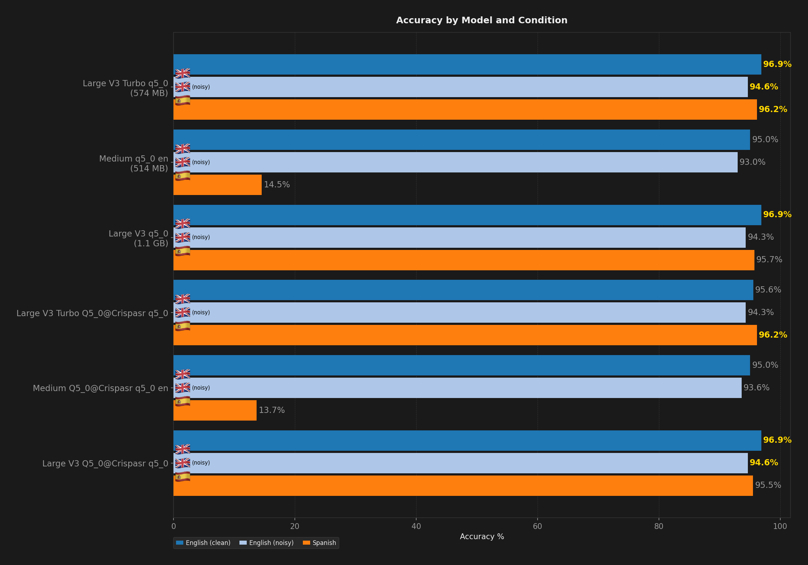
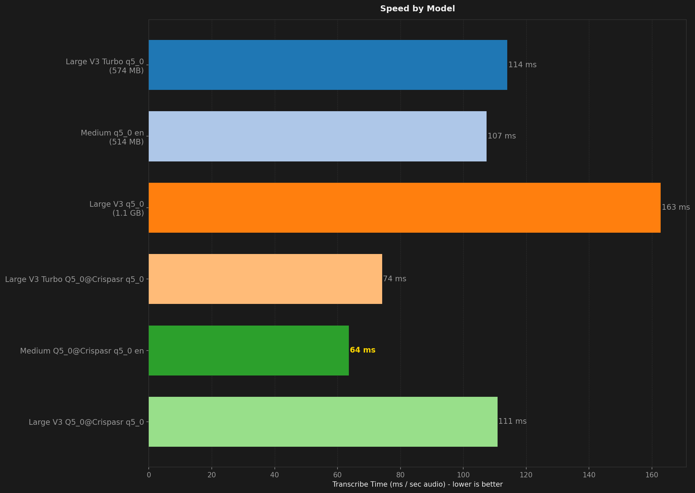
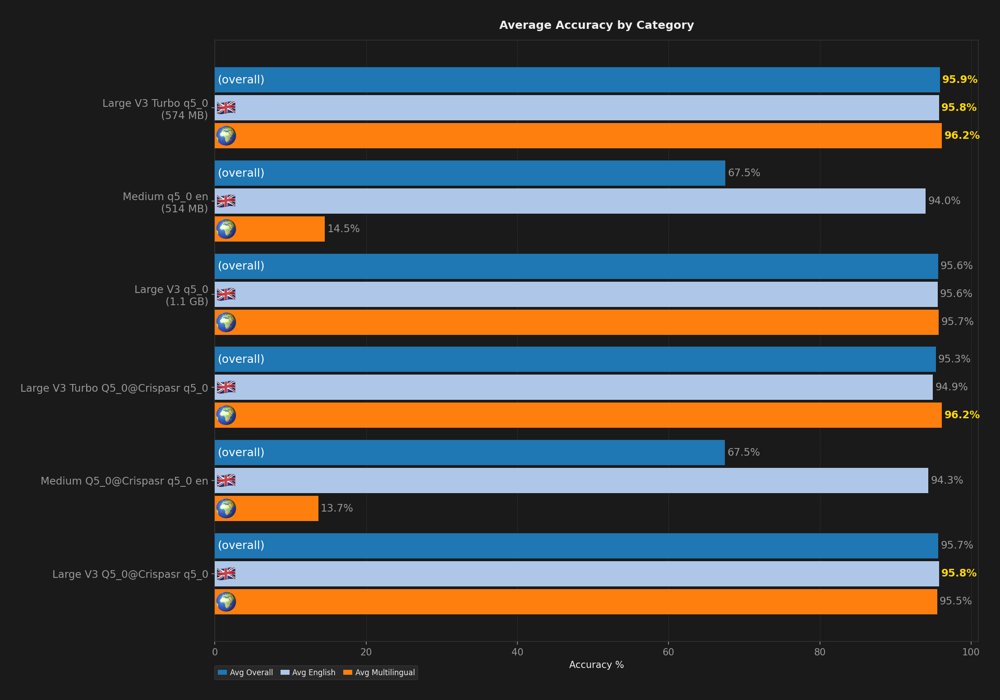
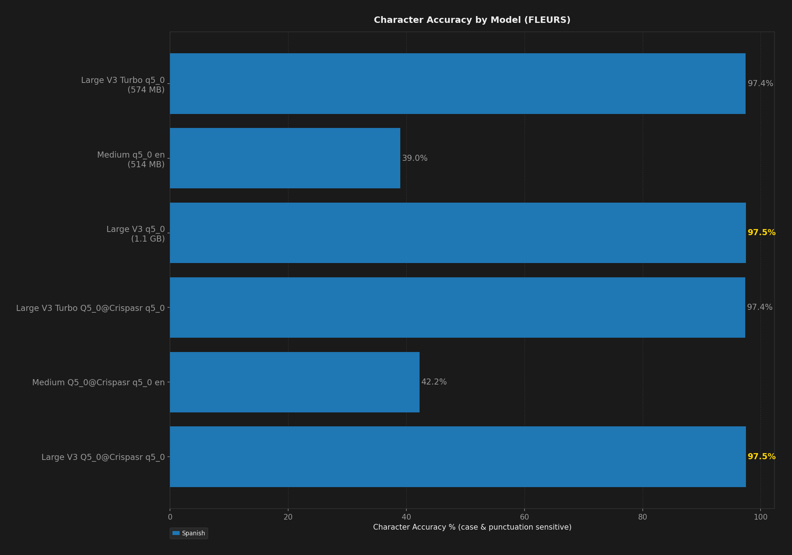

# STT Benchmark Report

**Description:** to test which asr harnes is best.

- **Date:** 2026-08-17T15:24:38.975Z
- **Hardware:** Apple M4 Max / 36 GB / macOS 26.5.1
- **Samples per dataset:** 20
- **Warmup utterances:** 3
- **Combinations tested:** 6

## Summary

| Model | Disk | Min Peak RSS | Avg Peak RSS | Max Peak RSS | Transcribe Time / sec Audio | Avg Overall | Avg English | Avg Multilingual | English (clean) | English (noisy) | Spanish | Avg Char Accuracy |
| --- | --- | --- | --- | --- | --- | --- | --- | --- | --- | --- | --- | --- |
| Large V3 q5_0 | 1.1 GB | 2.0 GB | 2.0 GB | 2.0 GB | 154 ms | 95.6% | 95.6% | 95.7% | **96.9%** | 94.3% | 95.7% | **97.5%** |
| Large V3 q5_0 [crispasr] | 1.1 GB | 1.5 GB | 1.5 GB | 1.5 GB | 104 ms | 95.7% | **95.8%** | 95.5% | **96.9%** | **94.6%** | 95.5% | **97.5%** |
| Large V3 Turbo q5_0 | 574 MB | 798 MB | 801 MB | 806 MB | 108 ms | **95.9%** | **95.8%** | **96.2%** | **96.9%** | **94.6%** | **96.2%** | 97.4% |
| Large V3 Turbo q5_0 [crispasr] | 574 MB | **737 MB** | **738 MB** | **740 MB** | 69 ms | 95.3% | 94.9% | **96.2%** | 95.6% | 94.3% | **96.2%** | 97.4% |
| Medium English q5_0 en | **514 MB** | 1.1 GB | 1.1 GB | 1.1 GB | 99 ms | 67.5% | 94.0% | 14.5% | 95.0% | 93.0% | 14.5% | 39.0% |
| Medium English q5_0 en [crispasr] | **514 MB** | 830 MB | 832 MB | 834 MB | **60 ms** | 67.5% | 94.3% | 13.7% | 95.0% | 93.6% | 13.7% | 42.2% |

## Ratings (1-10)

| Model | Speed | Accuracy | Languages |
| --- | --- | --- | --- |
| Large V3 q5_0 | 6 | 10 | 10 |
| Large V3 q5_0 [crispasr] | 7 | 10 | 10 |
| Large V3 Turbo q5_0 | 7 | 10 | 10 |
| Large V3 Turbo q5_0 [crispasr] | 8 | 10 | 10 |
| Medium English q5_0 en | 7 | 5 (10 en) | 1 |
| Medium English q5_0 en [crispasr] | 8 | 4 (10 en) | 1 |

## Charts (All Models)

## Accuracy by Condition

### English (clean)

| Model | Accuracy (%) |
| --- | --- |
| Large V3 q5_0 | 96.9% |
| Large V3 q5_0 [crispasr] | 96.9% |
| Large V3 Turbo q5_0 | 96.9% |
| Large V3 Turbo q5_0 [crispasr] | 95.6% |
| Medium English q5_0 en | 95.0% |
| Medium English q5_0 en [crispasr] | 95.0% |

### English (noisy)

| Model | Accuracy (%) |
| --- | --- |
| Large V3 q5_0 | 94.3% |
| Large V3 q5_0 [crispasr] | 94.6% |
| Large V3 Turbo q5_0 | 94.6% |
| Large V3 Turbo q5_0 [crispasr] | 94.3% |
| Medium English q5_0 en | 93.0% |
| Medium English q5_0 en [crispasr] | 93.6% |

### Spanish

| Model | Word Accuracy (%) | Char Accuracy (%) |
| --- | --- | --- |
| Large V3 q5_0 | 95.7% | 97.5% |
| Large V3 q5_0 [crispasr] | 95.5% | 97.5% |
| Large V3 Turbo q5_0 | 96.2% | 97.4% |
| Large V3 Turbo q5_0 [crispasr] | 96.2% | 97.4% |
| Medium English q5_0 en | 14.5% | 39.0% |
| Medium English q5_0 en [crispasr] | 13.7% | 42.2% |

## Speed by Condition

### English (clean)

| Model | Transcribe Time / sec Audio |
| --- | --- |
| Large V3 q5_0 | 149 ms |
| Large V3 q5_0 [crispasr] | 109 ms |
| Large V3 Turbo q5_0 | 117 ms |
| Large V3 Turbo q5_0 [crispasr] | 74 ms |
| Medium English q5_0 en | 102 ms |
| Medium English q5_0 en [crispasr] | 63 ms |

### English (noisy)

| Model | Transcribe Time / sec Audio |
| --- | --- |
| Large V3 q5_0 | 209 ms |
| Large V3 q5_0 [crispasr] | 140 ms |
| Large V3 Turbo q5_0 | 137 ms |
| Large V3 Turbo q5_0 [crispasr] | 97 ms |
| Medium English q5_0 en | 147 ms |
| Medium English q5_0 en [crispasr] | 82 ms |

### Spanish

| Model | Transcribe Time / sec Audio |
| --- | --- |
| Large V3 q5_0 | 130 ms |
| Large V3 q5_0 [crispasr] | 83 ms |
| Large V3 Turbo q5_0 | 88 ms |
| Large V3 Turbo q5_0 [crispasr] | 51 ms |
| Medium English q5_0 en | 73 ms |
| Medium English q5_0 en [crispasr] | 46 ms |
