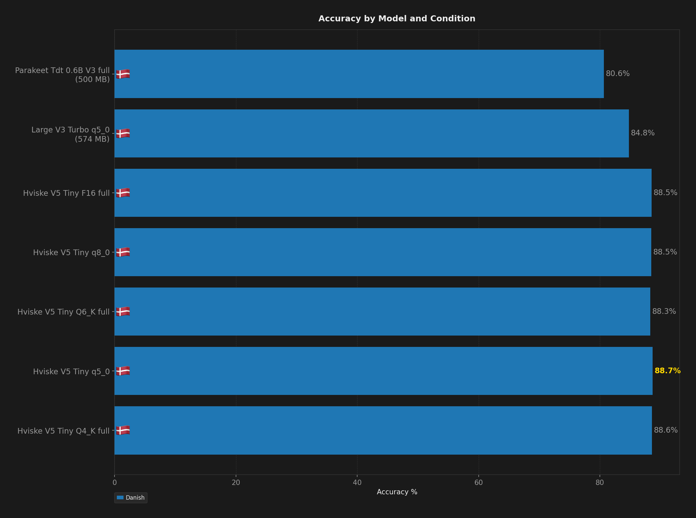
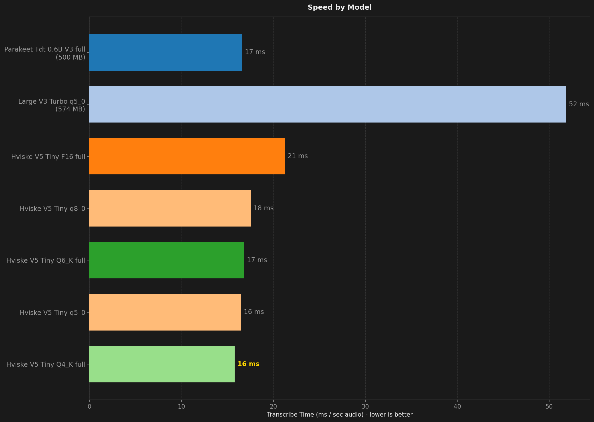
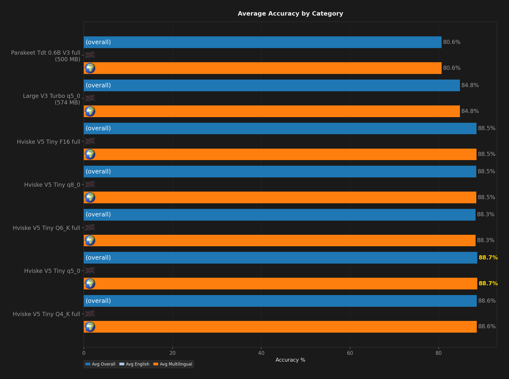
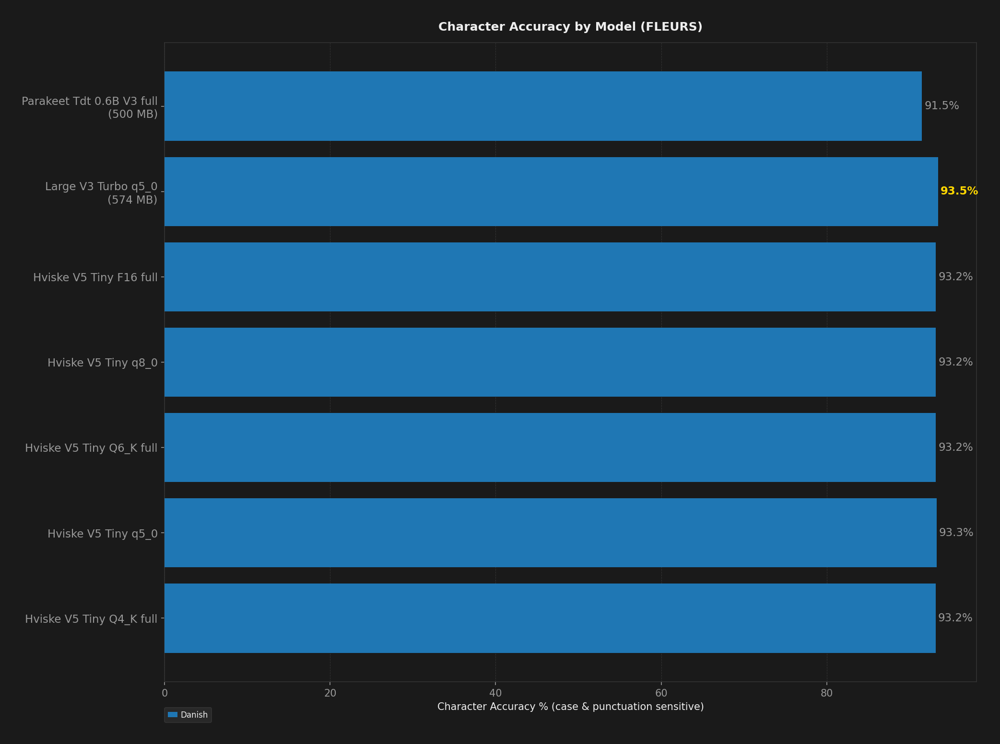

# STT Benchmark Report

**Description:** This benchmark compares the hviske model to the already main models recommended in Codictate

- **Date:** 2026-08-18T08:24:00.473Z
- **Hardware:** Apple M4 Max / 36 GB / macOS 26.5.1
- **Samples per dataset:** 200
- **Warmup utterances:** 3
- **ASR Harness:** crispasr
- **Combinations tested:** 7

## Summary

| Model | Disk | Min Peak RSS | Avg Peak RSS | Max Peak RSS | Transcribe Time / sec Audio | Avg Overall | Avg English | Avg Multilingual | Danish | Avg Char Accuracy |
| --- | --- | --- | --- | --- | --- | --- | --- | --- | --- | --- |
| Hviske V5 Tiny F16 full | 503 MB | 595 MB | 601 MB | 604 MB | 21 ms | 88.5% | - | 88.5% | 88.5% | 93.2% |
| Hviske V5 Tiny Q4 full | **153 MB** | 248 MB | 253 MB | 256 MB | **16 ms** | 88.6% | - | 88.6% | 88.6% | 93.2% |
| Hviske V5 Tiny Q5 q5_0 | 181 MB | 277 MB | 282 MB | 285 MB | 16 ms | **88.7%** | - | **88.7%** | **88.7%** | 93.3% |
| Hviske V5 Tiny Q6 full | 232 MB | 327 MB | 332 MB | 336 MB | 17 ms | 88.3% | - | 88.3% | 88.3% | 93.2% |
| Hviske V5 Tiny Q8 q8_0 | 268 MB | 362 MB | 368 MB | 372 MB | 18 ms | 88.5% | - | 88.5% | 88.5% | 93.2% |
| Large V3 Turbo q5_0 | 574 MB | 741 MB | 742 MB | 742 MB | 52 ms | 84.8% | - | 84.8% | 84.8% | **93.5%** |
| Parakeet TDT v3 full | 500 MB | **78 MB** | **79 MB** | **80 MB** | 17 ms | 80.6% | - | 80.6% | 80.6% | 91.5% |

## Ratings (1-10)

| Model | Speed | Accuracy | Languages |
| --- | --- | --- | --- |
| Hviske V5 Tiny F16 full | 9 | 9 | 1 |
| Hviske V5 Tiny Q4 full | 10 | 9 | 1 |
| Hviske V5 Tiny Q5 q5_0 | 10 | 9 | 1 |
| Hviske V5 Tiny Q6 full | 10 | 9 | 1 |
| Hviske V5 Tiny Q8 q8_0 | 10 | 9 | 1 |
| Large V3 Turbo q5_0 | 9 | 8 | 10 |
| Parakeet TDT v3 full | 10 | 7 | 8 |

## Charts (All Models)

## Accuracy by Condition

### Danish

| Model | Word Accuracy (%) | Char Accuracy (%) |
| --- | --- | --- |
| Hviske V5 Tiny F16 full | 88.5% | 93.2% |
| Hviske V5 Tiny Q4 full | 88.6% | 93.2% |
| Hviske V5 Tiny Q5 q5_0 | 88.7% | 93.3% |
| Hviske V5 Tiny Q6 full | 88.3% | 93.2% |
| Hviske V5 Tiny Q8 q8_0 | 88.5% | 93.2% |
| Large V3 Turbo q5_0 | 84.8% | 93.5% |
| Parakeet TDT v3 full | 80.6% | 91.5% |

## Speed by Condition

### Danish

| Model | Transcribe Time / sec Audio |
| --- | --- |
| Hviske V5 Tiny F16 full | 21 ms |
| Hviske V5 Tiny Q4 full | 16 ms |
| Hviske V5 Tiny Q5 q5_0 | 16 ms |
| Hviske V5 Tiny Q6 full | 17 ms |
| Hviske V5 Tiny Q8 q8_0 | 18 ms |
| Large V3 Turbo q5_0 | 52 ms |
| Parakeet TDT v3 full | 17 ms |
