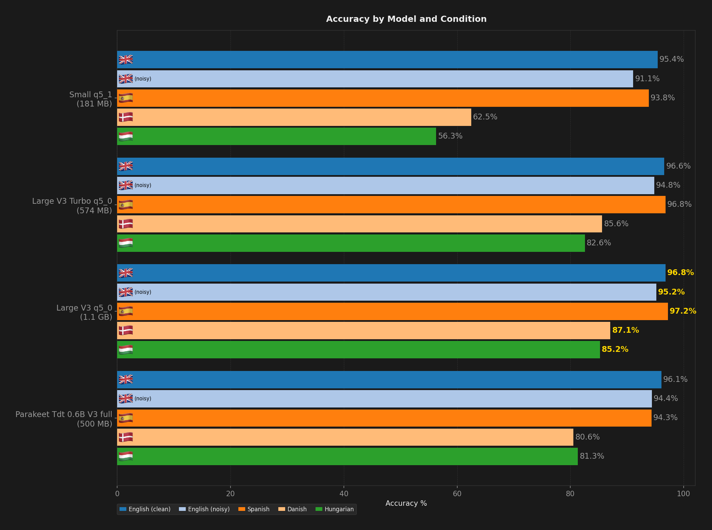
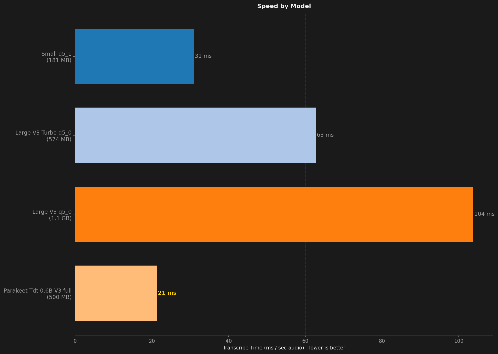
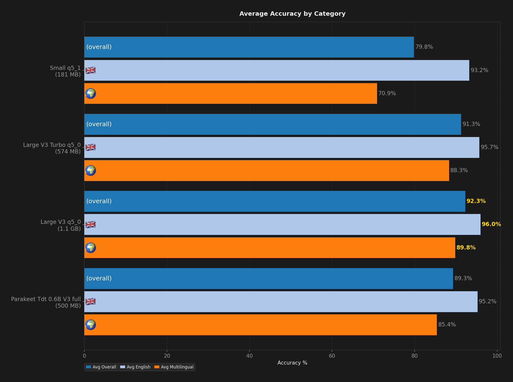
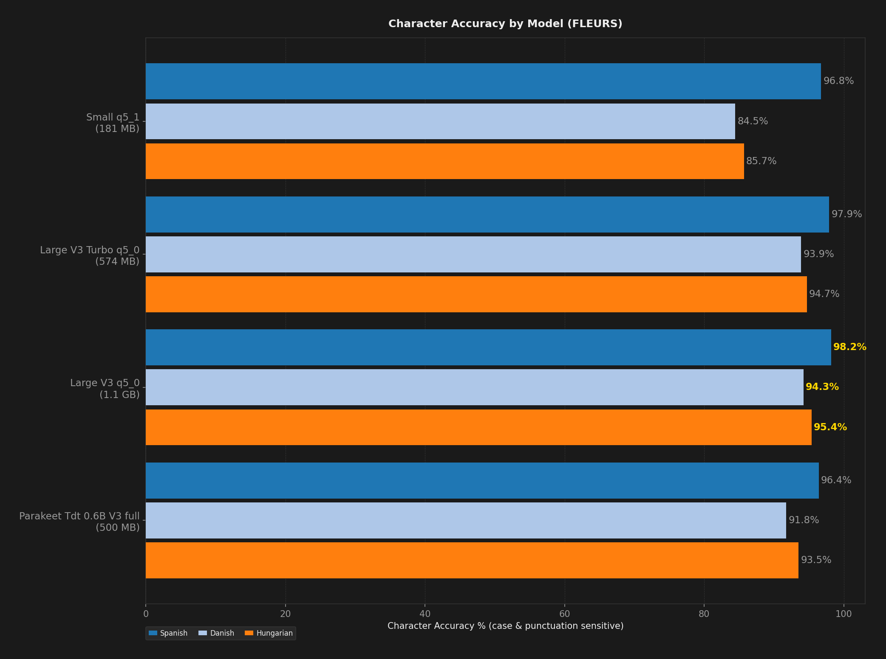

# STT Benchmark Report

**Description:** Curated models at 400 samples per dataset to match the Wispr Flow 1.6.765 external-product run at equal depth for the published comparison

- **Date:** 2026-09-04T09:41:04.025Z
- **Hardware:** Apple M4 Max / 36 GB / macOS 26.6.2
- **Samples per dataset:** 400
- **Warmup utterances:** 3
- **ASR Harness:** crispasr
- **Combinations tested:** 4

## Summary

| Model | Disk | Min Peak RSS | Avg Peak RSS | Max Peak RSS | Transcribe Time / sec Audio | Avg Overall | Avg English | Avg Multilingual | English (clean) | English (noisy) | Spanish | Danish | Hungarian | Avg Char Accuracy |
| --- | --- | --- | --- | --- | --- | --- | --- | --- | --- | --- | --- | --- | --- | --- |
| Large V3 q5_0 | 1.1 GB | 1.5 GB | 1.5 GB | 1.5 GB | 99 ms | **92.3%** | **96.0%** | **89.8%** | **96.8%** | **95.2%** | **97.2%** | **87.1%** | **85.2%** | **96.0%** |
| Large V3 Turbo q5_0 | 574 MB | 755 MB | 757 MB | 759 MB | 59 ms | 91.3% | 95.7% | 88.3% | 96.6% | 94.8% | 96.8% | 85.6% | 82.6% | 95.5% |
| Parakeet TDT v3 full | 500 MB | **78 MB** | **80 MB** | **86 MB** | **20 ms** | 89.3% | 95.2% | 85.4% | 96.1% | 94.4% | 94.3% | 80.6% | 81.3% | 93.9% |
| Small q5_1 | **181 MB** | 382 MB | 383 MB | 386 MB | 30 ms | 79.8% | 93.2% | 70.9% | 95.4% | 91.1% | 93.8% | 62.5% | 56.3% | 89.0% |

## Ratings (1-10)

| Model | Speed | Accuracy | Languages |
| --- | --- | --- | --- |
| Large V3 q5_0 | 7 | 9 | 10 |
| Large V3 Turbo q5_0 | 8 | 9 | 10 |
| Parakeet TDT v3 full | 9 | 9 | 8 |
| Small q5_1 | 9 | 7 | 10 |

## Charts (All Models)

## Accuracy by Condition

### English (clean)

| Model | Accuracy (%) |
| --- | --- |
| Large V3 q5_0 | 96.8% |
| Large V3 Turbo q5_0 | 96.6% |
| Parakeet TDT v3 full | 96.1% |
| Small q5_1 | 95.4% |

### English (noisy)

| Model | Accuracy (%) |
| --- | --- |
| Large V3 q5_0 | 95.2% |
| Large V3 Turbo q5_0 | 94.8% |
| Parakeet TDT v3 full | 94.4% |
| Small q5_1 | 91.1% |

### Spanish

| Model | Word Accuracy (%) | Char Accuracy (%) |
| --- | --- | --- |
| Large V3 q5_0 | 97.2% | 98.2% |
| Large V3 Turbo q5_0 | 96.8% | 97.9% |
| Parakeet TDT v3 full | 94.3% | 96.4% |
| Small q5_1 | 93.8% | 96.8% |

### Danish

| Model | Word Accuracy (%) | Char Accuracy (%) |
| --- | --- | --- |
| Large V3 q5_0 | 87.1% | 94.3% |
| Large V3 Turbo q5_0 | 85.6% | 93.9% |
| Parakeet TDT v3 full | 80.6% | 91.8% |
| Small q5_1 | 62.5% | 84.5% |

### Hungarian

| Model | Word Accuracy (%) | Char Accuracy (%) |
| --- | --- | --- |
| Large V3 q5_0 | 85.2% | 95.4% |
| Large V3 Turbo q5_0 | 82.6% | 94.7% |
| Parakeet TDT v3 full | 81.3% | 93.5% |
| Small q5_1 | 56.3% | 85.7% |

## Speed by Condition

### English (clean)

| Model | Transcribe Time / sec Audio |
| --- | --- |
| Large V3 q5_0 | 123 ms |
| Large V3 Turbo q5_0 | 78 ms |
| Parakeet TDT v3 full | 25 ms |
| Small q5_1 | 36 ms |

### English (noisy)

| Model | Transcribe Time / sec Audio |
| --- | --- |
| Large V3 q5_0 | 129 ms |
| Large V3 Turbo q5_0 | 81 ms |
| Parakeet TDT v3 full | 28 ms |
| Small q5_1 | 37 ms |

### Spanish

| Model | Transcribe Time / sec Audio |
| --- | --- |
| Large V3 q5_0 | 81 ms |
| Large V3 Turbo q5_0 | 47 ms |
| Parakeet TDT v3 full | 17 ms |
| Small q5_1 | 24 ms |

### Danish

| Model | Transcribe Time / sec Audio |
| --- | --- |
| Large V3 q5_0 | 92 ms |
| Large V3 Turbo q5_0 | 54 ms |
| Parakeet TDT v3 full | 19 ms |
| Small q5_1 | 28 ms |

### Hungarian

| Model | Transcribe Time / sec Audio |
| --- | --- |
| Large V3 q5_0 | 93 ms |
| Large V3 Turbo q5_0 | 52 ms |
| Parakeet TDT v3 full | 17 ms |
| Small q5_1 | 28 ms |
