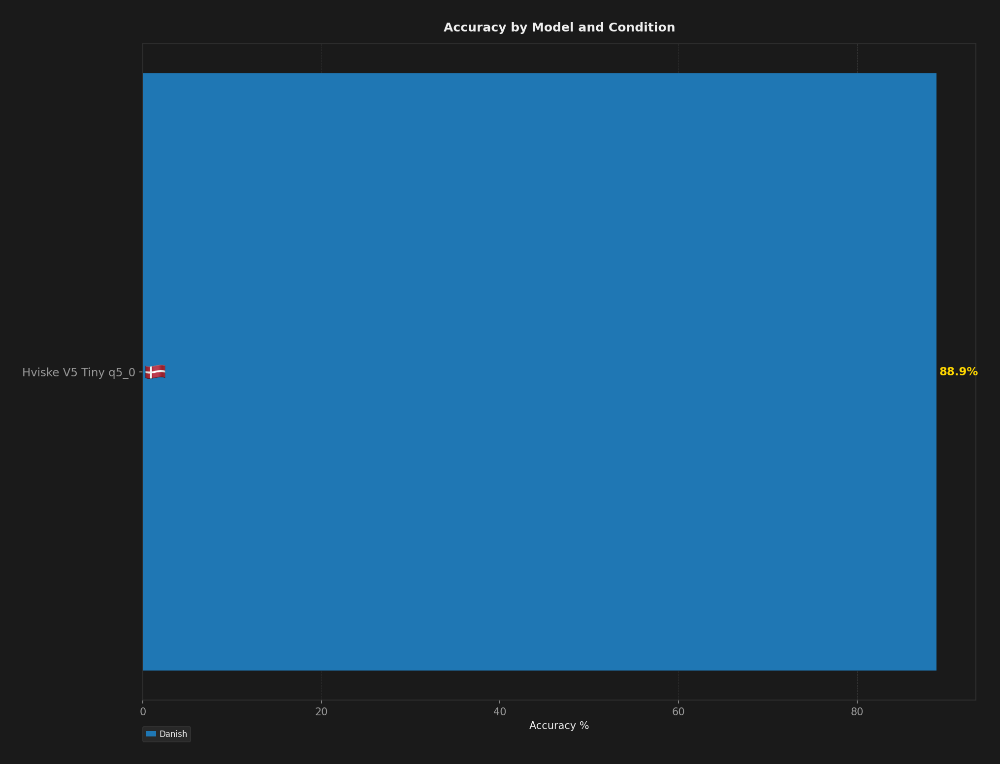
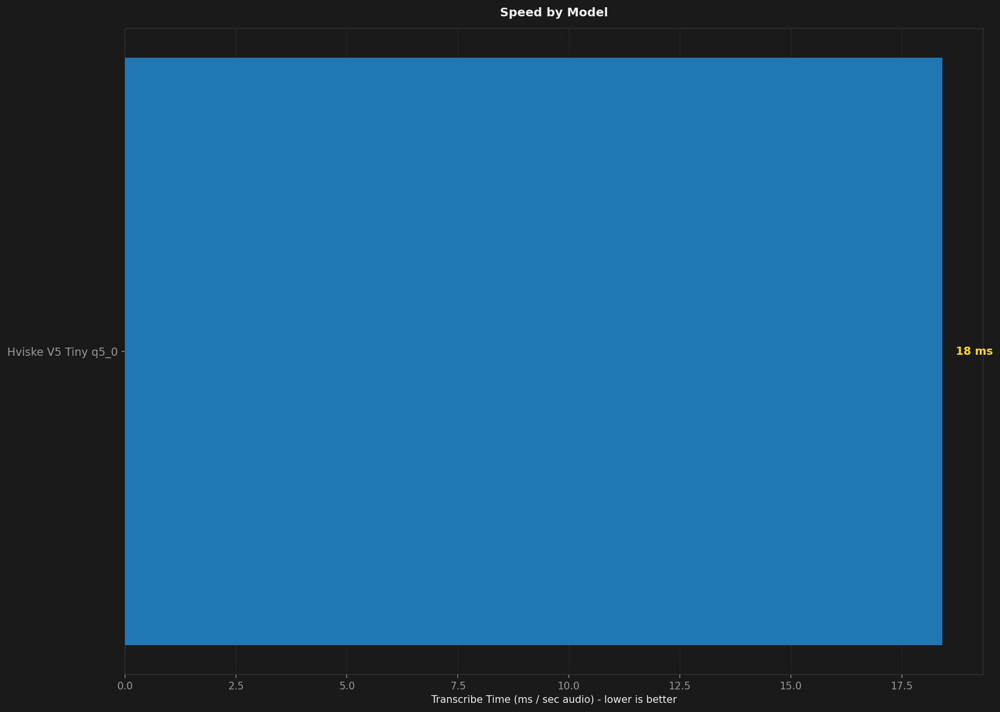
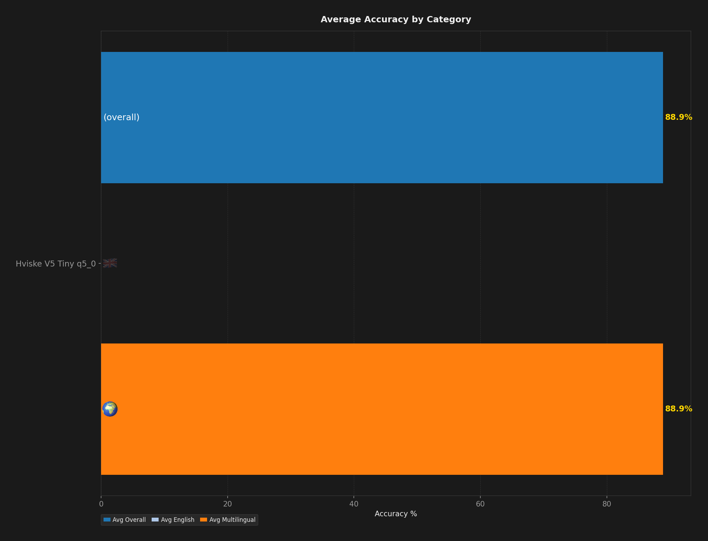
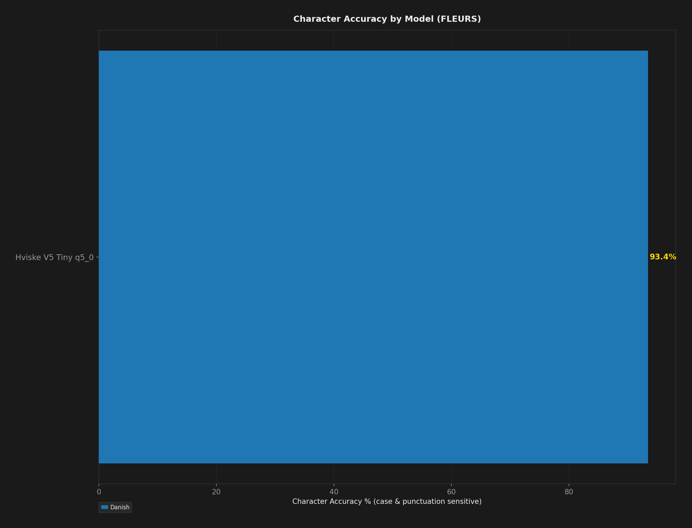

# STT Benchmark Report

**Description:** hviske-v5-tiny-q5_0 on FLEURS Danish at 400 samples to match the Wispr Flow 1.6.765 depth for the published comparison

- **Date:** 2026-09-04T09:43:22.717Z
- **Hardware:** Apple M4 Max / 36 GB / macOS 26.6.2
- **Samples per dataset:** 400
- **Warmup utterances:** 3
- **ASR Harness:** crispasr
- **Combinations tested:** 1

## Summary

| Model | Disk | Min Peak RSS | Avg Peak RSS | Max Peak RSS | Transcribe Time / sec Audio | Avg Overall | Avg English | Avg Multilingual | Danish | Avg Char Accuracy |
| --- | --- | --- | --- | --- | --- | --- | --- | --- | --- | --- |
| Hviske V5 Tiny Q5 q5_0 | **181 MB** | **300 MB** | **305 MB** | **308 MB** | **18 ms** | **88.9%** | - | **88.9%** | **88.9%** | **93.4%** |

## Ratings (1-10)

| Model | Speed | Accuracy | Languages |
| --- | --- | --- | --- |
| Hviske V5 Tiny Q5 q5_0 | 10 | 9 | 1 |

## Charts (All Models)

## Accuracy by Condition

### Danish

| Model | Word Accuracy (%) | Char Accuracy (%) |
| --- | --- | --- |
| Hviske V5 Tiny Q5 q5_0 | 88.9% | 93.4% |

## Speed by Condition

### Danish

| Model | Transcribe Time / sec Audio |
| --- | --- |
| Hviske V5 Tiny Q5 q5_0 | 18 ms |
