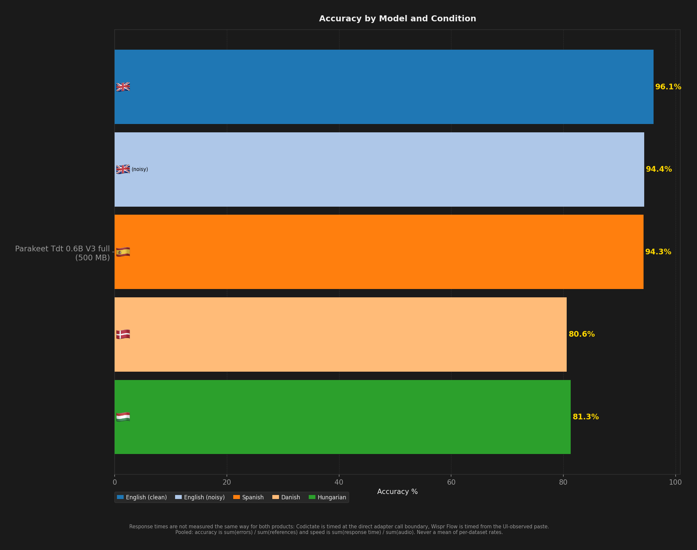
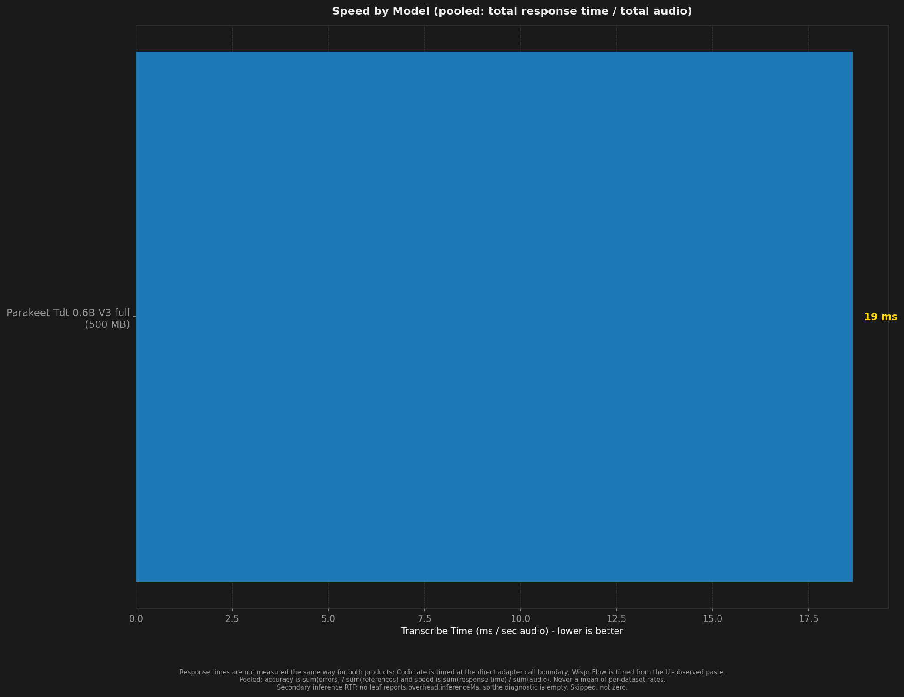
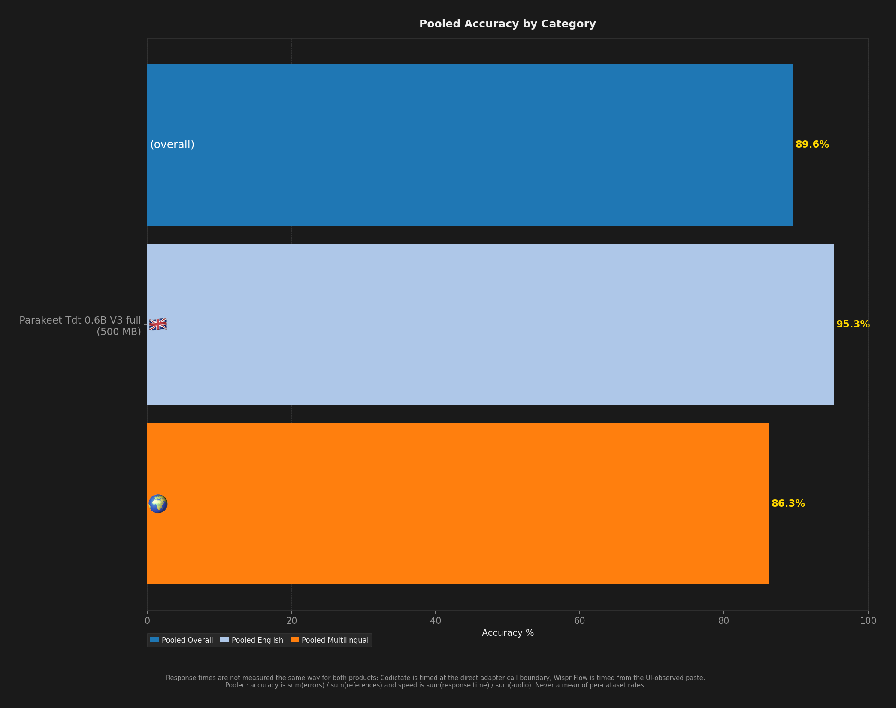
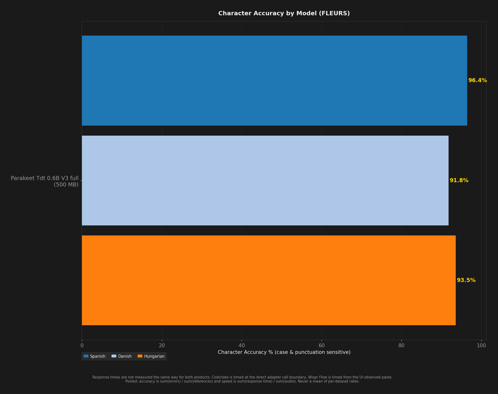

# STT Benchmark Report

**Description:** benchmark-v2 publication batch 2026-09-v2; codictate parakeet-tdt-0.6b-v3; clips [0, 400) of the consumable range; hotkey option+z

- **Date:** 2026-09-05T07:09:59.751Z
- **Hardware:** Apple M4 Max / 36 GB / macOS 26.6.2
- **Pooled unique scored clips per dataset:** 400
- **Sample selection:** `--to 400` (topped every dataset up to depth 400)
- **Warmup utterances:** 3
- **ASR Harness:** crispasr
- **Combinations tested:** 1

> Response times are not measured the same way for both products: Codictate is timed at the direct adapter call boundary, Wispr Flow is timed from the UI-observed paste.

Accuracy and speed are **pooled**: `sum(errors) / sum(references)` and `sum(response time) / sum(audio)`. An unweighted mean of per-dataset rates is a different number and is never published. Leaves with no denominator are skipped, never counted as zero.

Speed comes from `speedV2` - the provenance-filtered v2 measurement - and a leaf that has none is shown as `(legacy)`, from `meanRTF`. The two are different measurements (`meanRTF` is session wall clock over audio, over every scored Sample) and neither ever stands in for the other.

## Summary

| Model | Disk | Min Peak RSS | Avg Peak RSS | Max Peak RSS | Transcribe Time / sec Audio | Pooled Overall | Pooled English | Pooled Multilingual | English (clean) | English (noisy) | Spanish | Danish | Hungarian | Pooled Char Accuracy | Failures |
| --- | --- | --- | --- | --- | --- | --- | --- | --- | --- | --- | --- | --- | --- | --- | --- |
| Parakeet TDT v3 full | **500 MB** | **78 MB** | **80 MB** | **86 MB** | **19 ms** | **89.6%** | **95.3%** | **86.3%** | **96.1%** | **94.4%** | **94.3%** | **80.6%** | **81.3%** | **94.1%** | 0 |

## Ratings (1-10)

| Model | Speed | Accuracy | Languages |
| --- | --- | --- | --- |
| Parakeet TDT v3 full | 10 | 9 | 8 |

## Charts (All Models)

## Accuracy by Condition

### English (clean)

| Model | Accuracy (%) |
| --- | --- |
| Parakeet TDT v3 full | 96.1% |

### English (noisy)

| Model | Accuracy (%) |
| --- | --- |
| Parakeet TDT v3 full | 94.4% |

### Spanish

| Model | Word Accuracy (%) | Char Accuracy (%) |
| --- | --- | --- |
| Parakeet TDT v3 full | 94.3% | 96.4% |

### Danish

| Model | Word Accuracy (%) | Char Accuracy (%) |
| --- | --- | --- |
| Parakeet TDT v3 full | 80.6% | 91.8% |

### Hungarian

| Model | Word Accuracy (%) | Char Accuracy (%) |
| --- | --- | --- |
| Parakeet TDT v3 full | 81.3% | 93.5% |

## Speed by Condition

### English (clean)

| Model | Transcribe Time / sec Audio |
| --- | --- |
| Parakeet TDT v3 full | 25 ms |

### English (noisy)

| Model | Transcribe Time / sec Audio |
| --- | --- |
| Parakeet TDT v3 full | 26 ms |

### Spanish

| Model | Transcribe Time / sec Audio |
| --- | --- |
| Parakeet TDT v3 full | 15 ms |

### Danish

| Model | Transcribe Time / sec Audio |
| --- | --- |
| Parakeet TDT v3 full | 17 ms |

### Hungarian

| Model | Transcribe Time / sec Audio |
| --- | --- |
| Parakeet TDT v3 full | 16 ms |
