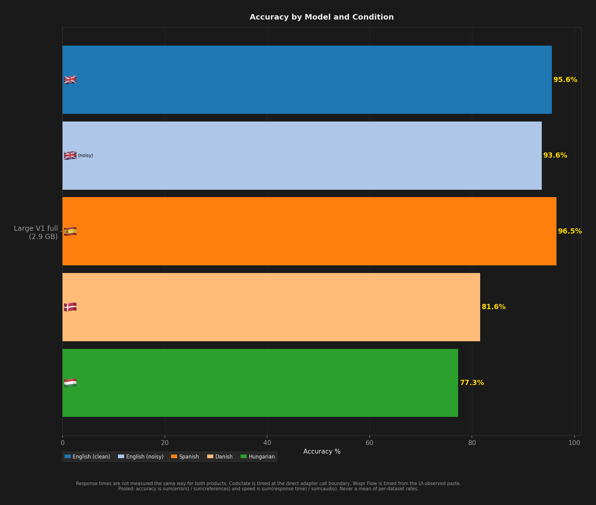
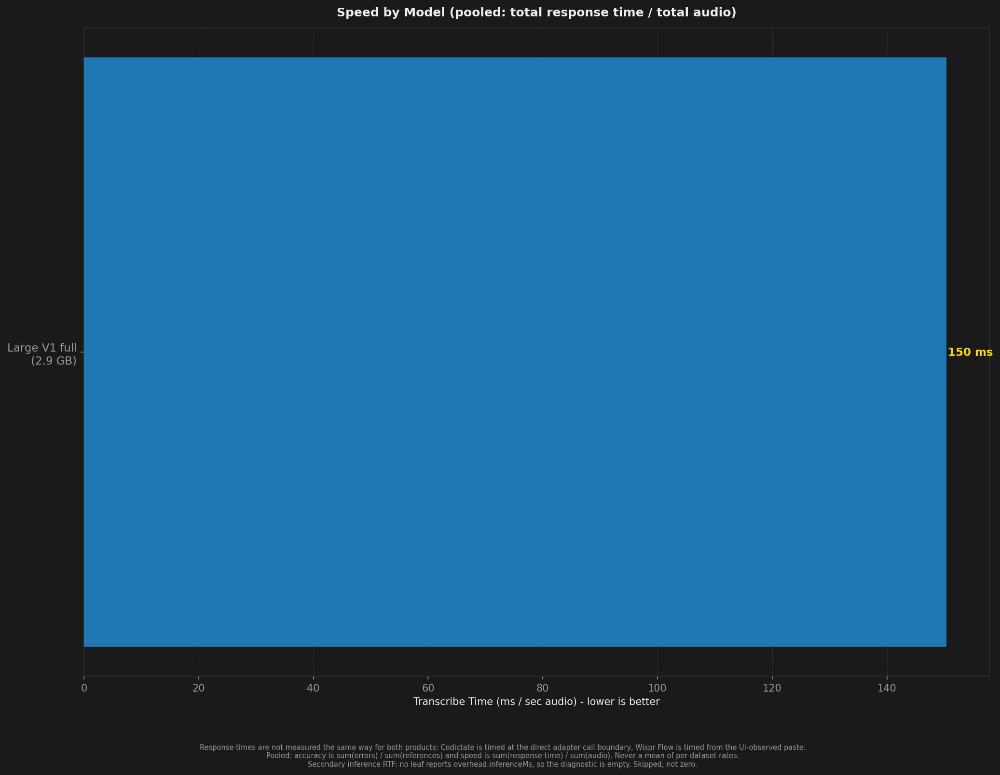
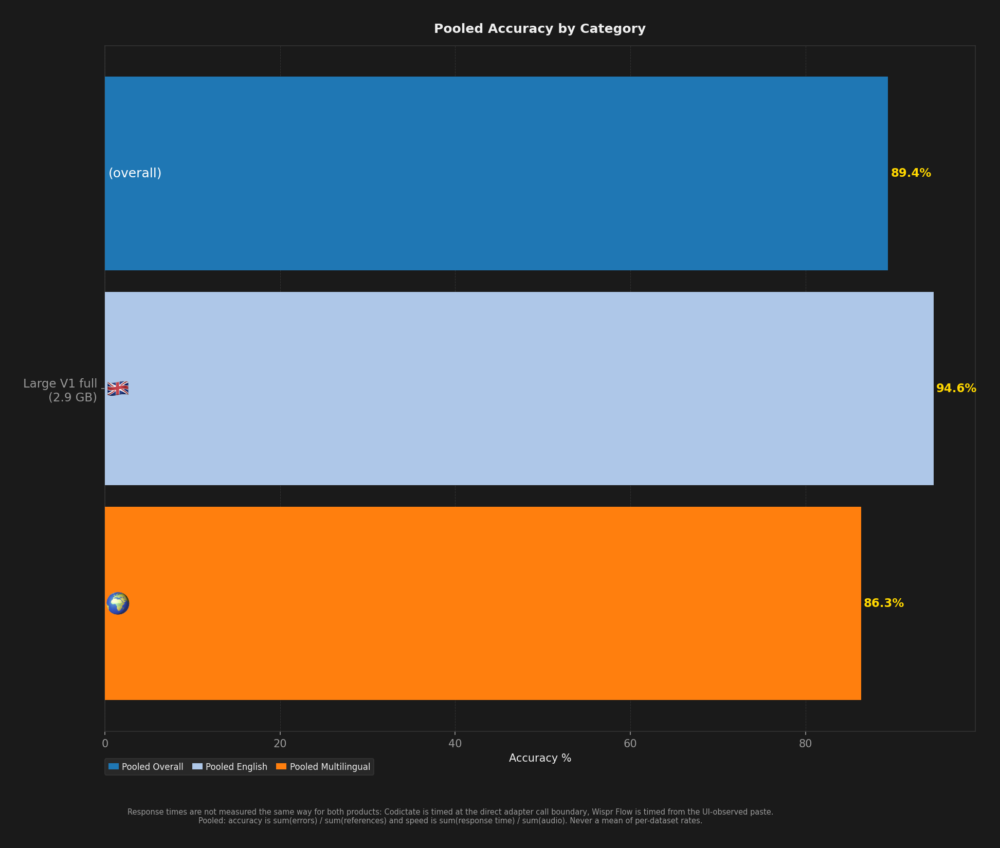
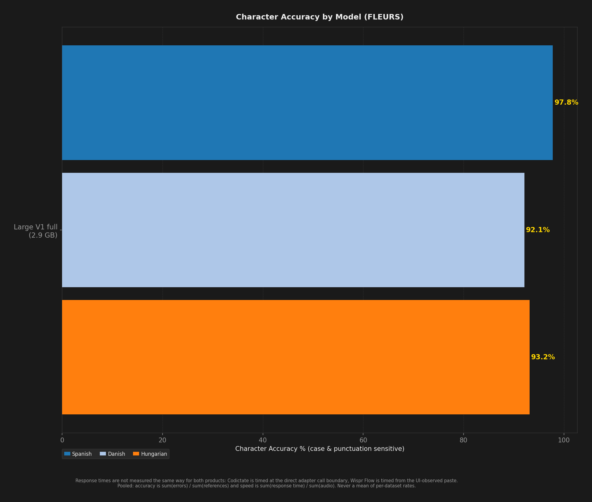

# STT Benchmark Report

**Description:** benchmark-v2 publication batch 2026-09-v2; codictate large-v1; clips [0, 400) of the consumable range; hotkey option+z

- **Date:** 2026-09-05T08:02:02.497Z
- **Hardware:** Apple M4 Max / 36 GB / macOS 26.6.2
- **Pooled unique scored clips per dataset:** 400
- **Sample selection:** `--to 400` (topped every dataset up to depth 400)
- **Warmup utterances:** 3
- **ASR Harness:** crispasr
- **Combinations tested:** 1

> Response times are not measured the same way for both products: Codictate is timed at the direct adapter call boundary, Wispr Flow is timed from the UI-observed paste.

Accuracy and speed are **pooled**: `sum(errors) / sum(references)` and `sum(response time) / sum(audio)`. An unweighted mean of per-dataset rates is a different number and is never published. Leaves with no denominator are skipped, never counted as zero.

Speed comes from `speedV2` - the provenance-filtered v2 measurement - and a leaf that has none is shown as `(legacy)`, from `meanRTF`. The two are different measurements (`meanRTF` is session wall clock over audio, over every scored Sample) and neither ever stands in for the other.

## Summary

| Model | Disk | Min Peak RSS | Avg Peak RSS | Max Peak RSS | Transcribe Time / sec Audio | Pooled Overall | Pooled English | Pooled Multilingual | English (clean) | English (noisy) | Spanish | Danish | Hungarian | Pooled Char Accuracy | Failures |
| --- | --- | --- | --- | --- | --- | --- | --- | --- | --- | --- | --- | --- | --- | --- | --- |
| Large V1 full | **2.9 GB** | **3.5 GB** | **3.5 GB** | **3.5 GB** | **150 ms** | **89.4%** | **94.6%** | **86.3%** | **95.6%** | **93.6%** | **96.5%** | **81.6%** | **77.3%** | **94.5%** | 0 |

## Ratings (1-10)

| Model | Speed | Accuracy | Languages |
| --- | --- | --- | --- |
| Large V1 full | 6 | 9 | 10 |

## Charts (All Models)

## Accuracy by Condition

### English (clean)

| Model | Accuracy (%) |
| --- | --- |
| Large V1 full | 95.6% |

### English (noisy)

| Model | Accuracy (%) |
| --- | --- |
| Large V1 full | 93.6% |

### Spanish

| Model | Word Accuracy (%) | Char Accuracy (%) |
| --- | --- | --- |
| Large V1 full | 96.5% | 97.8% |

### Danish

| Model | Word Accuracy (%) | Char Accuracy (%) |
| --- | --- | --- |
| Large V1 full | 81.6% | 92.1% |

### Hungarian

| Model | Word Accuracy (%) | Char Accuracy (%) |
| --- | --- | --- |
| Large V1 full | 77.3% | 93.2% |

## Speed by Condition

### English (clean)

| Model | Transcribe Time / sec Audio |
| --- | --- |
| Large V1 full | 187 ms |

### English (noisy)

| Model | Transcribe Time / sec Audio |
| --- | --- |
| Large V1 full | 199 ms |

### Spanish

| Model | Transcribe Time / sec Audio |
| --- | --- |
| Large V1 full | 122 ms |

### Danish

| Model | Transcribe Time / sec Audio |
| --- | --- |
| Large V1 full | 139 ms |

### Hungarian

| Model | Transcribe Time / sec Audio |
| --- | --- |
| Large V1 full | 140 ms |
