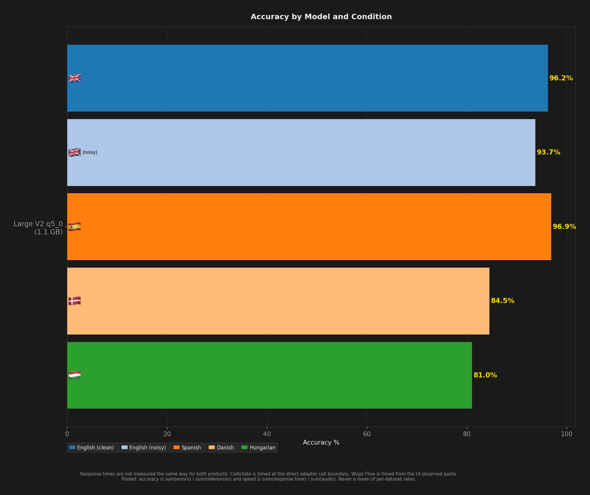
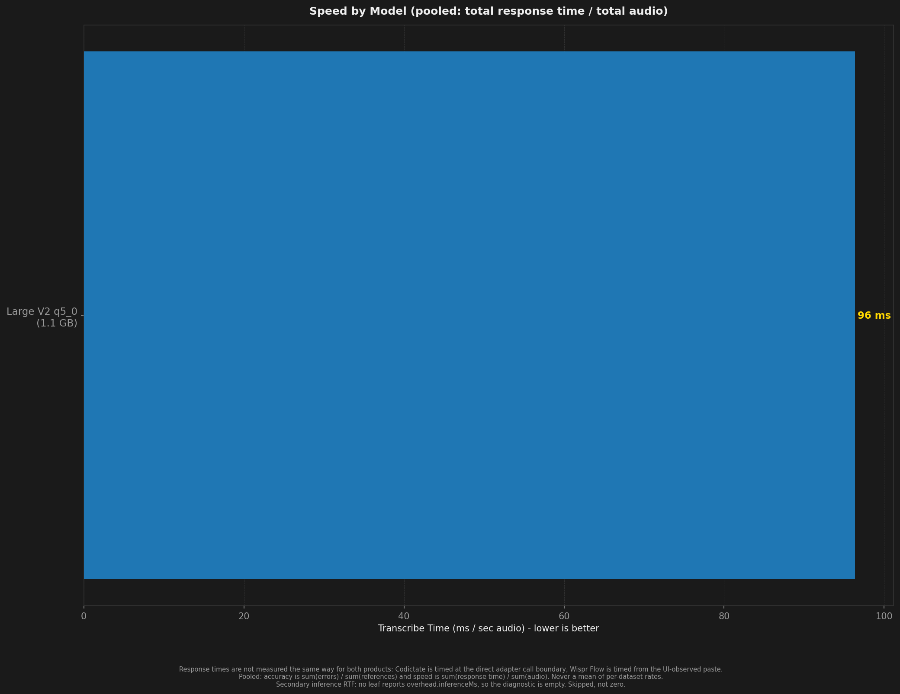
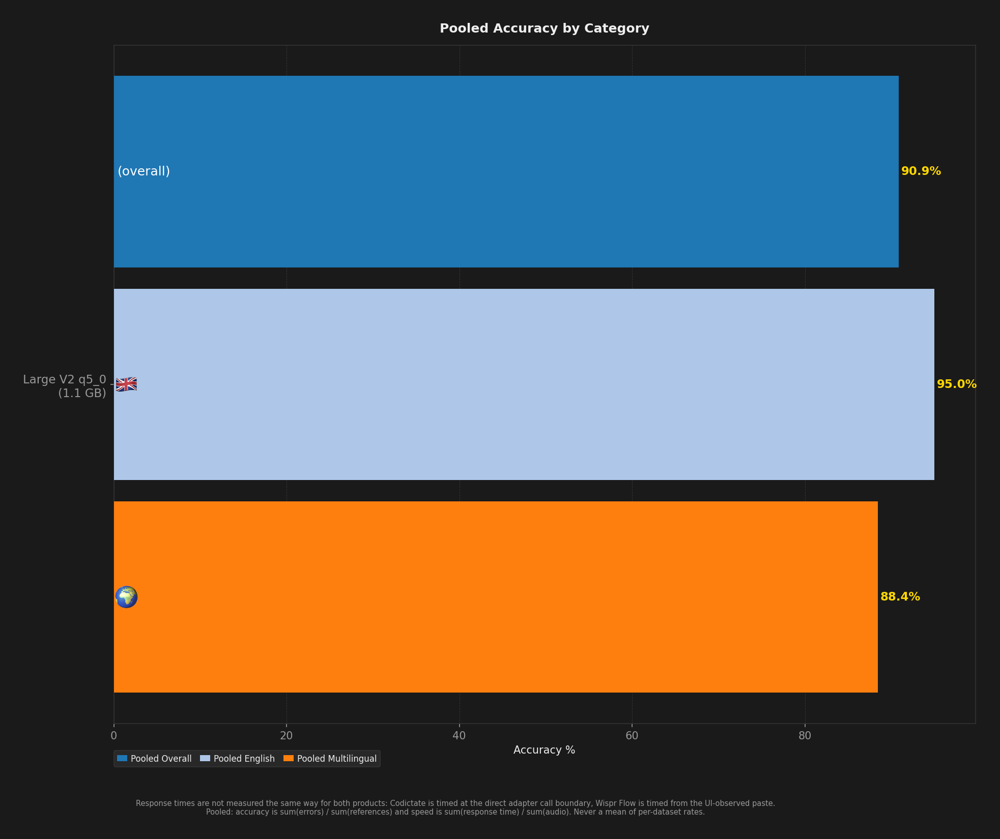
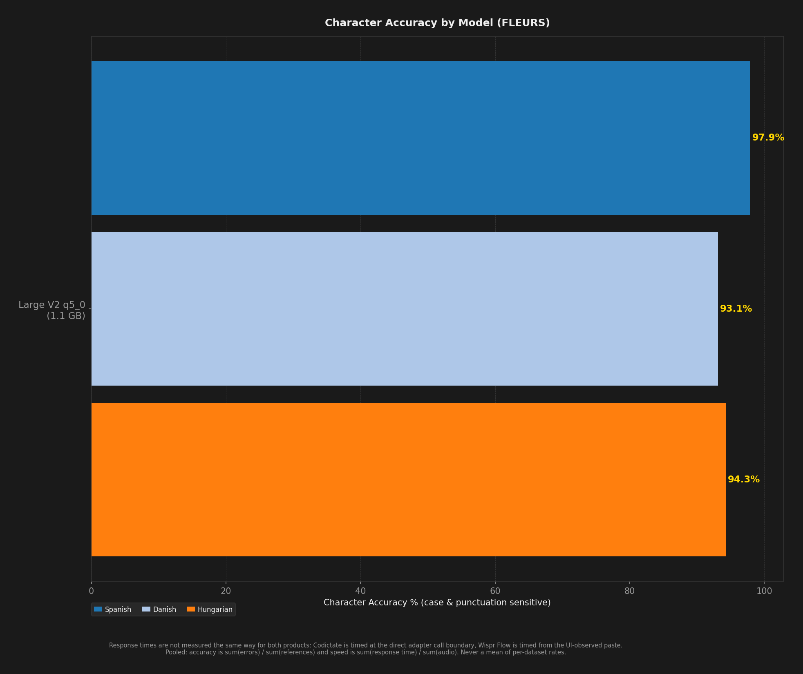

# STT Benchmark Report

**Description:** benchmark-v2 publication batch 2026-09-v2; codictate large-v2-q5_0; clips [0, 400) of the consumable range; hotkey option+z

- **Date:** 2026-09-05T09:27:02.712Z
- **Hardware:** Apple M4 Max / 36 GB / macOS 26.6.2
- **Pooled unique scored clips per dataset:** 400
- **Sample selection:** `--to 400` (topped every dataset up to depth 400)
- **Warmup utterances:** 3
- **ASR Harness:** crispasr
- **Combinations tested:** 1

> Response times are not measured the same way for both products: Codictate is timed at the direct adapter call boundary, Wispr Flow is timed from the UI-observed paste.

Accuracy and speed are **pooled**: `sum(errors) / sum(references)` and `sum(response time) / sum(audio)`. An unweighted mean of per-dataset rates is a different number and is never published. Leaves with no denominator are skipped, never counted as zero.

Speed comes from `speedV2` - the provenance-filtered v2 measurement - and a leaf that has none is shown as `(legacy)`, from `meanRTF`. The two are different measurements (`meanRTF` is session wall clock over audio, over every scored Sample) and neither ever stands in for the other.

## Summary

| Model | Disk | Min Peak RSS | Avg Peak RSS | Max Peak RSS | Transcribe Time / sec Audio | Pooled Overall | Pooled English | Pooled Multilingual | English (clean) | English (noisy) | Spanish | Danish | Hungarian | Pooled Char Accuracy | Failures |
| --- | --- | --- | --- | --- | --- | --- | --- | --- | --- | --- | --- | --- | --- | --- | --- |
| Large V2 q5_0 | **1.1 GB** | **1.5 GB** | **1.5 GB** | **1.5 GB** | **96 ms** | **90.9%** | **95.0%** | **88.4%** | **96.2%** | **93.7%** | **96.9%** | **84.5%** | **81.0%** | **95.3%** | 0 |

## Ratings (1-10)

| Model | Speed | Accuracy | Languages |
| --- | --- | --- | --- |
| Large V2 q5_0 | 8 | 9 | 10 |

## Charts (All Models)

## Accuracy by Condition

### English (clean)

| Model | Accuracy (%) |
| --- | --- |
| Large V2 q5_0 | 96.2% |

### English (noisy)

| Model | Accuracy (%) |
| --- | --- |
| Large V2 q5_0 | 93.7% |

### Spanish

| Model | Word Accuracy (%) | Char Accuracy (%) |
| --- | --- | --- |
| Large V2 q5_0 | 96.9% | 97.9% |

### Danish

| Model | Word Accuracy (%) | Char Accuracy (%) |
| --- | --- | --- |
| Large V2 q5_0 | 84.5% | 93.1% |

### Hungarian

| Model | Word Accuracy (%) | Char Accuracy (%) |
| --- | --- | --- |
| Large V2 q5_0 | 81.0% | 94.3% |

## Speed by Condition

### English (clean)

| Model | Transcribe Time / sec Audio |
| --- | --- |
| Large V2 q5_0 | 121 ms |

### English (noisy)

| Model | Transcribe Time / sec Audio |
| --- | --- |
| Large V2 q5_0 | 124 ms |

### Spanish

| Model | Transcribe Time / sec Audio |
| --- | --- |
| Large V2 q5_0 | 77 ms |

### Danish

| Model | Transcribe Time / sec Audio |
| --- | --- |
| Large V2 q5_0 | 91 ms |

### Hungarian

| Model | Transcribe Time / sec Audio |
| --- | --- |
| Large V2 q5_0 | 91 ms |
