# STT Benchmark Report

**Description:** Clips 401-950, 13 multilingual models, matching the Flow comparison depth

- **Date:** 2026-09-18T04:52:25.659Z
- **Hardware:** Apple M4 Max / 36 GB / macOS 26.6.2
- **Pooled unique scored clips per dataset:** 550
- **Sample selection:** `--to 950` (topped every dataset up to depth 950)
- **Warmup utterances:** 3
- **ASR Harness:** crispasr
- **Combinations tested:** 13

> Response times are not measured the same way for both products: Codictate is timed at the direct adapter call boundary, Wispr Flow is timed from the UI-observed paste.

Accuracy and speed are **pooled**: `sum(errors) / sum(references)` and `sum(response time) / sum(audio)`. An unweighted mean of per-dataset rates is a different number and is never published. Leaves with no denominator are skipped, never counted as zero.

Speed comes from `speedV2` - the provenance-filtered v2 measurement - and a leaf that has none is shown as `(legacy)`, from `meanRTF`. The two are different measurements (`meanRTF` is session wall clock over audio, over every scored Sample) and neither ever stands in for the other.

## Summary

| Model | Disk | Min Peak RSS | Avg Peak RSS | Max Peak RSS | Transcribe Time / sec Audio | Pooled Overall | Pooled English | Pooled Multilingual | English (clean) | English (noisy) | Spanish | Danish | Hungarian | Pooled Char Accuracy | Failures |
| --- | --- | --- | --- | --- | --- | --- | --- | --- | --- | --- | --- | --- | --- | --- | --- |
| Large V1 full | 2.9 GB | 3.5 GB | 3.5 GB | 3.5 GB | 149 ms | 89.5% | 95.0% | 86.1% | 96.5% | 93.3% | 96.1% | 82.4% | 77.2% | 94.4% | 0 |
| Large V2 full | 2.9 GB | 3.5 GB | 3.5 GB | 3.5 GB | 148 ms | 91.1% | 95.5% | 88.4% | 96.6% | 94.2% | 96.5% | 85.6% | 80.9% | 95.1% | 0 |
| Large V2 q5_0 | 1.1 GB | 1.5 GB | 1.5 GB | 1.5 GB | 97 ms | 91.1% | 95.5% | 88.3% | 96.7% | 94.1% | 96.6% | 85.4% | 80.9% | 95.1% | 0 |
| Large V2 q8_0 | 1.5 GB | 2.1 GB | 2.1 GB | 2.1 GB | 110 ms | 91.1% | 95.4% | 88.4% | 96.6% | 94.1% | 96.5% | 85.6% | 80.9% | 95.1% | 0 |
| Large V3 full | 2.9 GB | 3.5 GB | 3.5 GB | 3.5 GB | 149 ms | **92.8%** | **96.1%** | **90.7%** | **97.2%** | **95.0%** | **97.0%** | **87.8%** | 85.7% | 96.1% | 0 |
| Large V3 q5_0 | 1.1 GB | 1.5 GB | 1.5 GB | 1.6 GB | 98 ms | 92.7% | 96.1% | 90.7% | 97.2% | 94.9% | 97.0% | 87.7% | **85.8%** | **96.1%** | 0 |
| Large V3 Turbo full | 1.5 GB | 1.9 GB | 1.9 GB | 1.9 GB | 82 ms | 92.1% | 95.8% | 89.8% | 96.9% | 94.5% | 96.8% | 87.1% | 83.7% | 95.7% | 0 |
| Large V3 Turbo q5_0 | 574 MB | 779 MB | 781 MB | 783 MB | 59 ms | 91.8% | 95.7% | 89.4% | 96.9% | 94.3% | 96.6% | 86.5% | 83.3% | 95.6% | 0 |
| Large V3 Turbo q8_0 | 834 MB | 1.1 GB | 1.1 GB | 1.1 GB | 65 ms | 92.1% | 95.8% | 89.8% | 96.9% | 94.6% | 96.8% | 87.1% | 83.6% | 95.7% | 0 |
| Medium full | 1.5 GB | 1.9 GB | 1.9 GB | 1.9 GB | 85 ms | 88.1% | 94.9% | 84.0% | 96.6% | 93.1% | 96.1% | 79.3% | 73.5% | 93.7% | 0 |
| Medium q5_0 | 514 MB | 879 MB | 880 MB | 881 MB | 59 ms | 88.0% | 95.0% | 83.7% | 96.7% | 93.1% | 96.1% | 78.8% | 73.0% | 93.6% | 0 |
| Medium q8_0 | 785 MB | 1.2 GB | 1.2 GB | 1.2 GB | 65 ms | 88.1% | 95.0% | 83.9% | 96.6% | 93.1% | 96.1% | 79.1% | 73.4% | 93.7% | 0 |
| Parakeet TDT v3 full | **500 MB** | **78 MB** | **80 MB** | **85 MB** | **7 ms** | 89.8% | 95.0% | 86.6% | 96.3% | 93.6% | 95.8% | 80.3% | 81.9% | 94.3% | 0 |

## Ratings (1-10)

| Model | Speed | Accuracy | Languages |
| --- | --- | --- | --- |
| Large V1 full | 6 | 9 | 10 |
| Large V2 full | 6 | 9 | 10 |
| Large V2 q5_0 | 8 | 9 | 10 |
| Large V2 q8_0 | 7 | 9 | 10 |
| Large V3 full | 6 | 10 | 10 |
| Large V3 q5_0 | 7 | 10 | 10 |
| Large V3 Turbo full | 8 | 9 | 10 |
| Large V3 Turbo q5_0 | 8 | 9 | 10 |
| Large V3 Turbo q8_0 | 8 | 9 | 10 |
| Medium full | 8 | 9 | 10 |
| Medium q5_0 | 8 | 9 | 10 |
| Medium q8_0 | 8 | 9 | 10 |
| Parakeet TDT v3 full | 10 | 9 | 8 |

## Charts (Large V1 full - Large V3 Turbo q5_0)

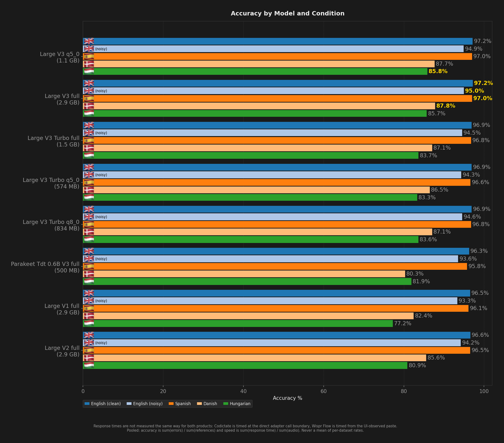

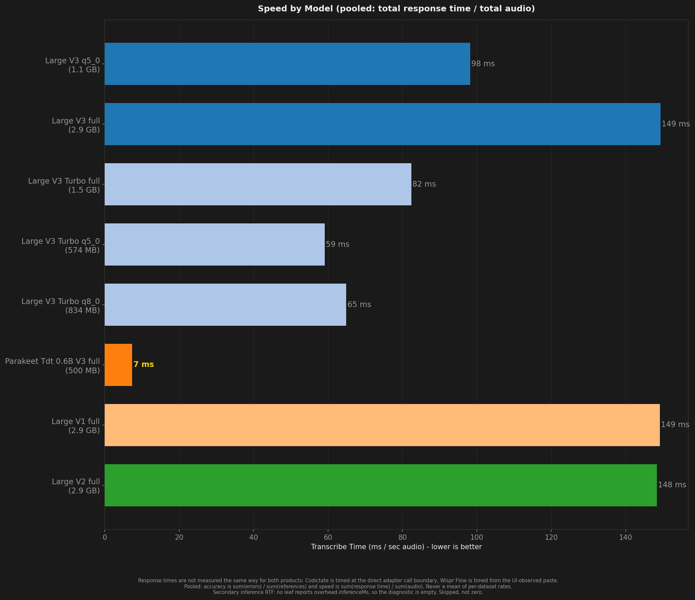

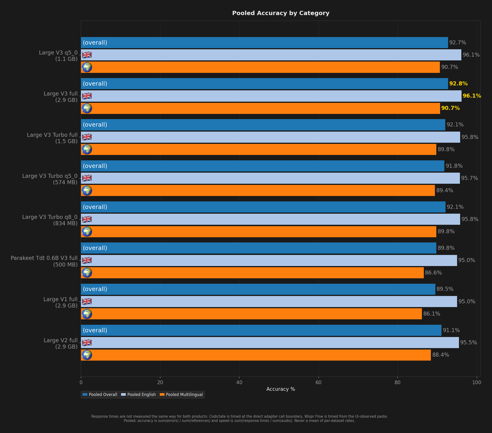

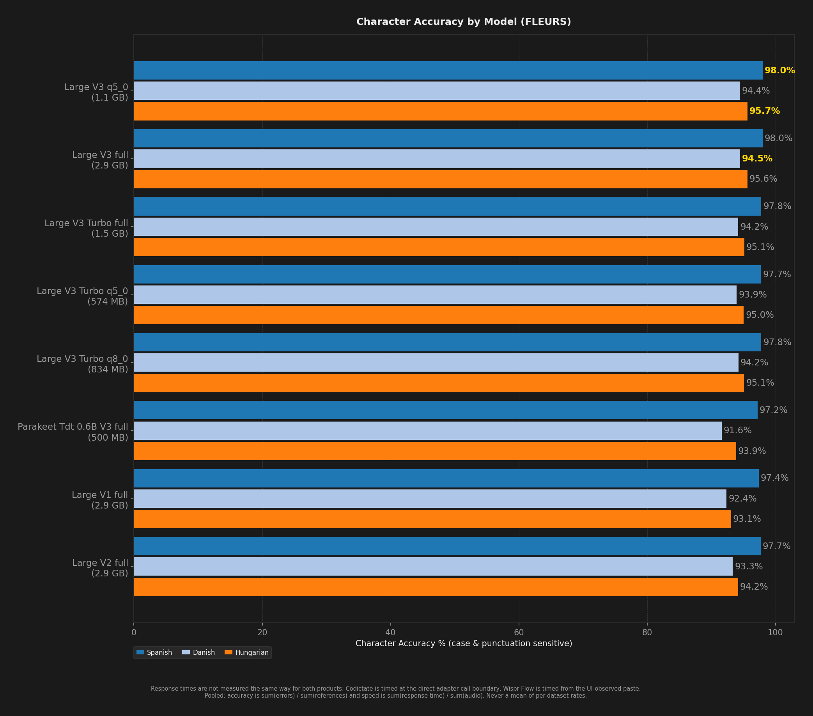

## Charts (Large V3 Turbo q8_0 - Parakeet TDT v3 full)

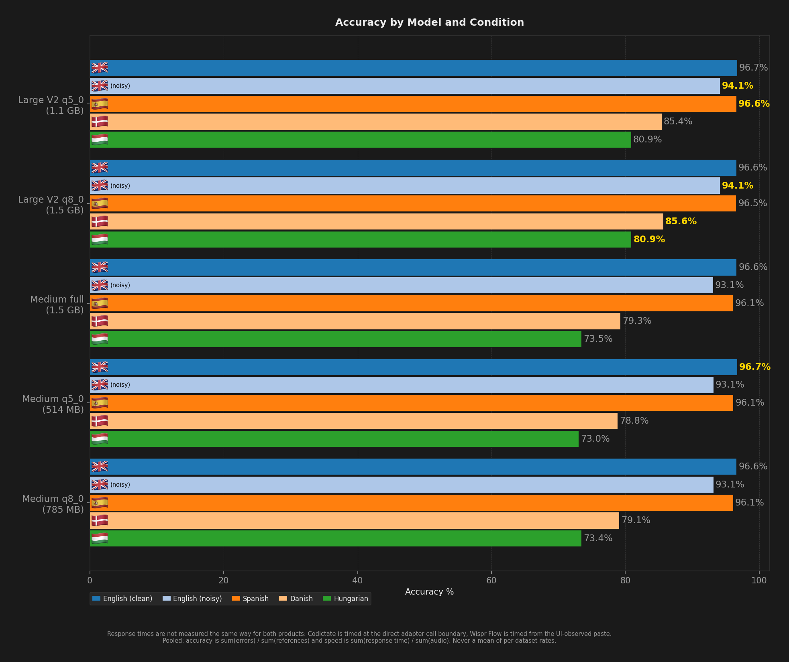

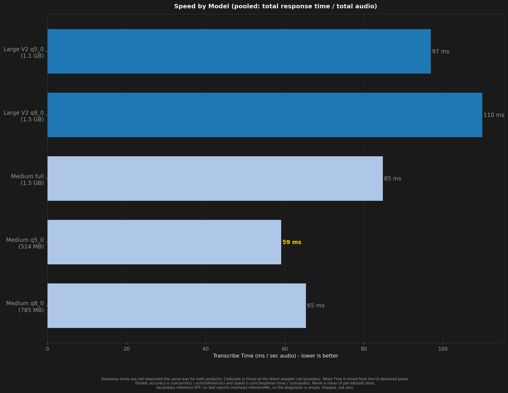

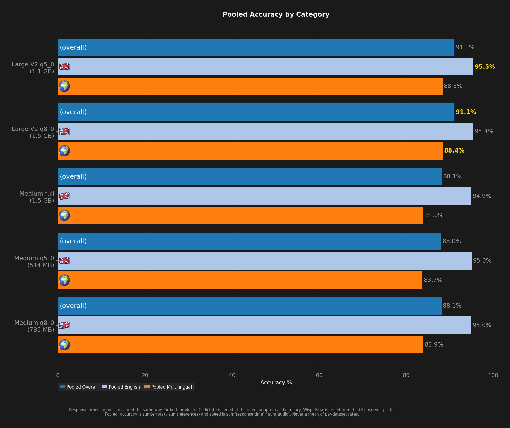

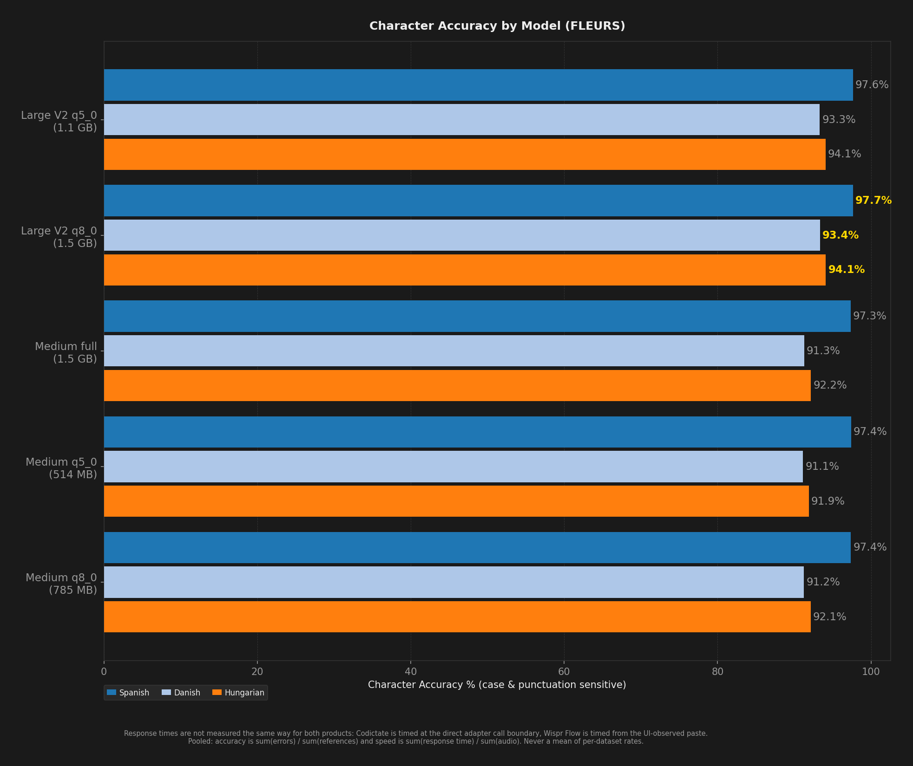

## Charts (All Models)

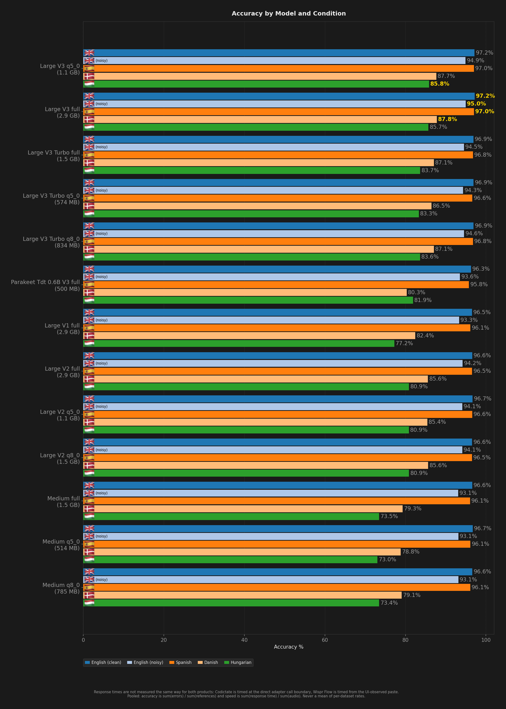

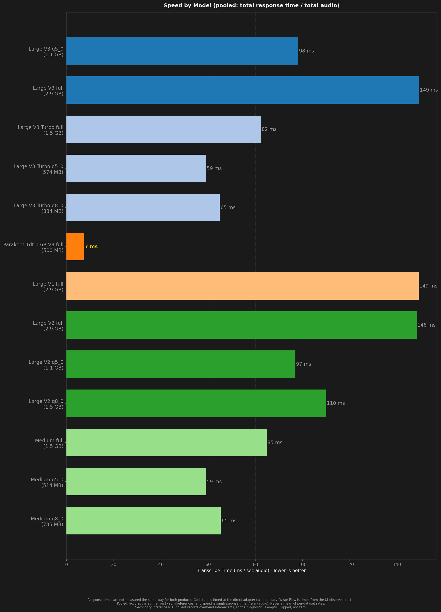

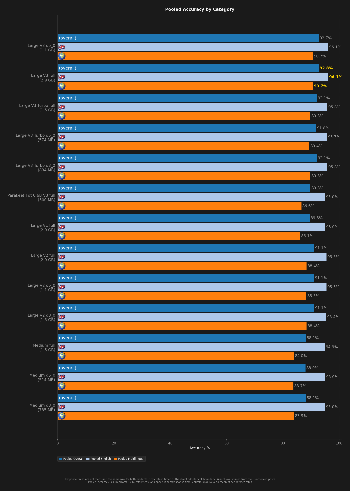

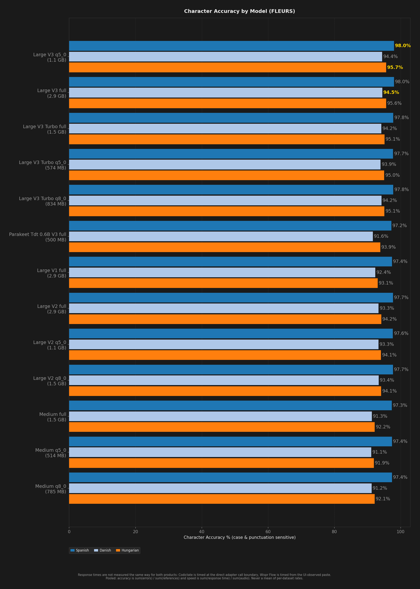

## Accuracy by Condition

### English (clean)

| Model | Accuracy (%) |
| --- | --- |
| Large V1 full | 96.5% |
| Large V2 full | 96.6% |
| Large V2 q5_0 | 96.7% |
| Large V2 q8_0 | 96.6% |
| Large V3 full | 97.2% |
| Large V3 q5_0 | 97.2% |
| Large V3 Turbo full | 96.9% |
| Large V3 Turbo q5_0 | 96.9% |
| Large V3 Turbo q8_0 | 96.9% |
| Medium full | 96.6% |
| Medium q5_0 | 96.7% |
| Medium q8_0 | 96.6% |
| Parakeet TDT v3 full | 96.3% |

### English (noisy)

| Model | Accuracy (%) |
| --- | --- |
| Large V1 full | 93.3% |
| Large V2 full | 94.2% |
| Large V2 q5_0 | 94.1% |
| Large V2 q8_0 | 94.1% |
| Large V3 full | 95.0% |
| Large V3 q5_0 | 94.9% |
| Large V3 Turbo full | 94.5% |
| Large V3 Turbo q5_0 | 94.3% |
| Large V3 Turbo q8_0 | 94.6% |
| Medium full | 93.1% |
| Medium q5_0 | 93.1% |
| Medium q8_0 | 93.1% |
| Parakeet TDT v3 full | 93.6% |

### Spanish

| Model | Word Accuracy (%) | Char Accuracy (%) |
| --- | --- | --- |
| Large V1 full | 96.1% | 97.4% |
| Large V2 full | 96.5% | 97.7% |
| Large V2 q5_0 | 96.6% | 97.6% |
| Large V2 q8_0 | 96.5% | 97.7% |
| Large V3 full | 97.0% | 98.0% |
| Large V3 q5_0 | 97.0% | 98.0% |
| Large V3 Turbo full | 96.8% | 97.8% |
| Large V3 Turbo q5_0 | 96.6% | 97.7% |
| Large V3 Turbo q8_0 | 96.8% | 97.8% |
| Medium full | 96.1% | 97.3% |
| Medium q5_0 | 96.1% | 97.4% |
| Medium q8_0 | 96.1% | 97.4% |
| Parakeet TDT v3 full | 95.8% | 97.2% |

### Danish

| Model | Word Accuracy (%) | Char Accuracy (%) |
| --- | --- | --- |
| Large V1 full | 82.4% | 92.4% |
| Large V2 full | 85.6% | 93.3% |
| Large V2 q5_0 | 85.4% | 93.3% |
| Large V2 q8_0 | 85.6% | 93.4% |
| Large V3 full | 87.8% | 94.5% |
| Large V3 q5_0 | 87.7% | 94.4% |
| Large V3 Turbo full | 87.1% | 94.2% |
| Large V3 Turbo q5_0 | 86.5% | 93.9% |
| Large V3 Turbo q8_0 | 87.1% | 94.2% |
| Medium full | 79.3% | 91.3% |
| Medium q5_0 | 78.8% | 91.1% |
| Medium q8_0 | 79.1% | 91.2% |
| Parakeet TDT v3 full | 80.3% | 91.6% |

### Hungarian

| Model | Word Accuracy (%) | Char Accuracy (%) |
| --- | --- | --- |
| Large V1 full | 77.2% | 93.1% |
| Large V2 full | 80.9% | 94.2% |
| Large V2 q5_0 | 80.9% | 94.1% |
| Large V2 q8_0 | 80.9% | 94.1% |
| Large V3 full | 85.7% | 95.6% |
| Large V3 q5_0 | 85.8% | 95.7% |
| Large V3 Turbo full | 83.7% | 95.1% |
| Large V3 Turbo q5_0 | 83.3% | 95.0% |
| Large V3 Turbo q8_0 | 83.6% | 95.1% |
| Medium full | 73.5% | 92.2% |
| Medium q5_0 | 73.0% | 91.9% |
| Medium q8_0 | 73.4% | 92.1% |
| Parakeet TDT v3 full | 81.9% | 93.9% |

## Speed by Condition

### English (clean)

| Model | Transcribe Time / sec Audio |
| --- | --- |
| Large V1 full | 187 ms |
| Large V2 full | 185 ms |
| Large V2 q5_0 | 119 ms |
| Large V2 q8_0 | 137 ms |
| Large V3 full | 186 ms |
| Large V3 q5_0 | 121 ms |
| Large V3 Turbo full | 108 ms |
| Large V3 Turbo q5_0 | 77 ms |
| Large V3 Turbo q8_0 | 85 ms |
| Medium full | 105 ms |
| Medium q5_0 | 72 ms |
| Medium q8_0 | 80 ms |
| Parakeet TDT v3 full | 9 ms |

### English (noisy)

| Model | Transcribe Time / sec Audio |
| --- | --- |
| Large V1 full | 204 ms |
| Large V2 full | 203 ms |
| Large V2 q5_0 | 130 ms |
| Large V2 q8_0 | 149 ms |
| Large V3 full | 203 ms |
| Large V3 q5_0 | 131 ms |
| Large V3 Turbo full | 120 ms |
| Large V3 Turbo q5_0 | 86 ms |
| Large V3 Turbo q8_0 | 94 ms |
| Medium full | 115 ms |
| Medium q5_0 | 78 ms |
| Medium q8_0 | 88 ms |
| Parakeet TDT v3 full | 10 ms |

### Spanish

| Model | Transcribe Time / sec Audio |
| --- | --- |
| Large V1 full | 122 ms |
| Large V2 full | 122 ms |
| Large V2 q5_0 | 80 ms |
| Large V2 q8_0 | 91 ms |
| Large V3 full | 123 ms |
| Large V3 q5_0 | 81 ms |
| Large V3 Turbo full | 67 ms |
| Large V3 Turbo q5_0 | 49 ms |
| Large V3 Turbo q8_0 | 53 ms |
| Medium full | 70 ms |
| Medium q5_0 | 48 ms |
| Medium q8_0 | 54 ms |
| Parakeet TDT v3 full | 6 ms |

### Danish

| Model | Transcribe Time / sec Audio |
| --- | --- |
| Large V1 full | 134 ms |
| Large V2 full | 132 ms |
| Large V2 q5_0 | 87 ms |
| Large V2 q8_0 | 98 ms |
| Large V3 full | 133 ms |
| Large V3 q5_0 | 88 ms |
| Large V3 Turbo full | 71 ms |
| Large V3 Turbo q5_0 | 51 ms |
| Large V3 Turbo q8_0 | 56 ms |
| Medium full | 76 ms |
| Medium q5_0 | 53 ms |
| Medium q8_0 | 59 ms |
| Parakeet TDT v3 full | 7 ms |

### Hungarian

| Model | Transcribe Time / sec Audio |
| --- | --- |
| Large V1 full | 135 ms |
| Large V2 full | 134 ms |
| Large V2 q5_0 | 89 ms |
| Large V2 q8_0 | 100 ms |
| Large V3 full | 136 ms |
| Large V3 q5_0 | 90 ms |
| Large V3 Turbo full | 70 ms |
| Large V3 Turbo q5_0 | 50 ms |
| Large V3 Turbo q8_0 | 55 ms |
| Medium full | 78 ms |
| Medium q5_0 | 56 ms |
| Medium q8_0 | 61 ms |
| Parakeet TDT v3 full | 7 ms |
