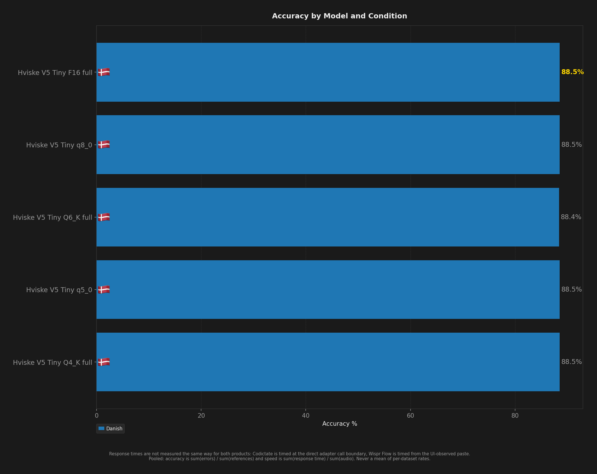
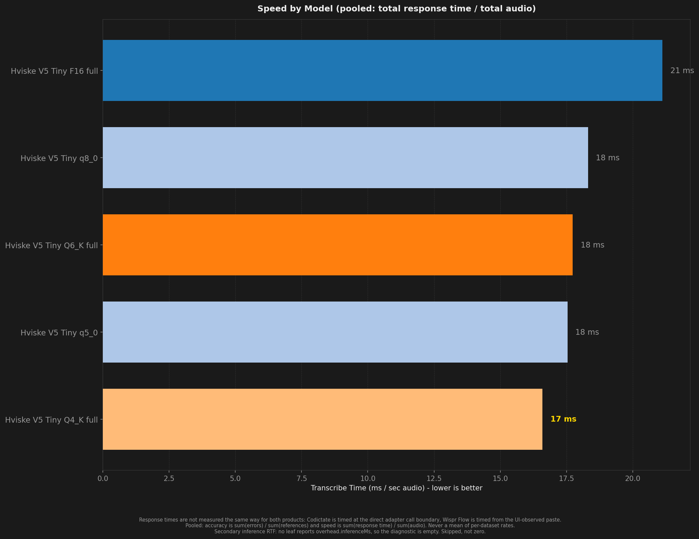
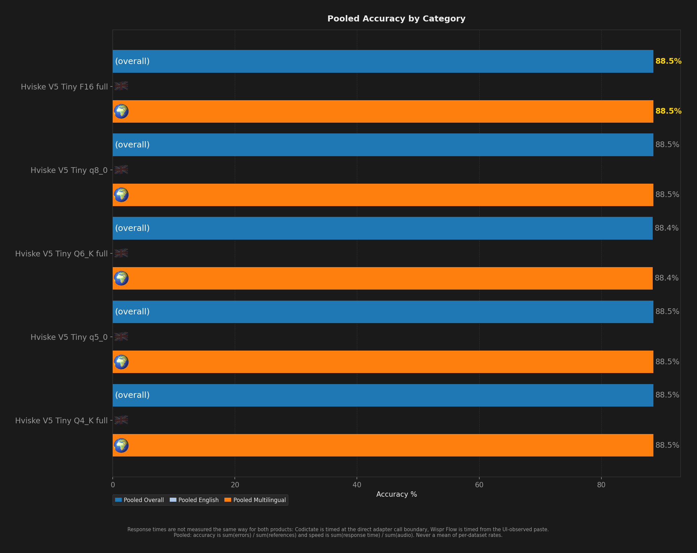
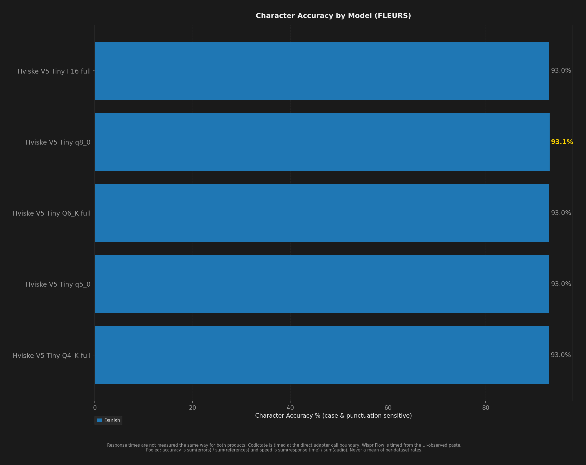

# STT Benchmark Report

**Description:** Clips 401 to end of da_dk, 5 Danish-pinned hviske models

- **Date:** 2026-09-18T05:02:07.773Z
- **Hardware:** Apple M4 Max / 36 GB / macOS 26.6.2
- **Pooled unique scored clips per dataset:** 527
- **Sample selection:** `--to 927` (topped every dataset up to depth 927)
- **Warmup utterances:** 3
- **ASR Harness:** crispasr
- **Combinations tested:** 5

> Response times are not measured the same way for both products: Codictate is timed at the direct adapter call boundary, Wispr Flow is timed from the UI-observed paste.

Accuracy and speed are **pooled**: `sum(errors) / sum(references)` and `sum(response time) / sum(audio)`. An unweighted mean of per-dataset rates is a different number and is never published. Leaves with no denominator are skipped, never counted as zero.

Speed comes from `speedV2` - the provenance-filtered v2 measurement - and a leaf that has none is shown as `(legacy)`, from `meanRTF`. The two are different measurements (`meanRTF` is session wall clock over audio, over every scored Sample) and neither ever stands in for the other.

## Summary

| Model | Disk | Min Peak RSS | Avg Peak RSS | Max Peak RSS | Transcribe Time / sec Audio | Pooled Overall | Pooled English | Pooled Multilingual | Danish | Pooled Char Accuracy | Failures |
| --- | --- | --- | --- | --- | --- | --- | --- | --- | --- | --- | --- |
| Hviske V5 Tiny F16 full | 503 MB | 643 MB | 651 MB | 660 MB | 21 ms | **88.5%** | - | **88.5%** | **88.5%** | 93.0% | 0 |
| Hviske V5 Tiny Q4 full | **153 MB** | **293 MB** | **301 MB** | **310 MB** | **17 ms** | 88.5% | - | 88.5% | 88.5% | 93.0% | 0 |
| Hviske V5 Tiny Q5 q5_0 | 181 MB | 321 MB | 330 MB | 339 MB | 18 ms | 88.5% | - | 88.5% | 88.5% | 93.0% | 0 |
| Hviske V5 Tiny Q6 full | 232 MB | 372 MB | 380 MB | 389 MB | 18 ms | 88.4% | - | 88.4% | 88.4% | 93.0% | 0 |
| Hviske V5 Tiny Q8 q8_0 | 268 MB | 408 MB | 417 MB | 425 MB | 18 ms | 88.5% | - | 88.5% | 88.5% | **93.1%** | 0 |

## Ratings (1-10)

| Model | Speed | Accuracy | Languages |
| --- | --- | --- | --- |
| Hviske V5 Tiny F16 full | 9 | 9 | 1 |
| Hviske V5 Tiny Q4 full | 10 | 9 | 1 |
| Hviske V5 Tiny Q5 q5_0 | 10 | 9 | 1 |
| Hviske V5 Tiny Q6 full | 10 | 9 | 1 |
| Hviske V5 Tiny Q8 q8_0 | 10 | 9 | 1 |

## Charts (All Models)

## Accuracy by Condition

### Danish

| Model | Word Accuracy (%) | Char Accuracy (%) |
| --- | --- | --- |
| Hviske V5 Tiny F16 full | 88.5% | 93.0% |
| Hviske V5 Tiny Q4 full | 88.5% | 93.0% |
| Hviske V5 Tiny Q5 q5_0 | 88.5% | 93.0% |
| Hviske V5 Tiny Q6 full | 88.4% | 93.0% |
| Hviske V5 Tiny Q8 q8_0 | 88.5% | 93.1% |

## Speed by Condition

### Danish

| Model | Transcribe Time / sec Audio |
| --- | --- |
| Hviske V5 Tiny F16 full | 21 ms |
| Hviske V5 Tiny Q4 full | 17 ms |
| Hviske V5 Tiny Q5 q5_0 | 18 ms |
| Hviske V5 Tiny Q6 full | 18 ms |
| Hviske V5 Tiny Q8 q8_0 | 18 ms |
