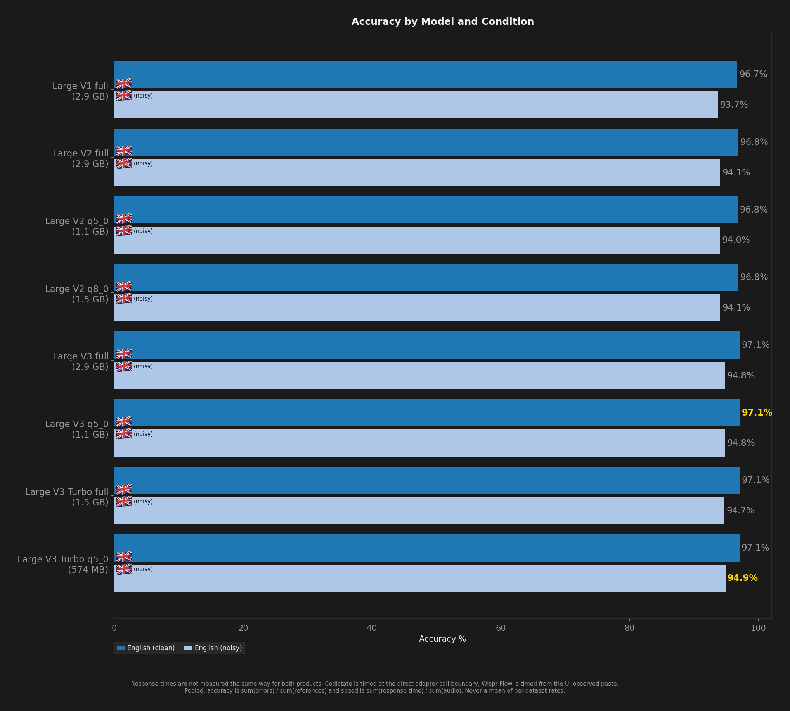
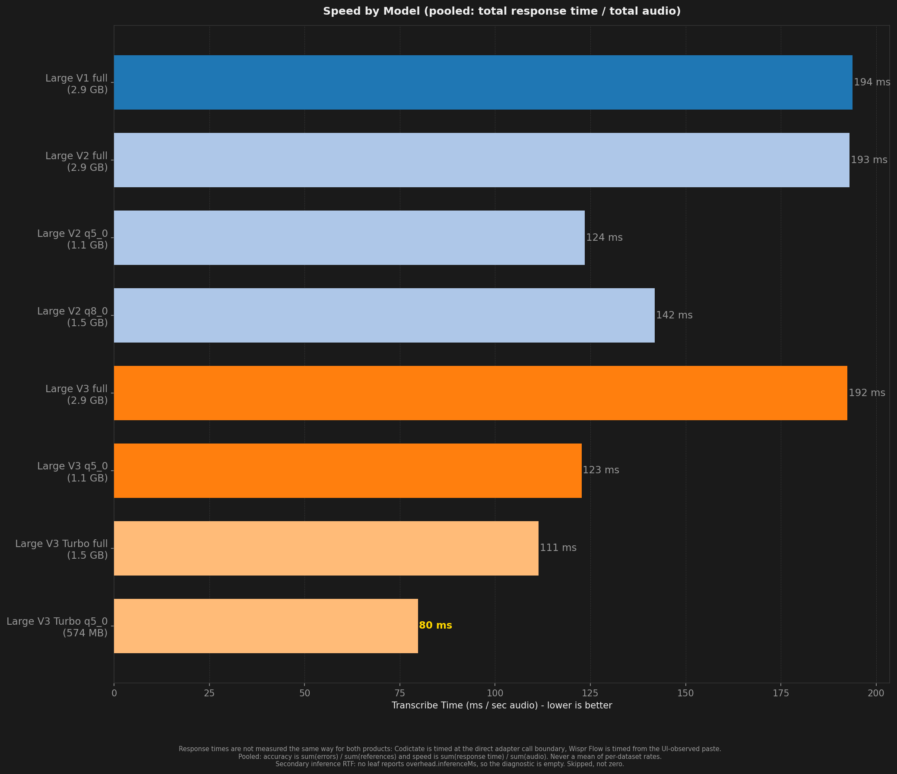
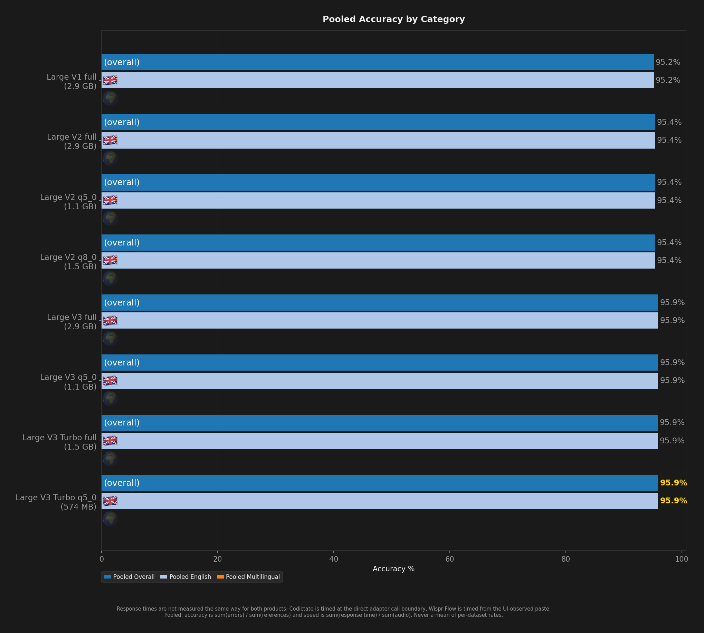
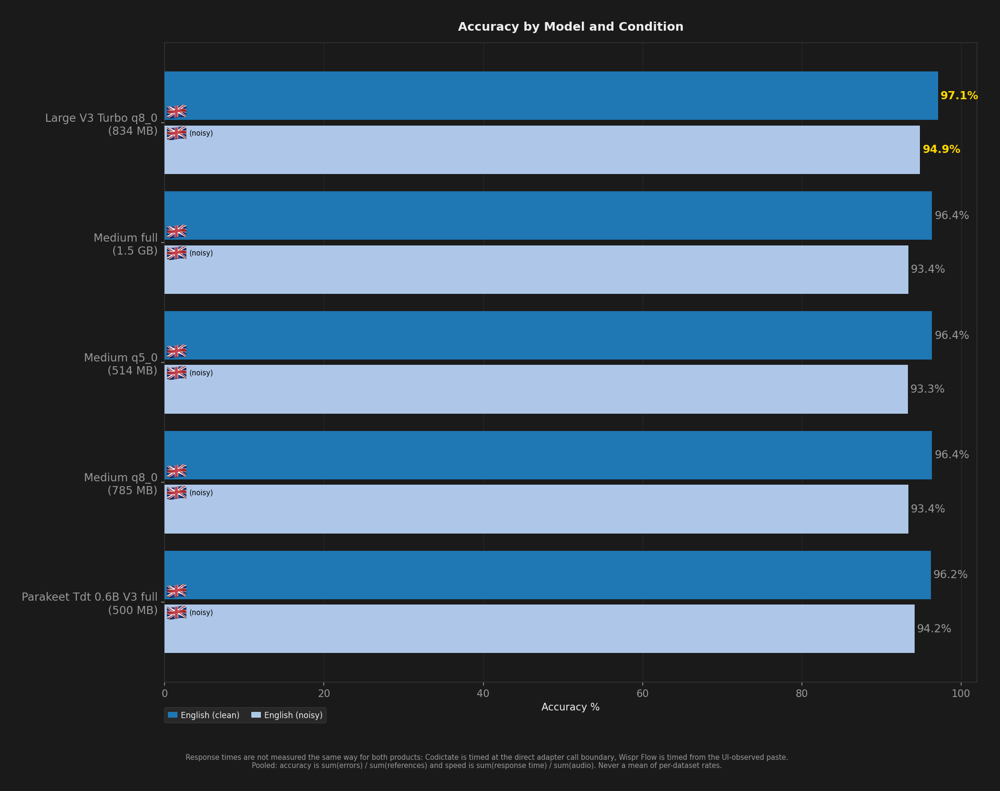
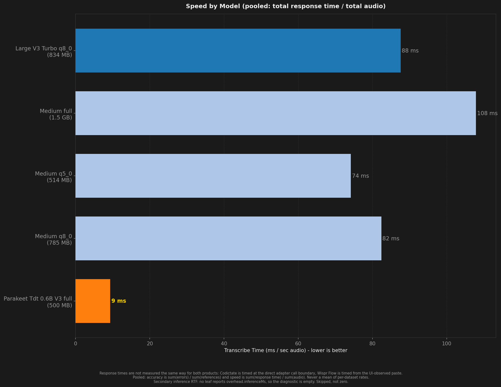
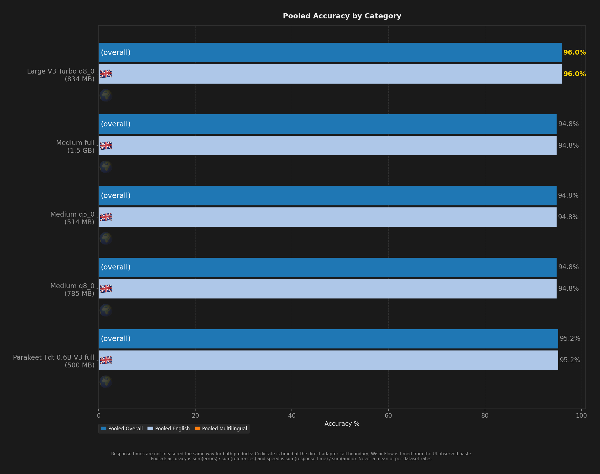
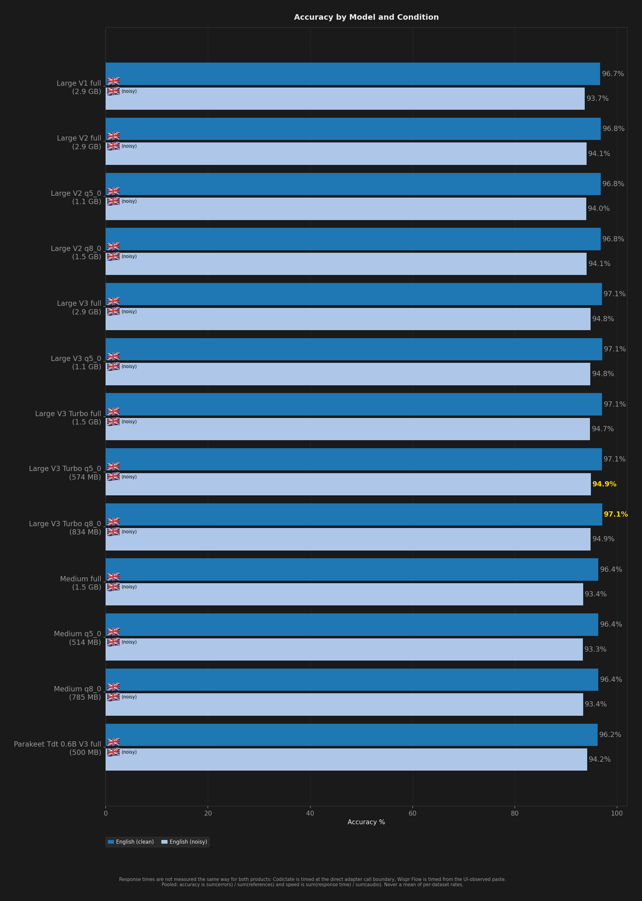
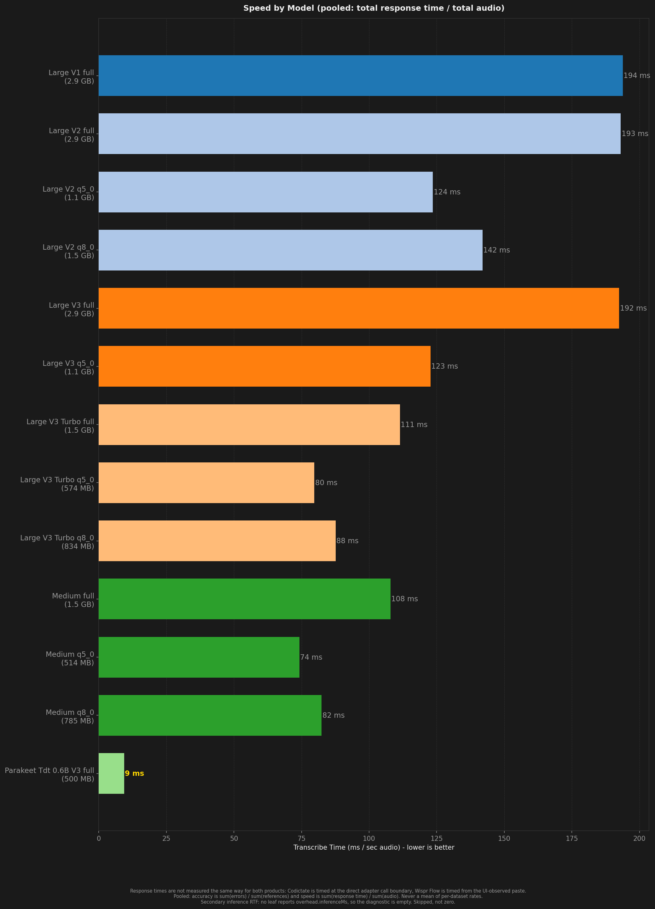
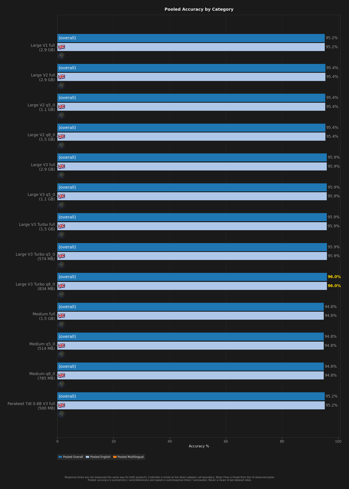

# STT Benchmark Report

**Description:** English clips 951 to corpus end, 13 multilingual models, matching the Flow depth

- **Date:** 2026-09-22T21:46:06.311Z
- **Hardware:** Apple M4 Max / 36 GB / macOS 26.6.2
- **Pooled unique scored clips per dataset:** 1986
- **Sample selection:** `--to 2936` (topped every dataset up to depth 2936)
- **Warmup utterances:** 3
- **ASR Harness:** crispasr
- **Combinations tested:** 13

> Response times are not measured the same way for both products: Codictate is timed at the direct adapter call boundary, Wispr Flow is timed from the UI-observed paste.

Accuracy and speed are **pooled**: `sum(errors) / sum(references)` and `sum(response time) / sum(audio)`. An unweighted mean of per-dataset rates is a different number and is never published. Leaves with no denominator are skipped, never counted as zero.

Speed comes from `speedV2` - the provenance-filtered v2 measurement - and a leaf that has none is shown as `(legacy)`, from `meanRTF`. The two are different measurements (`meanRTF` is session wall clock over audio, over every scored Sample) and neither ever stands in for the other.

## Summary

| Model | Disk | Min Peak RSS | Avg Peak RSS | Max Peak RSS | Transcribe Time / sec Audio | Pooled Overall | Pooled English | Pooled Multilingual | English (clean) | English (noisy) | Failures |
| --- | --- | --- | --- | --- | --- | --- | --- | --- | --- | --- | --- |
| Large V1 full | 2.9 GB | 3.5 GB | 3.5 GB | 3.5 GB | 194 ms | 95.2% | 95.2% | - | 96.7% | 93.7% | 0 |
| Large V2 full | 2.9 GB | 3.5 GB | 3.5 GB | 3.5 GB | 193 ms | 95.4% | 95.4% | - | 96.8% | 94.1% | 0 |
| Large V2 q5_0 | 1.1 GB | 1.5 GB | 1.5 GB | 1.5 GB | 124 ms | 95.4% | 95.4% | - | 96.8% | 94.0% | 0 |
| Large V2 q8_0 | 1.5 GB | 2.1 GB | 2.1 GB | 2.1 GB | 142 ms | 95.4% | 95.4% | - | 96.8% | 94.1% | 0 |
| Large V3 full | 2.9 GB | 3.5 GB | 3.5 GB | 3.6 GB | 192 ms | 95.9% | 95.9% | - | 97.1% | 94.8% | 0 |
| Large V3 q5_0 | 1.1 GB | 1.5 GB | 1.6 GB | 1.6 GB | 123 ms | 95.9% | 95.9% | - | 97.1% | 94.8% | 0 |
| Large V3 Turbo full | 1.5 GB | 1.9 GB | 1.9 GB | 1.9 GB | 111 ms | 95.9% | 95.9% | - | 97.1% | 94.7% | 0 |
| Large V3 Turbo q5_0 | 574 MB | 782 MB | 783 MB | 785 MB | 80 ms | 95.9% | 95.9% | - | 97.1% | **94.9%** | 0 |
| Large V3 Turbo q8_0 | 834 MB | 1.1 GB | 1.1 GB | 1.1 GB | 88 ms | **96.0%** | **96.0%** | - | **97.1%** | 94.9% | 0 |
| Medium full | 1.5 GB | 1.9 GB | 1.9 GB | 1.9 GB | 108 ms | 94.8% | 94.8% | - | 96.4% | 93.4% | 0 |
| Medium q5_0 | 514 MB | 880 MB | 881 MB | 882 MB | 74 ms | 94.8% | 94.8% | - | 96.4% | 93.3% | 0 |
| Medium q8_0 | 785 MB | 1.2 GB | 1.2 GB | 1.2 GB | 82 ms | 94.8% | 94.8% | - | 96.4% | 93.4% | 0 |
| Parakeet TDT v3 full | **500 MB** | **78 MB** | **79 MB** | **82 MB** | **9 ms** | 95.2% | 95.2% | - | 96.2% | 94.2% | 0 |

## Ratings (1-10)

| Model | Speed | Accuracy | Languages |
| --- | --- | --- | --- |
| Large V1 full | 5 | 10 | 10 |
| Large V2 full | 5 | 10 | 10 |
| Large V2 q5_0 | 7 | 10 | 10 |
| Large V2 q8_0 | 6 | 10 | 10 |
| Large V3 full | 5 | 10 | 10 |
| Large V3 q5_0 | 7 | 10 | 10 |
| Large V3 Turbo full | 7 | 10 | 10 |
| Large V3 Turbo q5_0 | 8 | 10 | 10 |
| Large V3 Turbo q8_0 | 8 | 10 | 10 |
| Medium full | 7 | 10 | 10 |
| Medium q5_0 | 8 | 10 | 10 |
| Medium q8_0 | 8 | 10 | 10 |
| Parakeet TDT v3 full | 10 | 10 | 8 |

## Charts (Large V1 full - Large V3 Turbo q5_0)

## Charts (Large V3 Turbo q8_0 - Parakeet TDT v3 full)

## Charts (All Models)

## Accuracy by Condition

### English (clean)

| Model | Accuracy (%) |
| --- | --- |
| Large V1 full | 96.7% |
| Large V2 full | 96.8% |
| Large V2 q5_0 | 96.8% |
| Large V2 q8_0 | 96.8% |
| Large V3 full | 97.1% |
| Large V3 q5_0 | 97.1% |
| Large V3 Turbo full | 97.1% |
| Large V3 Turbo q5_0 | 97.1% |
| Large V3 Turbo q8_0 | 97.1% |
| Medium full | 96.4% |
| Medium q5_0 | 96.4% |
| Medium q8_0 | 96.4% |
| Parakeet TDT v3 full | 96.2% |

### English (noisy)

| Model | Accuracy (%) |
| --- | --- |
| Large V1 full | 93.7% |
| Large V2 full | 94.1% |
| Large V2 q5_0 | 94.0% |
| Large V2 q8_0 | 94.1% |
| Large V3 full | 94.8% |
| Large V3 q5_0 | 94.8% |
| Large V3 Turbo full | 94.7% |
| Large V3 Turbo q5_0 | 94.9% |
| Large V3 Turbo q8_0 | 94.9% |
| Medium full | 93.4% |
| Medium q5_0 | 93.3% |
| Medium q8_0 | 93.4% |
| Parakeet TDT v3 full | 94.2% |

## Speed by Condition

### English (clean)

| Model | Transcribe Time / sec Audio |
| --- | --- |
| Large V1 full | 182 ms |
| Large V2 full | 182 ms |
| Large V2 q5_0 | 116 ms |
| Large V2 q8_0 | 134 ms |
| Large V3 full | 180 ms |
| Large V3 q5_0 | 115 ms |
| Large V3 Turbo full | 104 ms |
| Large V3 Turbo q5_0 | 74 ms |
| Large V3 Turbo q8_0 | 81 ms |
| Medium full | 101 ms |
| Medium q5_0 | 70 ms |
| Medium q8_0 | 77 ms |
| Parakeet TDT v3 full | 9 ms |

### English (noisy)

| Model | Transcribe Time / sec Audio |
| --- | --- |
| Large V1 full | 206 ms |
| Large V2 full | 204 ms |
| Large V2 q5_0 | 131 ms |
| Large V2 q8_0 | 150 ms |
| Large V3 full | 205 ms |
| Large V3 q5_0 | 130 ms |
| Large V3 Turbo full | 119 ms |
| Large V3 Turbo q5_0 | 85 ms |
| Large V3 Turbo q8_0 | 94 ms |
| Medium full | 115 ms |
| Medium q5_0 | 79 ms |
| Medium q8_0 | 87 ms |
| Parakeet TDT v3 full | 10 ms |
