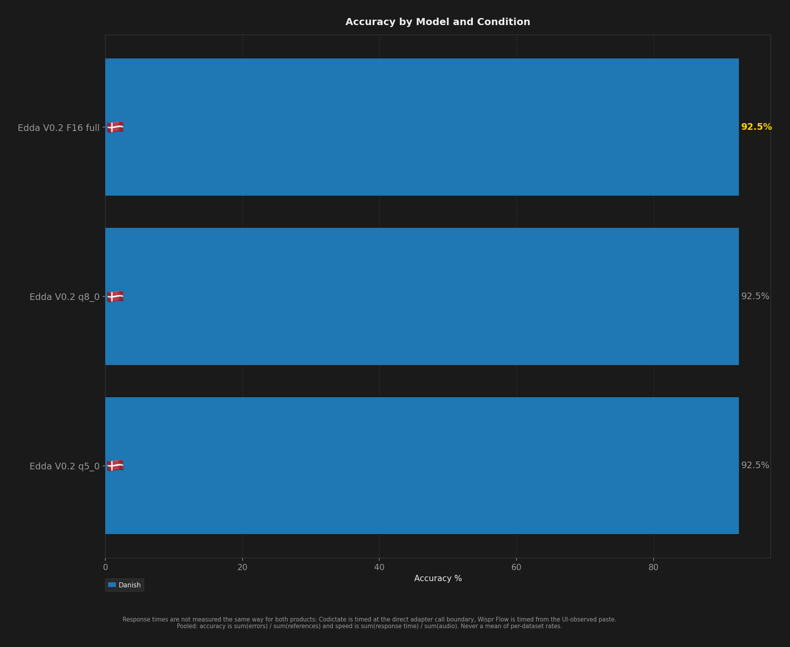
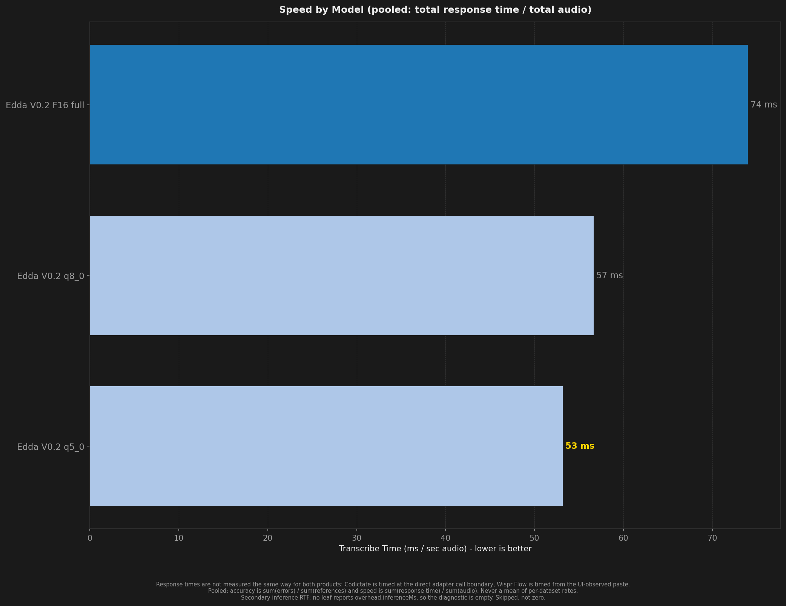
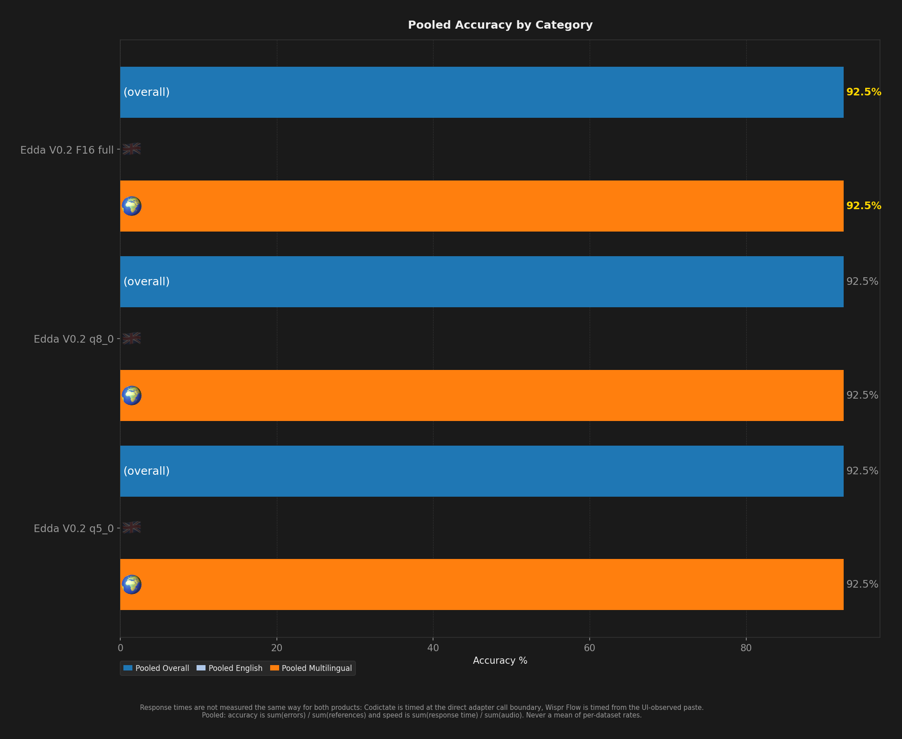
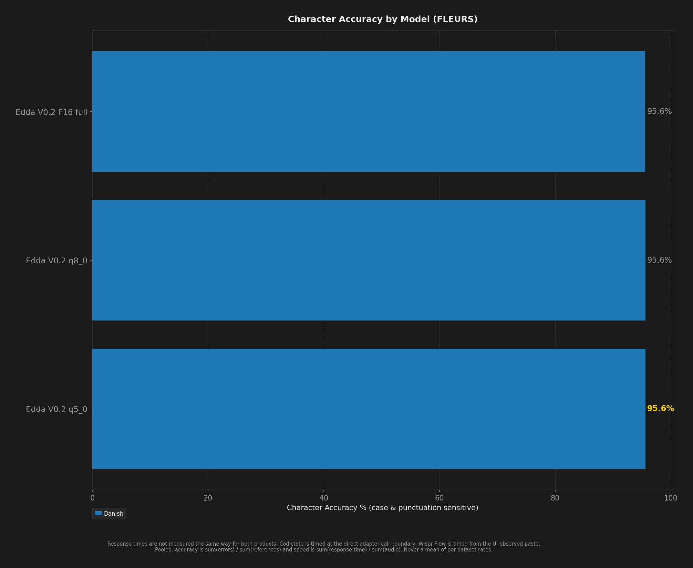

# STT Benchmark Report

**Description:** Edda v0.2 f16/q8_0/q5_0 on the full FLEURS da_dk corpus, next to hviske v5 and large-v3-turbo

- **Date:** 2026-10-08T07:15:05.456Z
- **Hardware:** Apple M4 Max / 36 GB / macOS 26.6.2
- **Pooled unique scored clips per dataset:** 927
- **Sample selection:** `--to 927` (topped every dataset up to depth 927)
- **Warmup utterances:** 3
- **ASR Harness:** crispasr
- **Combinations tested:** 3

> Response times are not measured the same way for both products: Codictate is timed at the direct adapter call boundary, Wispr Flow is timed from the UI-observed paste.

Accuracy and speed are **pooled**: `sum(errors) / sum(references)` and `sum(response time) / sum(audio)`. An unweighted mean of per-dataset rates is a different number and is never published. Leaves with no denominator are skipped, never counted as zero.

Speed comes from `speedV2` - the provenance-filtered v2 measurement - and a leaf that has none is shown as `(legacy)`, from `meanRTF`. The two are different measurements (`meanRTF` is session wall clock over audio, over every scored Sample) and neither ever stands in for the other.

## Summary

| Model | Disk | Min Peak RSS | Avg Peak RSS | Max Peak RSS | Transcribe Time / sec Audio | Pooled Overall | Pooled English | Pooled Multilingual | Danish | Pooled Char Accuracy | Failures |
| --- | --- | --- | --- | --- | --- | --- | --- | --- | --- | --- | --- |
| Edda V0.2 F16 full | 1.5 GB | 1.9 GB | 1.9 GB | 1.9 GB | 74 ms | **92.5%** | - | **92.5%** | **92.5%** | 95.6% | 0 |
| Edda V0.2 Q5 q5_0 | **547 MB** | **786 MB** | **787 MB** | **789 MB** | **53 ms** | 92.5% | - | 92.5% | 92.5% | **95.6%** | 0 |
| Edda V0.2 Q8 q8_0 | 834 MB | 1.1 GB | 1.1 GB | 1.1 GB | 57 ms | 92.5% | - | 92.5% | 92.5% | 95.6% | 0 |

## Ratings (1-10)

| Model | Speed | Accuracy | Languages |
| --- | --- | --- | --- |
| Edda V0.2 F16 full | 8 | 9 | 1 |
| Edda V0.2 Q5 q5_0 | 9 | 9 | 1 |
| Edda V0.2 Q8 q8_0 | 9 | 9 | 1 |

## Charts (All Models)

## Accuracy by Condition

### Danish

| Model | Word Accuracy (%) | Char Accuracy (%) |
| --- | --- | --- |
| Edda V0.2 F16 full | 92.5% | 95.6% |
| Edda V0.2 Q5 q5_0 | 92.5% | 95.6% |
| Edda V0.2 Q8 q8_0 | 92.5% | 95.6% |

## Speed by Condition

### Danish

| Model | Transcribe Time / sec Audio |
| --- | --- |
| Edda V0.2 F16 full | 74 ms |
| Edda V0.2 Q5 q5_0 | 53 ms |
| Edda V0.2 Q8 q8_0 | 57 ms |
