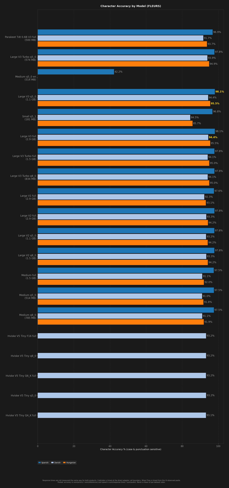

# STT Benchmark Report

**Description:** Aggregated results from all benchmark runs

- **Date:** 2026-09-06T10:04:23.760Z
- **Hardware:** Apple M4 Max / 36 GB / macOS 26.6.2
- **Pooled unique scored clips per dataset:** 400
- **Warmup utterances:** 3
- **ASR Harnesses:** crispasr (untagged rows), whisper-cli (rows tagged `[whisper-cli]`)
- **Combinations tested:** 53

> Response times are not measured the same way for both products: Codictate is timed at the direct adapter call boundary, Wispr Flow is timed from the UI-observed paste.

Accuracy and speed are **pooled**: `sum(errors) / sum(references)` and `sum(response time) / sum(audio)`. An unweighted mean of per-dataset rates is a different number and is never published. Leaves with no denominator are skipped, never counted as zero.

Speed comes from `speedV2` - the provenance-filtered v2 measurement - and a leaf that has none is shown as `(legacy)`, from `meanRTF`. The two are different measurements (`meanRTF` is session wall clock over audio, over every scored Sample) and neither ever stands in for the other.

## Summary

| Model | Disk | Min Peak RSS | Avg Peak RSS | Max Peak RSS | Transcribe Time / sec Audio | Pooled Overall | Pooled English | Pooled Multilingual | English (clean) | English (noisy) | Spanish | Danish | Hungarian | Pooled Char Accuracy | Failures |
| --- | --- | --- | --- | --- | --- | --- | --- | --- | --- | --- | --- | --- | --- | --- | --- |
| Base q5_1 [whisper-cli] | 57 MB | 214 MB | 219 MB | 227 MB | 57 ms (legacy) | 70.1% | 90.2% | 58.8% | 90.8% | 89.9% | 88.9% | 37.6% | 36.4% | N/A | 0 (+5 leafs not counted) |
| Base q8_0 [whisper-cli] | 78 MB | 243 MB | 247 MB | 256 MB | 57 ms (legacy) | 70.3% | 91.0% | 58.6% | 92.4% | 90.1% | 88.6% | 38.4% | 35.5% | N/A | 0 (+5 leafs not counted) |
| Base q5_1 en [whisper-cli] | 57 MB | 215 MB | 217 MB | 225 MB | 58 ms (legacy) | 20.3% | 92.1% | -4.2% | 92.7% | 92.1% | 3.8% | -9.6% | -10.2% | N/A | 0 (+5 leafs not counted) |
| Base q8_0 en [whisper-cli] | 78 MB | 243 MB | 247 MB | 259 MB | 58 ms (legacy) | 30.6% | 92.0% | -4.2% | 92.4% | 91.8% | 3.2% | -7.9% | -10.9% | N/A | 0 (+5 leafs not counted) |
| Base full en [whisper-cli] | 142 MB | 330 MB | 333 MB | 340 MB | 59 ms (legacy) | 37.8% | 92.3% | -5.3% | 93.1% | 91.8% | 0.8% | -7.0% | -13.8% | N/A | 0 (+5 leafs not counted) |
| Base full [whisper-cli] | 142 MB | 330 MB | 334 MB | 343 MB | 57 ms (legacy) | 70.4% | 91.1% | 58.8% | 91.8% | 90.6% | 88.4% | 39.5% | 35.3% | N/A | 0 (+5 leafs not counted) |
| Hviske V5 Tiny F16 full | 503 MB | 634 MB | 641 MB | 644 MB | 23 ms | 88.8% | - | 88.8% | - | - | - | 88.8% | - | 93.4% | 0 |
| Hviske V5 Tiny Q4 full | 153 MB | 289 MB | 295 MB | 297 MB | 19 ms | 88.8% | - | 88.8% | - | - | - | 88.8% | - | 93.3% | 0 |
| Hviske V5 Tiny Q5 q5_0 | 181 MB | 317 MB | 322 MB | 325 MB | 20 ms | 88.9% | - | 88.9% | - | - | - | **88.9%** | - | 93.5% | 0 |
| Hviske V5 Tiny Q6 full | 232 MB | 368 MB | 373 MB | 376 MB | 20 ms | 88.8% | - | 88.8% | - | - | - | 88.8% | - | 93.4% | 0 |
| Hviske V5 Tiny Q8 q8_0 | 268 MB | 400 MB | 407 MB | 411 MB | 20 ms | 88.8% | - | 88.8% | - | - | - | 88.8% | - | 93.4% | 0 |
| Large V1 full | 2.9 GB | 3.5 GB | 3.5 GB | 3.5 GB | 150 ms | 89.4% | 94.6% | 86.3% | 95.6% | 93.6% | 96.5% | 81.6% | 77.3% | 94.5% | 0 |
| Large V1 full [whisper-cli] | 2.9 GB | 4.0 GB | 4.0 GB | 4.0 GB | 184 ms (legacy) | 89.9% | 94.1% | 87.5% | 94.7% | 93.7% | 95.8% | 80.7% | 82.2% | N/A | 0 (+5 leafs not counted) |
| Large V2 full | 2.9 GB | 3.5 GB | 3.5 GB | 3.5 GB | 149 ms | 90.9% | 95.0% | 88.6% | 96.2% | 93.6% | 96.9% | 84.8% | 81.1% | 95.3% | 0 |
| Large V2 q5_0 | 1.1 GB | 1.5 GB | 1.5 GB | 1.5 GB | 96 ms | 90.9% | 95.0% | 88.4% | 96.2% | 93.7% | 96.9% | 84.5% | 81.0% | 95.3% | 0 |
| Large V2 q5_0 [whisper-cli] | 1.1 GB | 2.0 GB | 2.0 GB | 2.0 GB | 146 ms (legacy) | 91.4% | 94.9% | 89.4% | 95.3% | 94.6% | 96.1% | 83.9% | 85.3% | N/A | 0 (+5 leafs not counted) |
| Large V2 q8_0 | 1.5 GB | 2.1 GB | 2.1 GB | 2.1 GB | 116 ms | 90.9% | 95.0% | 88.5% | 96.2% | 93.6% | 96.8% | 84.8% | 81.1% | 95.3% | 0 |
| Large V2 q8_0 [whisper-cli] | 1.5 GB | 2.5 GB | 2.5 GB | 2.6 GB | 154 ms (legacy) | 91.5% | 94.9% | 89.6% | 95.0% | 94.9% | 96.1% | 84.6% | 85.2% | N/A | 0 (+5 leafs not counted) |
| Large V2 full [whisper-cli] | 2.9 GB | 4.0 GB | 4.0 GB | 4.0 GB | 185 ms (legacy) | 91.5% | 94.8% | 89.6% | 95.0% | 94.7% | 96.1% | 84.5% | 85.3% | N/A | 0 (+5 leafs not counted) |
| Large V3 full | 2.9 GB | 3.5 GB | 3.5 GB | 3.5 GB | 147 ms | **92.6%** | **96.0%** | 90.7% | 96.7% | **95.3%** | 97.2% | 87.4% | 85.2% | **96.1%** | 0 |
| Large V3 q5_0 | 1.1 GB | 1.5 GB | 1.5 GB | 1.5 GB | 96 ms | 92.6% | 96.0% | 90.6% | **96.8%** | 95.2% | **97.2%** | 87.1% | 85.2% | 96.1% | 0 |
| Large V3 q5_0 [whisper-cli] | 1.1 GB | 2.0 GB | 2.0 GB | 2.0 GB | 147 ms (legacy) | 92.2% | 95.3% | 90.4% | 96.5% | 94.0% | 97.0% | 87.1% | 85.5% | N/A | 0 (+5 leafs not counted) |
| Large V3 Turbo full | 1.5 GB | 1.8 GB | 1.8 GB | 1.8 GB | 83 ms | 91.7% | 95.8% | 89.3% | 96.6% | 95.0% | 96.6% | 85.7% | 83.1% | 95.7% | 0 |
| Large V3 Turbo q5_0 | 574 MB | 768 MB | 769 MB | 772 MB | 59 ms | 91.6% | 95.7% | 89.2% | 96.6% | 94.8% | 96.8% | 85.6% | 82.5% | 95.6% | 0 |
| Large V3 Turbo q5_0 [whisper-cli] | 574 MB | 798 MB | 801 MB | 805 MB | 105 ms (legacy) | 91.3% | 95.0% | 89.3% | 96.2% | 93.8% | 96.8% | 85.4% | 83.5% | N/A | 0 (+5 leafs not counted) |
| Large V3 Turbo q8_0 | 834 MB | 1.1 GB | 1.1 GB | 1.1 GB | 65 ms | 91.7% | 95.9% | 89.3% | 96.6% | 95.0% | 96.7% | 85.6% | 83.1% | 95.7% | 0 |
| Large V3 Turbo q8_0 [whisper-cli] | 834 MB | 1.1 GB | 1.1 GB | 1.1 GB | 108 ms (legacy) | 90.2% | 95.1% | 85.4% | 95.5% | 94.8% | 96.7% | 83.2% | 87.5% | N/A | 0 (+5 leafs not counted) |
| Large V3 Turbo full [whisper-cli] | 1.5 GB | 1.9 GB | 1.9 GB | 1.9 GB | 109 ms (legacy) | 91.1% | 95.0% | 83.2% | 95.4% | 94.7% | 96.7% | 83.2% | 87.4% | N/A | 0 (+5 leafs not counted) |
| Large V3 full [whisper-cli] | 2.9 GB | 4.0 GB | 4.0 GB | 4.0 GB | 183 ms (legacy) | 92.3% | 93.8% | **91.8%** | 96.3% | 93.8% | 96.5% | 87.3% | **89.5%** | N/A | 0 (+5 leafs not counted) |
| Medium full | 1.5 GB | 1.9 GB | 1.9 GB | 1.9 GB | 84 ms | 87.8% | 94.4% | 83.8% | 96.1% | 92.6% | 96.2% | 78.2% | 72.8% | 93.7% | 0 |
| Medium q5_0 | 514 MB | 872 MB | 873 MB | 875 MB | 60 ms | 87.7% | 94.5% | 83.7% | 96.0% | 92.9% | 96.2% | 78.0% | 72.5% | 93.6% | 0 |
| Medium q5_0 [whisper-cli] | 514 MB | 1.1 GB | 1.1 GB | 1.1 GB | 99 ms (legacy) | 88.3% | 94.1% | 85.0% | 95.3% | 93.3% | 95.2% | 77.1% | 78.2% | N/A | 0 (+5 leafs not counted) |
| Medium q8_0 | 785 MB | 1.2 GB | 1.2 GB | 1.2 GB | 66 ms | 87.7% | 94.4% | 83.8% | 96.1% | 92.6% | 96.2% | 78.2% | 72.6% | 93.6% | 0 |
| Medium q8_0 [whisper-cli] | 785 MB | 1.4 GB | 1.4 GB | 1.4 GB | 106 ms (legacy) | 85.8% | 94.0% | 77.9% | 95.0% | 93.4% | 95.2% | 77.9% | 77.9% | N/A | 0 (+5 leafs not counted) |
| Medium English q5_0 en | 514 MB | 830 MB | 832 MB | 834 MB | 60 ms (legacy) | 61.6% | 94.4% | 13.7% | 95.0% | 93.6% | 13.7% | - | - | 42.2% | 0 (+3 leafs not counted) |
| Medium English q5_0 en [whisper-cli] | 514 MB | 1.1 GB | 1.1 GB | 1.1 GB | 96 ms (legacy) | 17.1% | 93.1% | -8.9% | 95.7% | 93.1% | 9.2% | -11.4% | -32.0% | N/A | 0 (+5 leafs not counted) |
| Medium q8_0 en [whisper-cli] | 785 MB | 1.4 GB | 1.4 GB | 1.4 GB | 103 ms (legacy) | 17.3% | 93.0% | -8.6% | 95.7% | 93.0% | 10.0% | -16.3% | -27.4% | N/A | 0 (+5 leafs not counted) |
| Medium full en [whisper-cli] | 1.5 GB | 2.1 GB | 2.1 GB | 2.1 GB | 116 ms (legacy) | 18.5% | 93.5% | -7.0% | 95.7% | 93.5% | 10.8% | -13.9% | -25.6% | N/A | 0 (+5 leafs not counted) |
| Medium full [whisper-cli] | 1.5 GB | 2.1 GB | 2.1 GB | 2.1 GB | 116 ms (legacy) | 86.0% | 94.0% | 78.3% | 94.8% | 93.4% | 95.2% | 78.2% | 78.3% | N/A | 0 (+5 leafs not counted) |
| Parakeet TDT v3 full | 500 MB | **78 MB** | **80 MB** | **86 MB** | **19 ms** | 89.6% | 95.3% | 86.3% | 96.1% | 94.4% | 94.3% | 80.6% | 81.3% | 94.1% | 0 |
| Small q5_1 | 181 MB | 382 MB | 383 MB | 386 MB | 30 ms (legacy) | 80.7% | 93.3% | 73.2% | 95.4% | 91.1% | 93.8% | 62.5% | 56.3% | 89.4% | 0 (+5 leafs not counted) |
| Small q5_1 [whisper-cli] | 181 MB | 473 MB | 477 MB | 482 MB | 58 ms (legacy) | 81.1% | 93.0% | 74.4% | 94.9% | 91.1% | 94.1% | 64.3% | 59.4% | N/A | 0 (+5 leafs not counted) |
| Small q8_0 [whisper-cli] | 252 MB | 555 MB | 558 MB | 566 MB | 58 ms (legacy) | 81.9% | 92.9% | 75.7% | 94.1% | 92.1% | 94.0% | 63.9% | 61.0% | N/A | 0 (+5 leafs not counted) |
| Small English q5_1 en [whisper-cli] | 181 MB | 472 MB | 475 MB | 482 MB | 62 ms (legacy) | 27.3% | 94.0% | -10.3% | 95.4% | 93.0% | 5.7% | -17.2% | -26.3% | N/A | 0 (+5 leafs not counted) |
| Small q8_0 en [whisper-cli] | 252 MB | 555 MB | 558 MB | 568 MB | 60 ms (legacy) | 28.7% | 93.7% | -8.1% | 95.3% | 92.7% | 10.1% | -19.3% | -23.0% | N/A | 0 (+5 leafs not counted) |
| Small full en [whisper-cli] | 466 MB | 804 MB | 807 MB | 815 MB | 61 ms (legacy) | 29.4% | 93.8% | -7.1% | 95.3% | 92.8% | 9.0% | -15.3% | -21.9% | N/A | 0 (+5 leafs not counted) |
| Small full [whisper-cli] | 466 MB | 804 MB | 807 MB | 812 MB | 59 ms (legacy) | 82.1% | 92.9% | 76.0% | 94.3% | 92.0% | 94.0% | 64.2% | 61.8% | N/A | 0 (+5 leafs not counted) |
| Tiny q5_1 [whisper-cli] | **31 MB** | 151 MB | 157 MB | 165 MB | 58 ms (legacy) | 58.4% | 86.4% | 42.6% | 87.1% | 86.0% | 83.5% | 14.4% | 11.7% | N/A | 0 (+5 leafs not counted) |
| Tiny q8_0 [whisper-cli] | 42 MB | 168 MB | 174 MB | 180 MB | 57 ms (legacy) | 59.6% | 86.9% | 44.1% | 87.2% | 86.8% | 85.0% | 11.2% | 17.9% | N/A | 0 (+5 leafs not counted) |
| Tiny q5_1 en [whisper-cli] | **31 MB** | 151 MB | 157 MB | 162 MB | 59 ms (legacy) | 22.4% | 88.0% | -14.7% | 88.8% | 87.5% | -1.0% | -26.0% | -23.2% | N/A | 0 (+5 leafs not counted) |
| Tiny q8_0 en [whisper-cli] | 42 MB | 168 MB | 173 MB | 181 MB | 58 ms (legacy) | 21.8% | 88.5% | -15.9% | 89.1% | 88.1% | -2.3% | -20.7% | -30.7% | N/A | 0 (+5 leafs not counted) |
| Tiny full en [whisper-cli] | 75 MB | 218 MB | 224 MB | 228 MB | 59 ms (legacy) | 23.5% | 88.2% | -13.1% | 88.9% | 87.8% | -1.2% | -18.7% | -24.4% | N/A | 0 (+5 leafs not counted) |
| Tiny full [whisper-cli] | 75 MB | 218 MB | 224 MB | 231 MB | 57 ms (legacy) | 52.6% | 87.6% | 44.7% | 87.6% | 86.4% | 85.0% | 14.2% | 16.9% | N/A | 0 (+5 leafs not counted) |

## Ratings (1-10)

| Model | Speed | Accuracy | Languages |
| --- | --- | --- | --- |
| Base q5_1 [whisper-cli] | 9 | 5 | 10 |
| Base q8_0 [whisper-cli] | 9 | 5 | 10 |
| Base q5_1 en [whisper-cli] | 9 | 1 (9 en) | 1 |
| Base q8_0 en [whisper-cli] | 9 | 1 (9 en) | 1 |
| Base full en [whisper-cli] | 8 | 1 (9 en) | 1 |
| Base full [whisper-cli] | 9 | 5 | 10 |
| Hviske V5 Tiny F16 full | 9 | 9 | 1 |
| Hviske V5 Tiny Q4 full | 10 | 9 | 1 |
| Hviske V5 Tiny Q5 q5_0 | 9 | 9 | 1 |
| Hviske V5 Tiny Q6 full | 9 | 9 | 1 |
| Hviske V5 Tiny Q8 q8_0 | 9 | 9 | 1 |
| Large V1 full | 6 | 9 | 10 |
| Large V1 full [whisper-cli] | 5 | 9 | 10 |
| Large V2 full | 6 | 9 | 10 |
| Large V2 q5_0 | 8 | 9 | 10 |
| Large V2 q5_0 [whisper-cli] | 6 | 9 | 10 |
| Large V2 q8_0 | 7 | 9 | 10 |
| Large V2 q8_0 [whisper-cli] | 6 | 9 | 10 |
| Large V2 full [whisper-cli] | 5 | 9 | 10 |
| Large V3 full | 6 | 10 | 10 |
| Large V3 q5_0 | 8 | 10 | 10 |
| Large V3 q5_0 [whisper-cli] | 6 | 9 | 10 |
| Large V3 Turbo full | 8 | 9 | 10 |
| Large V3 Turbo q5_0 | 8 | 9 | 10 |
| Large V3 Turbo q5_0 [whisper-cli] | 7 | 9 | 10 |
| Large V3 Turbo q8_0 | 8 | 9 | 10 |
| Large V3 Turbo q8_0 [whisper-cli] | 7 | 9 | 10 |
| Large V3 Turbo full [whisper-cli] | 7 | 9 | 10 |
| Large V3 full [whisper-cli] | 5 | 9 | 10 |
| Medium full | 8 | 9 | 10 |
| Medium q5_0 | 8 | 9 | 10 |
| Medium q5_0 [whisper-cli] | 7 | 9 | 10 |
| Medium q8_0 | 8 | 9 | 10 |
| Medium q8_0 [whisper-cli] | 7 | 8 | 10 |
| Medium English q5_0 en | 8 | 3 (10 en) | 1 |
| Medium English q5_0 en [whisper-cli] | 8 | 1 (10 en) | 1 |
| Medium q8_0 en [whisper-cli] | 7 | 1 (10 en) | 1 |
| Medium full en [whisper-cli] | 7 | 1 (10 en) | 1 |
| Medium full [whisper-cli] | 7 | 8 | 10 |
| Parakeet TDT v3 full | 10 | 9 | 8 |
| Small q5_1 | 9 | 7 | 10 |
| Small q5_1 [whisper-cli] | 9 | 7 | 10 |
| Small q8_0 [whisper-cli] | 8 | 7 | 10 |
| Small English q5_1 en [whisper-cli] | 8 | 1 (10 en) | 1 |
| Small q8_0 en [whisper-cli] | 8 | 1 (10 en) | 1 |
| Small full en [whisper-cli] | 8 | 1 (10 en) | 1 |
| Small full [whisper-cli] | 8 | 7 | 10 |
| Tiny q5_1 [whisper-cli] | 9 | 3 | 10 |
| Tiny q8_0 [whisper-cli] | 9 | 3 | 10 |
| Tiny q5_1 en [whisper-cli] | 8 | 1 (9 en) | 1 |
| Tiny q8_0 en [whisper-cli] | 8 | 1 (9 en) | 1 |
| Tiny full en [whisper-cli] | 8 | 1 (9 en) | 1 |
| Tiny full [whisper-cli] | 9 | 2 | 10 |

## Charts (All Models)

## Accuracy by Condition

### English (clean)

| Model | Accuracy (%) |
| --- | --- |
| Base q5_1 [whisper-cli] | 90.8% |
| Base q8_0 [whisper-cli] | 92.4% |
| Base q5_1 en [whisper-cli] | 92.7% |
| Base q8_0 en [whisper-cli] | 92.4% |
| Base full en [whisper-cli] | 93.1% |
| Base full [whisper-cli] | 91.8% |
| Hviske V5 Tiny F16 full | - |
| Hviske V5 Tiny Q4 full | - |
| Hviske V5 Tiny Q5 q5_0 | - |
| Hviske V5 Tiny Q6 full | - |
| Hviske V5 Tiny Q8 q8_0 | - |
| Large V1 full | 95.6% |
| Large V1 full [whisper-cli] | 94.7% |
| Large V2 full | 96.2% |
| Large V2 q5_0 | 96.2% |
| Large V2 q5_0 [whisper-cli] | 95.3% |
| Large V2 q8_0 | 96.2% |
| Large V2 q8_0 [whisper-cli] | 95.0% |
| Large V2 full [whisper-cli] | 95.0% |
| Large V3 full | 96.7% |
| Large V3 q5_0 | 96.8% |
| Large V3 q5_0 [whisper-cli] | 96.5% |
| Large V3 Turbo full | 96.6% |
| Large V3 Turbo q5_0 | 96.6% |
| Large V3 Turbo q5_0 [whisper-cli] | 96.2% |
| Large V3 Turbo q8_0 | 96.6% |
| Large V3 Turbo q8_0 [whisper-cli] | 95.5% |
| Large V3 Turbo full [whisper-cli] | 95.4% |
| Large V3 full [whisper-cli] | 96.3% |
| Medium full | 96.1% |
| Medium q5_0 | 96.0% |
| Medium q5_0 [whisper-cli] | 95.3% |
| Medium q8_0 | 96.1% |
| Medium q8_0 [whisper-cli] | 95.0% |
| Medium English q5_0 en | 95.0% |
| Medium English q5_0 en [whisper-cli] | 95.7% |
| Medium q8_0 en [whisper-cli] | 95.7% |
| Medium full en [whisper-cli] | 95.7% |
| Medium full [whisper-cli] | 94.8% |
| Parakeet TDT v3 full | 96.1% |
| Small q5_1 | 95.4% |
| Small q5_1 [whisper-cli] | 94.9% |
| Small q8_0 [whisper-cli] | 94.1% |
| Small English q5_1 en [whisper-cli] | 95.4% |
| Small q8_0 en [whisper-cli] | 95.3% |
| Small full en [whisper-cli] | 95.3% |
| Small full [whisper-cli] | 94.3% |
| Tiny q5_1 [whisper-cli] | 87.1% |
| Tiny q8_0 [whisper-cli] | 87.2% |
| Tiny q5_1 en [whisper-cli] | 88.8% |
| Tiny q8_0 en [whisper-cli] | 89.1% |
| Tiny full en [whisper-cli] | 88.9% |
| Tiny full [whisper-cli] | 87.6% |

### English (noisy)

| Model | Accuracy (%) |
| --- | --- |
| Base q5_1 [whisper-cli] | 89.9% |
| Base q8_0 [whisper-cli] | 90.1% |
| Base q5_1 en [whisper-cli] | 92.1% |
| Base q8_0 en [whisper-cli] | 91.8% |
| Base full en [whisper-cli] | 91.8% |
| Base full [whisper-cli] | 90.6% |
| Hviske V5 Tiny F16 full | - |
| Hviske V5 Tiny Q4 full | - |
| Hviske V5 Tiny Q5 q5_0 | - |
| Hviske V5 Tiny Q6 full | - |
| Hviske V5 Tiny Q8 q8_0 | - |
| Large V1 full | 93.6% |
| Large V1 full [whisper-cli] | 93.7% |
| Large V2 full | 93.6% |
| Large V2 q5_0 | 93.7% |
| Large V2 q5_0 [whisper-cli] | 94.6% |
| Large V2 q8_0 | 93.6% |
| Large V2 q8_0 [whisper-cli] | 94.9% |
| Large V2 full [whisper-cli] | 94.7% |
| Large V3 full | 95.3% |
| Large V3 q5_0 | 95.2% |
| Large V3 q5_0 [whisper-cli] | 94.0% |
| Large V3 Turbo full | 95.0% |
| Large V3 Turbo q5_0 | 94.8% |
| Large V3 Turbo q5_0 [whisper-cli] | 93.8% |
| Large V3 Turbo q8_0 | 95.0% |
| Large V3 Turbo q8_0 [whisper-cli] | 94.8% |
| Large V3 Turbo full [whisper-cli] | 94.7% |
| Large V3 full [whisper-cli] | 93.8% |
| Medium full | 92.6% |
| Medium q5_0 | 92.9% |
| Medium q5_0 [whisper-cli] | 93.3% |
| Medium q8_0 | 92.6% |
| Medium q8_0 [whisper-cli] | 93.4% |
| Medium English q5_0 en | 93.6% |
| Medium English q5_0 en [whisper-cli] | 93.1% |
| Medium q8_0 en [whisper-cli] | 93.0% |
| Medium full en [whisper-cli] | 93.5% |
| Medium full [whisper-cli] | 93.4% |
| Parakeet TDT v3 full | 94.4% |
| Small q5_1 | 91.1% |
| Small q5_1 [whisper-cli] | 91.1% |
| Small q8_0 [whisper-cli] | 92.1% |
| Small English q5_1 en [whisper-cli] | 93.0% |
| Small q8_0 en [whisper-cli] | 92.7% |
| Small full en [whisper-cli] | 92.8% |
| Small full [whisper-cli] | 92.0% |
| Tiny q5_1 [whisper-cli] | 86.0% |
| Tiny q8_0 [whisper-cli] | 86.8% |
| Tiny q5_1 en [whisper-cli] | 87.5% |
| Tiny q8_0 en [whisper-cli] | 88.1% |
| Tiny full en [whisper-cli] | 87.8% |
| Tiny full [whisper-cli] | 86.4% |

### Spanish

| Model | Word Accuracy (%) | Char Accuracy (%) |
| --- | --- | --- |
| Base q5_1 [whisper-cli] | 88.9% | N/A |
| Base q8_0 [whisper-cli] | 88.6% | N/A |
| Base q5_1 en [whisper-cli] | 3.8% | N/A |
| Base q8_0 en [whisper-cli] | 3.2% | N/A |
| Base full en [whisper-cli] | 0.8% | N/A |
| Base full [whisper-cli] | 88.4% | N/A |
| Hviske V5 Tiny F16 full | - | N/A |
| Hviske V5 Tiny Q4 full | - | N/A |
| Hviske V5 Tiny Q5 q5_0 | - | N/A |
| Hviske V5 Tiny Q6 full | - | N/A |
| Hviske V5 Tiny Q8 q8_0 | - | N/A |
| Large V1 full | 96.5% | 97.8% |
| Large V1 full [whisper-cli] | 95.8% | N/A |
| Large V2 full | 96.9% | 98.0% |
| Large V2 q5_0 | 96.9% | 97.9% |
| Large V2 q5_0 [whisper-cli] | 96.1% | N/A |
| Large V2 q8_0 | 96.8% | 98.0% |
| Large V2 q8_0 [whisper-cli] | 96.1% | N/A |
| Large V2 full [whisper-cli] | 96.1% | N/A |
| Large V3 full | 97.2% | 98.1% |
| Large V3 q5_0 | 97.2% | 98.2% |
| Large V3 q5_0 [whisper-cli] | 97.0% | N/A |
| Large V3 Turbo full | 96.6% | 97.9% |
| Large V3 Turbo q5_0 | 96.8% | 97.9% |
| Large V3 Turbo q5_0 [whisper-cli] | 96.8% | N/A |
| Large V3 Turbo q8_0 | 96.7% | 97.9% |
| Large V3 Turbo q8_0 [whisper-cli] | 96.7% | N/A |
| Large V3 Turbo full [whisper-cli] | 96.7% | N/A |
| Large V3 full [whisper-cli] | 96.5% | N/A |
| Medium full | 96.2% | 97.7% |
| Medium q5_0 | 96.2% | 97.7% |
| Medium q5_0 [whisper-cli] | 95.2% | N/A |
| Medium q8_0 | 96.2% | 97.7% |
| Medium q8_0 [whisper-cli] | 95.2% | N/A |
| Medium English q5_0 en | 13.7% | 42.2% |
| Medium English q5_0 en [whisper-cli] | 9.2% | N/A |
| Medium q8_0 en [whisper-cli] | 10.0% | N/A |
| Medium full en [whisper-cli] | 10.8% | N/A |
| Medium full [whisper-cli] | 95.2% | N/A |
| Parakeet TDT v3 full | 94.3% | 96.4% |
| Small q5_1 | 93.8% | 96.8% |
| Small q5_1 [whisper-cli] | 94.1% | N/A |
| Small q8_0 [whisper-cli] | 94.0% | N/A |
| Small English q5_1 en [whisper-cli] | 5.7% | N/A |
| Small q8_0 en [whisper-cli] | 10.1% | N/A |
| Small full en [whisper-cli] | 9.0% | N/A |
| Small full [whisper-cli] | 94.0% | N/A |
| Tiny q5_1 [whisper-cli] | 83.5% | N/A |
| Tiny q8_0 [whisper-cli] | 85.0% | N/A |
| Tiny q5_1 en [whisper-cli] | -1.0% | N/A |
| Tiny q8_0 en [whisper-cli] | -2.3% | N/A |
| Tiny full en [whisper-cli] | -1.2% | N/A |
| Tiny full [whisper-cli] | 85.0% | N/A |

### Danish

| Model | Word Accuracy (%) | Char Accuracy (%) |
| --- | --- | --- |
| Base q5_1 [whisper-cli] | 37.6% | N/A |
| Base q8_0 [whisper-cli] | 38.4% | N/A |
| Base q5_1 en [whisper-cli] | -9.6% | N/A |
| Base q8_0 en [whisper-cli] | -7.9% | N/A |
| Base full en [whisper-cli] | -7.0% | N/A |
| Base full [whisper-cli] | 39.5% | N/A |
| Hviske V5 Tiny F16 full | 88.8% | 93.4% |
| Hviske V5 Tiny Q4 full | 88.8% | 93.3% |
| Hviske V5 Tiny Q5 q5_0 | 88.9% | 93.5% |
| Hviske V5 Tiny Q6 full | 88.8% | 93.4% |
| Hviske V5 Tiny Q8 q8_0 | 88.8% | 93.4% |
| Large V1 full | 81.6% | 92.1% |
| Large V1 full [whisper-cli] | 80.7% | N/A |
| Large V2 full | 84.8% | 93.3% |
| Large V2 q5_0 | 84.5% | 93.1% |
| Large V2 q5_0 [whisper-cli] | 83.9% | N/A |
| Large V2 q8_0 | 84.8% | 93.3% |
| Large V2 q8_0 [whisper-cli] | 84.6% | N/A |
| Large V2 full [whisper-cli] | 84.5% | N/A |
| Large V3 full | 87.4% | 94.4% |
| Large V3 q5_0 | 87.1% | 94.3% |
| Large V3 q5_0 [whisper-cli] | 87.1% | N/A |
| Large V3 Turbo full | 85.7% | 94.0% |
| Large V3 Turbo q5_0 | 85.6% | 93.9% |
| Large V3 Turbo q5_0 [whisper-cli] | 85.4% | N/A |
| Large V3 Turbo q8_0 | 85.6% | 93.9% |
| Large V3 Turbo q8_0 [whisper-cli] | 83.2% | N/A |
| Large V3 Turbo full [whisper-cli] | 83.2% | N/A |
| Large V3 full [whisper-cli] | 87.3% | N/A |
| Medium full | 78.2% | 90.8% |
| Medium q5_0 | 78.0% | 90.8% |
| Medium q5_0 [whisper-cli] | 77.1% | N/A |
| Medium q8_0 | 78.2% | 90.8% |
| Medium q8_0 [whisper-cli] | 77.9% | N/A |
| Medium English q5_0 en | - | N/A |
| Medium English q5_0 en [whisper-cli] | -11.4% | N/A |
| Medium q8_0 en [whisper-cli] | -16.3% | N/A |
| Medium full en [whisper-cli] | -13.9% | N/A |
| Medium full [whisper-cli] | 78.2% | N/A |
| Parakeet TDT v3 full | 80.6% | 91.8% |
| Small q5_1 | 62.5% | 84.5% |
| Small q5_1 [whisper-cli] | 64.3% | N/A |
| Small q8_0 [whisper-cli] | 63.9% | N/A |
| Small English q5_1 en [whisper-cli] | -17.2% | N/A |
| Small q8_0 en [whisper-cli] | -19.3% | N/A |
| Small full en [whisper-cli] | -15.3% | N/A |
| Small full [whisper-cli] | 64.2% | N/A |
| Tiny q5_1 [whisper-cli] | 14.4% | N/A |
| Tiny q8_0 [whisper-cli] | 11.2% | N/A |
| Tiny q5_1 en [whisper-cli] | -26.0% | N/A |
| Tiny q8_0 en [whisper-cli] | -20.7% | N/A |
| Tiny full en [whisper-cli] | -18.7% | N/A |
| Tiny full [whisper-cli] | 14.2% | N/A |

### Hungarian

| Model | Word Accuracy (%) | Char Accuracy (%) |
| --- | --- | --- |
| Base q5_1 [whisper-cli] | 36.4% | N/A |
| Base q8_0 [whisper-cli] | 35.5% | N/A |
| Base q5_1 en [whisper-cli] | -10.2% | N/A |
| Base q8_0 en [whisper-cli] | -10.9% | N/A |
| Base full en [whisper-cli] | -13.8% | N/A |
| Base full [whisper-cli] | 35.3% | N/A |
| Hviske V5 Tiny F16 full | - | N/A |
| Hviske V5 Tiny Q4 full | - | N/A |
| Hviske V5 Tiny Q5 q5_0 | - | N/A |
| Hviske V5 Tiny Q6 full | - | N/A |
| Hviske V5 Tiny Q8 q8_0 | - | N/A |
| Large V1 full | 77.3% | 93.2% |
| Large V1 full [whisper-cli] | 82.2% | N/A |
| Large V2 full | 81.1% | 94.3% |
| Large V2 q5_0 | 81.0% | 94.3% |
| Large V2 q5_0 [whisper-cli] | 85.3% | N/A |
| Large V2 q8_0 | 81.1% | 94.3% |
| Large V2 q8_0 [whisper-cli] | 85.2% | N/A |
| Large V2 full [whisper-cli] | 85.3% | N/A |
| Large V3 full | 85.2% | 95.4% |
| Large V3 q5_0 | 85.2% | 95.4% |
| Large V3 q5_0 [whisper-cli] | 85.5% | N/A |
| Large V3 Turbo full | 83.1% | 94.9% |
| Large V3 Turbo q5_0 | 82.5% | 94.7% |
| Large V3 Turbo q5_0 [whisper-cli] | 83.5% | N/A |
| Large V3 Turbo q8_0 | 83.1% | 94.8% |
| Large V3 Turbo q8_0 [whisper-cli] | 87.5% | N/A |
| Large V3 Turbo full [whisper-cli] | 87.4% | N/A |
| Large V3 full [whisper-cli] | 89.5% | N/A |
| Medium full | 72.8% | 91.8% |
| Medium q5_0 | 72.5% | 91.6% |
| Medium q5_0 [whisper-cli] | 78.2% | N/A |
| Medium q8_0 | 72.6% | 91.7% |
| Medium q8_0 [whisper-cli] | 77.9% | N/A |
| Medium English q5_0 en | - | N/A |
| Medium English q5_0 en [whisper-cli] | -32.0% | N/A |
| Medium q8_0 en [whisper-cli] | -27.4% | N/A |
| Medium full en [whisper-cli] | -25.6% | N/A |
| Medium full [whisper-cli] | 78.3% | N/A |
| Parakeet TDT v3 full | 81.3% | 93.5% |
| Small q5_1 | 56.3% | 85.7% |
| Small q5_1 [whisper-cli] | 59.4% | N/A |
| Small q8_0 [whisper-cli] | 61.0% | N/A |
| Small English q5_1 en [whisper-cli] | -26.3% | N/A |
| Small q8_0 en [whisper-cli] | -23.0% | N/A |
| Small full en [whisper-cli] | -21.9% | N/A |
| Small full [whisper-cli] | 61.8% | N/A |
| Tiny q5_1 [whisper-cli] | 11.7% | N/A |
| Tiny q8_0 [whisper-cli] | 17.9% | N/A |
| Tiny q5_1 en [whisper-cli] | -23.2% | N/A |
| Tiny q8_0 en [whisper-cli] | -30.7% | N/A |
| Tiny full en [whisper-cli] | -24.4% | N/A |
| Tiny full [whisper-cli] | 16.9% | N/A |

## Speed by Condition

### English (clean)

| Model | Transcribe Time / sec Audio |
| --- | --- |
| Base q5_1 [whisper-cli] | 120 ms (legacy) |
| Base q8_0 [whisper-cli] | 119 ms (legacy) |
| Base q5_1 en [whisper-cli] | 119 ms (legacy) |
| Base q8_0 en [whisper-cli] | 120 ms (legacy) |
| Base full en [whisper-cli] | 120 ms (legacy) |
| Base full [whisper-cli] | 120 ms (legacy) |
| Hviske V5 Tiny F16 full | - |
| Hviske V5 Tiny Q4 full | - |
| Hviske V5 Tiny Q5 q5_0 | - |
| Hviske V5 Tiny Q6 full | - |
| Hviske V5 Tiny Q8 q8_0 | - |
| Large V1 full | 187 ms |
| Large V1 full [whisper-cli] | 338 ms (legacy) |
| Large V2 full | 185 ms |
| Large V2 q5_0 | 121 ms |
| Large V2 q5_0 [whisper-cli] | 242 ms (legacy) |
| Large V2 q8_0 | 139 ms |
| Large V2 q8_0 [whisper-cli] | 263 ms (legacy) |
| Large V2 full [whisper-cli] | 341 ms (legacy) |
| Large V3 full | 183 ms |
| Large V3 q5_0 | 118 ms |
| Large V3 q5_0 [whisper-cli] | 199 ms (legacy) |
| Large V3 Turbo full | 106 ms |
| Large V3 Turbo q5_0 | 77 ms |
| Large V3 Turbo q5_0 [whisper-cli] | 165 ms (legacy) |
| Large V3 Turbo q8_0 | 86 ms |
| Large V3 Turbo q8_0 [whisper-cli] | 228 ms (legacy) |
| Large V3 Turbo full [whisper-cli] | 228 ms (legacy) |
| Large V3 full [whisper-cli] | 340 ms (legacy) |
| Medium full | 104 ms |
| Medium q5_0 | 73 ms |
| Medium q5_0 [whisper-cli] | 158 ms (legacy) |
| Medium q8_0 | 82 ms |
| Medium q8_0 [whisper-cli] | 202 ms (legacy) |
| Medium English q5_0 en | 63 ms (legacy) |
| Medium English q5_0 en [whisper-cli] | 156 ms (legacy) |
| Medium q8_0 en [whisper-cli] | 207 ms (legacy) |
| Medium full en [whisper-cli] | 228 ms (legacy) |
| Medium full [whisper-cli] | 227 ms (legacy) |
| Parakeet TDT v3 full | 25 ms |
| Small q5_1 | 36 ms (legacy) |
| Small q5_1 [whisper-cli] | 92 ms (legacy) |
| Small q8_0 [whisper-cli] | 120 ms (legacy) |
| Small English q5_1 en [whisper-cli] | 120 ms (legacy) |
| Small q8_0 en [whisper-cli] | 121 ms (legacy) |
| Small full en [whisper-cli] | 121 ms (legacy) |
| Small full [whisper-cli] | 120 ms (legacy) |
| Tiny q5_1 [whisper-cli] | 120 ms (legacy) |
| Tiny q8_0 [whisper-cli] | 120 ms (legacy) |
| Tiny q5_1 en [whisper-cli] | 120 ms (legacy) |
| Tiny q8_0 en [whisper-cli] | 119 ms (legacy) |
| Tiny full en [whisper-cli] | 120 ms (legacy) |
| Tiny full [whisper-cli] | 120 ms (legacy) |

### English (noisy)

| Model | Transcribe Time / sec Audio |
| --- | --- |
| Base q5_1 [whisper-cli] | 63 ms (legacy) |
| Base q8_0 [whisper-cli] | 63 ms (legacy) |
| Base q5_1 en [whisper-cli] | 63 ms (legacy) |
| Base q8_0 en [whisper-cli] | 63 ms (legacy) |
| Base full en [whisper-cli] | 63 ms (legacy) |
| Base full [whisper-cli] | 63 ms (legacy) |
| Hviske V5 Tiny F16 full | - |
| Hviske V5 Tiny Q4 full | - |
| Hviske V5 Tiny Q5 q5_0 | - |
| Hviske V5 Tiny Q6 full | - |
| Hviske V5 Tiny Q8 q8_0 | - |
| Large V1 full | 199 ms |
| Large V1 full [whisper-cli] | 190 ms (legacy) |
| Large V2 full | 197 ms |
| Large V2 q5_0 | 124 ms |
| Large V2 q5_0 [whisper-cli] | 149 ms (legacy) |
| Large V2 q8_0 | 149 ms |
| Large V2 q8_0 [whisper-cli] | 157 ms (legacy) |
| Large V2 full [whisper-cli] | 191 ms (legacy) |
| Large V3 full | 194 ms |
| Large V3 q5_0 | 125 ms |
| Large V3 q5_0 [whisper-cli] | 163 ms (legacy) |
| Large V3 Turbo full | 116 ms |
| Large V3 Turbo q5_0 | 83 ms |
| Large V3 Turbo q5_0 [whisper-cli] | 129 ms (legacy) |
| Large V3 Turbo q8_0 | 91 ms |
| Large V3 Turbo q8_0 [whisper-cli] | 120 ms (legacy) |
| Large V3 Turbo full [whisper-cli] | 121 ms (legacy) |
| Large V3 full [whisper-cli] | 191 ms (legacy) |
| Medium full | 108 ms |
| Medium q5_0 | 76 ms |
| Medium q5_0 [whisper-cli] | 97 ms (legacy) |
| Medium q8_0 | 86 ms |
| Medium q8_0 [whisper-cli] | 108 ms (legacy) |
| Medium English q5_0 en | 82 ms (legacy) |
| Medium English q5_0 en [whisper-cli] | 98 ms (legacy) |
| Medium q8_0 en [whisper-cli] | 108 ms (legacy) |
| Medium full en [whisper-cli] | 124 ms (legacy) |
| Medium full [whisper-cli] | 125 ms (legacy) |
| Parakeet TDT v3 full | 26 ms |
| Small q5_1 | 37 ms (legacy) |
| Small q5_1 [whisper-cli] | 77 ms (legacy) |
| Small q8_0 [whisper-cli] | 65 ms (legacy) |
| Small English q5_1 en [whisper-cli] | 65 ms (legacy) |
| Small q8_0 en [whisper-cli] | 64 ms (legacy) |
| Small full en [whisper-cli] | 65 ms (legacy) |
| Small full [whisper-cli] | 64 ms (legacy) |
| Tiny q5_1 [whisper-cli] | 63 ms (legacy) |
| Tiny q8_0 [whisper-cli] | 63 ms (legacy) |
| Tiny q5_1 en [whisper-cli] | 63 ms (legacy) |
| Tiny q8_0 en [whisper-cli] | 63 ms (legacy) |
| Tiny full en [whisper-cli] | 63 ms (legacy) |
| Tiny full [whisper-cli] | 63 ms (legacy) |

### Spanish

| Model | Transcribe Time / sec Audio |
| --- | --- |
| Base q5_1 [whisper-cli] | 44 ms (legacy) |
| Base q8_0 [whisper-cli] | 44 ms (legacy) |
| Base q5_1 en [whisper-cli] | 45 ms (legacy) |
| Base q8_0 en [whisper-cli] | 45 ms (legacy) |
| Base full en [whisper-cli] | 45 ms (legacy) |
| Base full [whisper-cli] | 44 ms (legacy) |
| Hviske V5 Tiny F16 full | - |
| Hviske V5 Tiny Q4 full | - |
| Hviske V5 Tiny Q5 q5_0 | - |
| Hviske V5 Tiny Q6 full | - |
| Hviske V5 Tiny Q8 q8_0 | - |
| Large V1 full | 122 ms |
| Large V1 full [whisper-cli] | 142 ms (legacy) |
| Large V2 full | 122 ms |
| Large V2 q5_0 | 77 ms |
| Large V2 q5_0 [whisper-cli] | 118 ms (legacy) |
| Large V2 q8_0 | 107 ms |
| Large V2 q8_0 [whisper-cli] | 127 ms (legacy) |
| Large V2 full [whisper-cli] | 146 ms (legacy) |
| Large V3 full | 120 ms |
| Large V3 q5_0 | 79 ms |
| Large V3 q5_0 [whisper-cli] | 123 ms (legacy) |
| Large V3 Turbo full | 67 ms |
| Large V3 Turbo q5_0 | 47 ms |
| Large V3 Turbo q5_0 [whisper-cli] | 88 ms (legacy) |
| Large V3 Turbo q8_0 | 53 ms |
| Large V3 Turbo q8_0 [whisper-cli] | 83 ms (legacy) |
| Large V3 Turbo full [whisper-cli] | 84 ms (legacy) |
| Large V3 full [whisper-cli] | 142 ms (legacy) |
| Medium full | 68 ms |
| Medium q5_0 | 49 ms |
| Medium q5_0 [whisper-cli] | 84 ms (legacy) |
| Medium q8_0 | 54 ms |
| Medium q8_0 [whisper-cli] | 84 ms (legacy) |
| Medium English q5_0 en | 46 ms (legacy) |
| Medium English q5_0 en [whisper-cli] | 73 ms (legacy) |
| Medium q8_0 en [whisper-cli] | 71 ms (legacy) |
| Medium full en [whisper-cli] | 89 ms (legacy) |
| Medium full [whisper-cli] | 90 ms (legacy) |
| Parakeet TDT v3 full | 15 ms |
| Small q5_1 | 24 ms (legacy) |
| Small q5_1 [whisper-cli] | 47 ms (legacy) |
| Small q8_0 [whisper-cli] | 45 ms (legacy) |
| Small English q5_1 en [whisper-cli] | 47 ms (legacy) |
| Small q8_0 en [whisper-cli] | 45 ms (legacy) |
| Small full en [whisper-cli] | 47 ms (legacy) |
| Small full [whisper-cli] | 45 ms (legacy) |
| Tiny q5_1 [whisper-cli] | 44 ms (legacy) |
| Tiny q8_0 [whisper-cli] | 44 ms (legacy) |
| Tiny q5_1 en [whisper-cli] | 44 ms (legacy) |
| Tiny q8_0 en [whisper-cli] | 44 ms (legacy) |
| Tiny full en [whisper-cli] | 44 ms (legacy) |
| Tiny full [whisper-cli] | 44 ms (legacy) |

### Danish

| Model | Transcribe Time / sec Audio |
| --- | --- |
| Base q5_1 [whisper-cli] | 52 ms (legacy) |
| Base q8_0 [whisper-cli] | 52 ms (legacy) |
| Base q5_1 en [whisper-cli] | 55 ms (legacy) |
| Base q8_0 en [whisper-cli] | 53 ms (legacy) |
| Base full en [whisper-cli] | 55 ms (legacy) |
| Base full [whisper-cli] | 52 ms (legacy) |
| Hviske V5 Tiny F16 full | 23 ms |
| Hviske V5 Tiny Q4 full | 19 ms |
| Hviske V5 Tiny Q5 q5_0 | 20 ms |
| Hviske V5 Tiny Q6 full | 20 ms |
| Hviske V5 Tiny Q8 q8_0 | 20 ms |
| Large V1 full | 139 ms |
| Large V1 full [whisper-cli] | 172 ms (legacy) |
| Large V2 full | 138 ms |
| Large V2 q5_0 | 91 ms |
| Large V2 q5_0 [whisper-cli] | 136 ms (legacy) |
| Large V2 q8_0 | 104 ms |
| Large V2 q8_0 [whisper-cli] | 145 ms (legacy) |
| Large V2 full [whisper-cli] | 171 ms (legacy) |
| Large V3 full | 137 ms |
| Large V3 q5_0 | 91 ms |
| Large V3 q5_0 [whisper-cli] | 139 ms (legacy) |
| Large V3 Turbo full | 75 ms |
| Large V3 Turbo q5_0 | 53 ms |
| Large V3 Turbo q5_0 [whisper-cli] | 96 ms (legacy) |
| Large V3 Turbo q8_0 | 59 ms |
| Large V3 Turbo q8_0 [whisper-cli] | 99 ms (legacy) |
| Large V3 Turbo full [whisper-cli] | 99 ms (legacy) |
| Large V3 full [whisper-cli] | 169 ms (legacy) |
| Medium full | 80 ms |
| Medium q5_0 | 57 ms |
| Medium q5_0 [whisper-cli] | 97 ms (legacy) |
| Medium q8_0 | 62 ms |
| Medium q8_0 [whisper-cli] | 99 ms (legacy) |
| Medium English q5_0 en | - |
| Medium English q5_0 en [whisper-cli] | 102 ms (legacy) |
| Medium q8_0 en [whisper-cli] | 104 ms (legacy) |
| Medium full en [whisper-cli] | 115 ms (legacy) |
| Medium full [whisper-cli] | 102 ms (legacy) |
| Parakeet TDT v3 full | 17 ms |
| Small q5_1 | 28 ms (legacy) |
| Small q5_1 [whisper-cli] | 51 ms (legacy) |
| Small q8_0 [whisper-cli] | 52 ms (legacy) |
| Small English q5_1 en [whisper-cli] | 62 ms (legacy) |
| Small q8_0 en [whisper-cli] | 56 ms (legacy) |
| Small full en [whisper-cli] | 58 ms (legacy) |
| Small full [whisper-cli] | 52 ms (legacy) |
| Tiny q5_1 [whisper-cli] | 54 ms (legacy) |
| Tiny q8_0 [whisper-cli] | 53 ms (legacy) |
| Tiny q5_1 en [whisper-cli] | 53 ms (legacy) |
| Tiny q8_0 en [whisper-cli] | 53 ms (legacy) |
| Tiny full en [whisper-cli] | 53 ms (legacy) |
| Tiny full [whisper-cli] | 53 ms (legacy) |

### Hungarian

| Model | Transcribe Time / sec Audio |
| --- | --- |
| Base q5_1 [whisper-cli] | 47 ms (legacy) |
| Base q8_0 [whisper-cli] | 47 ms (legacy) |
| Base q5_1 en [whisper-cli] | 48 ms (legacy) |
| Base q8_0 en [whisper-cli] | 48 ms (legacy) |
| Base full en [whisper-cli] | 50 ms (legacy) |
| Base full [whisper-cli] | 47 ms (legacy) |
| Hviske V5 Tiny F16 full | - |
| Hviske V5 Tiny Q4 full | - |
| Hviske V5 Tiny Q5 q5_0 | - |
| Hviske V5 Tiny Q6 full | - |
| Hviske V5 Tiny Q8 q8_0 | - |
| Large V1 full | 140 ms |
| Large V1 full [whisper-cli] | 174 ms (legacy) |
| Large V2 full | 137 ms |
| Large V2 q5_0 | 91 ms |
| Large V2 q5_0 [whisper-cli] | 146 ms (legacy) |
| Large V2 q8_0 | 106 ms |
| Large V2 q8_0 [whisper-cli] | 148 ms (legacy) |
| Large V2 full [whisper-cli] | 174 ms (legacy) |
| Large V3 full | 135 ms |
| Large V3 q5_0 | 90 ms |
| Large V3 q5_0 [whisper-cli] | 141 ms (legacy) |
| Large V3 Turbo full | 72 ms |
| Large V3 Turbo q5_0 | 51 ms |
| Large V3 Turbo q5_0 [whisper-cli] | 86 ms (legacy) |
| Large V3 Turbo q8_0 | 56 ms |
| Large V3 Turbo q8_0 [whisper-cli] | 88 ms (legacy) |
| Large V3 Turbo full [whisper-cli] | 91 ms (legacy) |
| Large V3 full [whisper-cli] | 173 ms (legacy) |
| Medium full | 80 ms |
| Medium q5_0 | 56 ms |
| Medium q5_0 [whisper-cli] | 95 ms (legacy) |
| Medium q8_0 | 62 ms |
| Medium q8_0 [whisper-cli] | 95 ms (legacy) |
| Medium English q5_0 en | - |
| Medium English q5_0 en [whisper-cli] | 89 ms (legacy) |
| Medium q8_0 en [whisper-cli] | 91 ms (legacy) |
| Medium full en [whisper-cli] | 98 ms (legacy) |
| Medium full [whisper-cli] | 107 ms (legacy) |
| Parakeet TDT v3 full | 16 ms |
| Small q5_1 | 28 ms (legacy) |
| Small q5_1 [whisper-cli] | 48 ms (legacy) |
| Small q8_0 [whisper-cli] | 49 ms (legacy) |
| Small English q5_1 en [whisper-cli] | 52 ms (legacy) |
| Small q8_0 en [whisper-cli] | 52 ms (legacy) |
| Small full en [whisper-cli] | 52 ms (legacy) |
| Small full [whisper-cli] | 52 ms (legacy) |
| Tiny q5_1 [whisper-cli] | 48 ms (legacy) |
| Tiny q8_0 [whisper-cli] | 47 ms (legacy) |
| Tiny q5_1 en [whisper-cli] | 54 ms (legacy) |
| Tiny q8_0 en [whisper-cli] | 52 ms (legacy) |
| Tiny full en [whisper-cli] | 52 ms (legacy) |
| Tiny full [whisper-cli] | 48 ms (legacy) |
